# １.品优购项目-上

## 目标

- 能够遵循品优购代码规范
- 能够在品优购首页中引入 favicon 图标
- 能够说出三大标签 SEO 优化
- 能够在品优购首页中使用字体图标
- 能够说出 LOGO 需要哪些 SEO 优化

## 品优购项目规划

### 网站制作流程

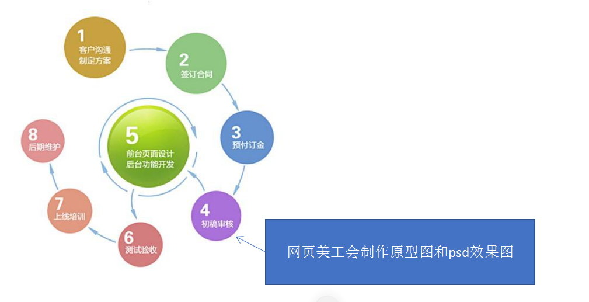

**原型图：** 页面的布局，告知我们开发人员，整个页面的结构是怎样的，说白了就是什么地方放什么内容

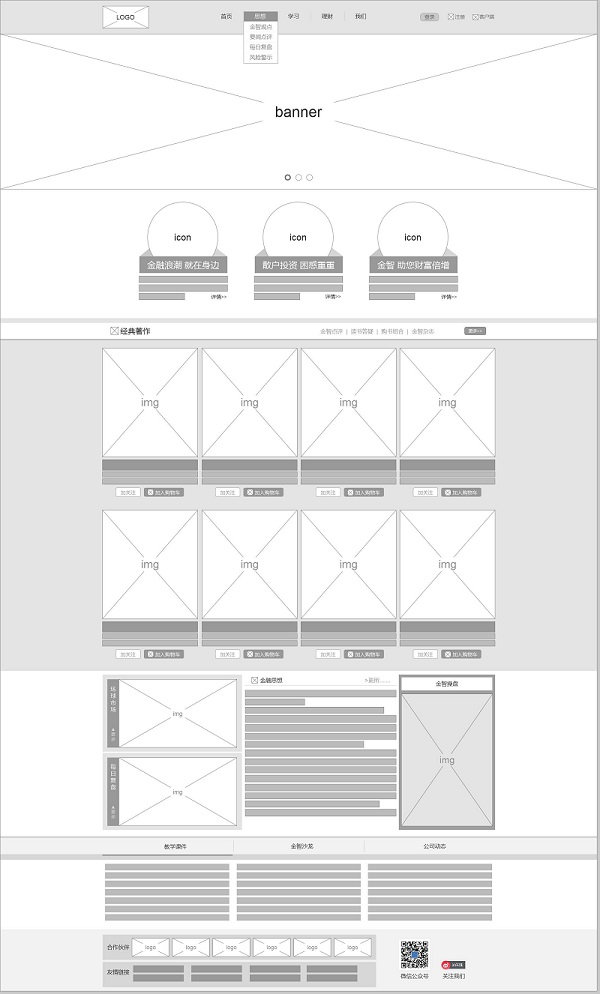

**效果图：**告知我们开发人员，最终做出来的成品应该是什么样子，相比原型图，效果图里面包含内容，风格，字体大小等等

<!--  -->

### 品优购项目介绍

- **项目名称：**品优购
- **项目描述：**品优购是一个电商网站，我们要完成 PC 端首页、列表页、注册页面的制作

**主页**

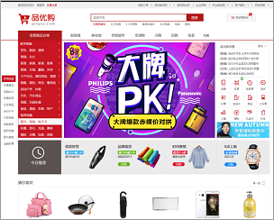

**列表页**

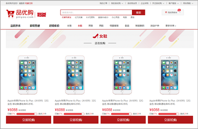

**注册页**

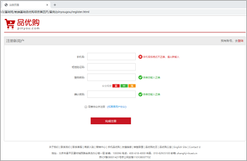

### 品优购项目的学习目的

- 电商类网站比较综合，里面需要大量的布局技术，包括布局方式、常见效果以及周边技术
- 品优购项目能复习、总结、提高基础班所学布局技术
- 写完品优购项目，能对实际开发中制作 **PC 端页面流程**有一个整体的感知
- 为后期学习移动端项目做铺垫

### 开发工具以及技术栈

#### 开发工具

`VScode`  、`Photoshop（fw）`、主流浏览器（以`Chrome`浏览器为主）

#### 技术栈

- 利用 HTML5 + CSS3 手动布局，可以大量使用 H5 新增标签和样式 
- 采取结构与样式相分离，模块化开发
- 良好的代码规范有利于团队更好的开发协作，提高代码质量，因此品优购项目里面，请同学们遵循以下代码规范。（[详情见素材文件夹--- 品优购代码规范.md](./品优购代码规范.md)）

### 品优购项目搭建工作

#### 创建的文件夹如下（称为项目结构）

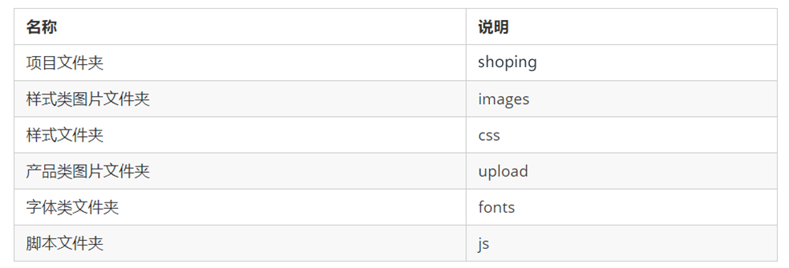

#### 创建文件如下


**初始化样式**

```css
有些网站初始化的不太提倡  * { margin: 0;  padding: 0; }
比如新浪： html,body,ul,li,ol,dl,dd,dt,p,h1,h2,h3,h4,h5,h6,form,fieldset,legend,img{margin:0;padding:0} 
```

### 项目模块化开发

所谓的模块化：将一个项目按照功能划分，一个功能一个模块，互不影响，模块化开发具有重复使用、更换方便等优点

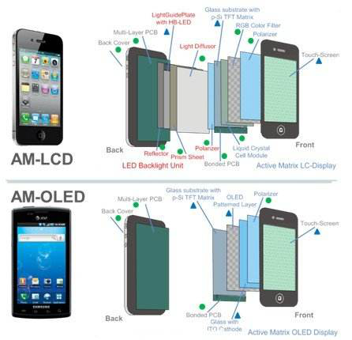

**代码也如此**，有些样式和结构在很多页面都会出现，**比如页面头部和底部，大部分页面都有(如下图)**。此时，可以把这些结构和样式单独作为一个模块，然后重复使用

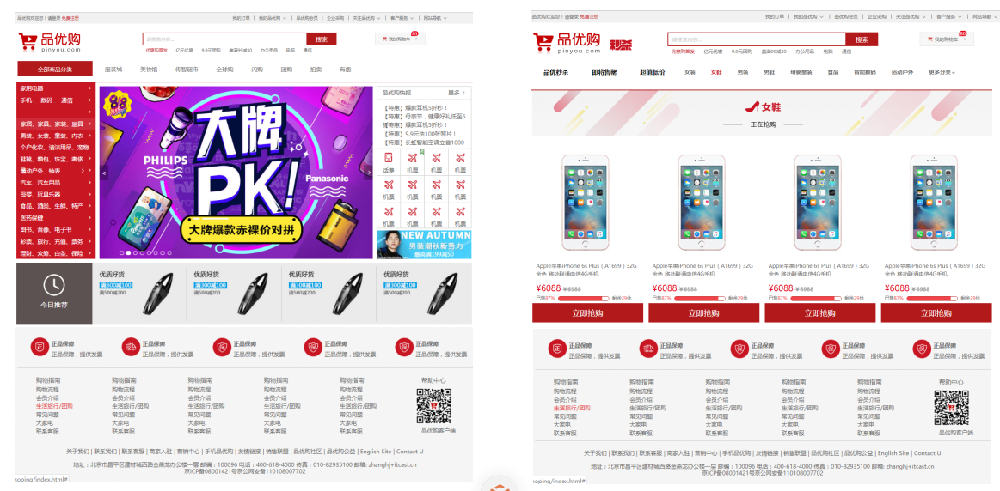

- 有些样式和结构在很多页面都会出现，比如页面头部和底部，大部分页面都有。此时，可以把这些结构和样式单独作为一个模块，然后重复使用
- 这里最典型的应用就是 **`common.css`** 公共样式。写好一个样式，其余的页面用到这些相同的样式
- 模块化开发具有重复使用、修改方便等优点

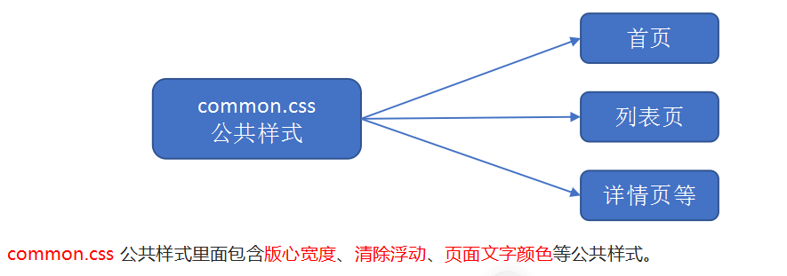

### 网站 favicon 图标（★★★）

favicon.ico 一般用于作为缩略的网站标志，它显示在浏览器的地址栏或者标签上。目前主要的浏览器都支持 favicon.ico 图标。


#### 制作favicon图标

- 把品优购图标切成 `png` 图片
- 把 `png` 图片转换为 `ico` 图标，这需要借助于第三方转换网站，例如比特虫：http://www.bitbug.net/

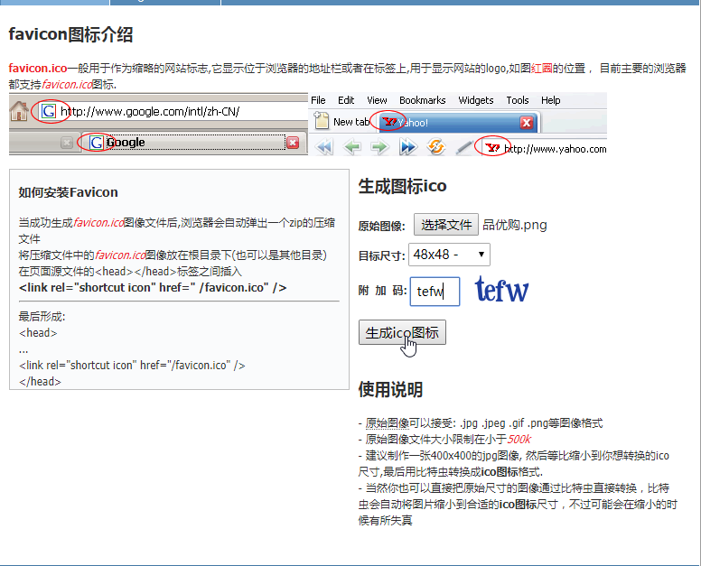

#### 使用favicon图标

##### **favicon图标放到网站根目录下**

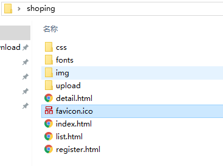

##### HTML页面引入favicon图标

在html 页面里面的 `<head> </head>`元素之间引入代码

```html
 <link rel="shortcut icon" href="favicon.ico"  type="image/x-icon"/> 
```

### TDK三大标签SEO优化（★★）

#### SEO是什么

**SEO（Search Engine Optimization）**汉译为搜索引擎优化，是一种利用搜索引擎的规则提高网站在有关搜索引擎内自然排名的方式。

**SEO** 的目的是对网站进行深度的优化，从而帮助网站获取免费的流量，进而在搜索引擎上提升网站的排名，提高网站的知名度。

页面必须有三个标签用来符合 SEO 优化

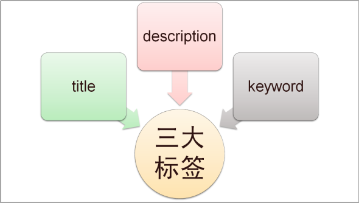

#### TDK是什么

##### T -- Title（网站标题）

**title** 具有不可替代性，是我们内页的第一个重要标签，是搜索引擎了解网页的入口和对网页主题归属的最佳判断点。

**建议：**网站名（产品名）- 网站的介绍  （尽量不要超过30个汉字）

**例如：**

- 京东(JD.COM)-综合网购首选-正品低价、品质保障、配送及时、轻松购物！
- 小米商城 - 小米5s、红米Note 4、小米MIX、小米笔记本官方网站

##### D -- description（网站描述）

简要说明我们网站主要是做什么的。

**我们提倡**，description 作为网站的总体业务和主题概括，多采用“我们是…”、“我们提供…”、“×××网作为…”、“电话：010…”之类语句。

**例如：**

`<meta name="description" content="京东JD.COM-专业的综合网上购物商城,销售家电、数码通讯、电脑、家居百货、服装服饰、母婴、图书、食品等数万个品牌优质商品.便捷、诚信的服务，为您提供愉悦的网上购物体验!" />`

##### K -- keywords （关键字）

**keywords 是页面关键词**，是搜索引擎的关注点之一。

keywords 最好限制为 6～8 个关键词，关键词之间用英文逗号隔开，采用 关键词1,关键词2 的形式

**例如：**

`<meta name= " keywords" content="网上购物,网上商城,手机,笔记本,电脑,MP3,CD,VCD,DV,相机,数码,配件,手表,存储卡,京东" />`

**对于我们前端人员来说，我们只需要准备好这三个标签，具体里面的内容，有专门的 SEO 人员准备**

**示例代码**

```html
<head>
    ...
    <title>品优购商城-综合网购首选-正品低价、品质保障、配送及时、轻松购物！
    </title>
    <!-- 网站说明 -->
    <meta name="description"
        content="品优购商城-专业的综合网上购物商城,销售家电、数码通讯、电脑、家居百货、服装服饰、母婴、图书、食品等数万个品牌优质商品.便捷、诚信的服务，为您提供愉悦的网上购物体验!" />
    <!-- 关键字 -->
    <meta name="keywords" content="网上购物,网上商城,手机,笔记本,电脑,MP3,CD,VCD,DV,相机,数码,配件,手表,存储卡,京东" />
    ...
</head>
```

## 品优购首页制作

我们开始制作首页的头部和底部的时候，根据模块化开发，样式要写到common.css里面

### 常用模块类名命名

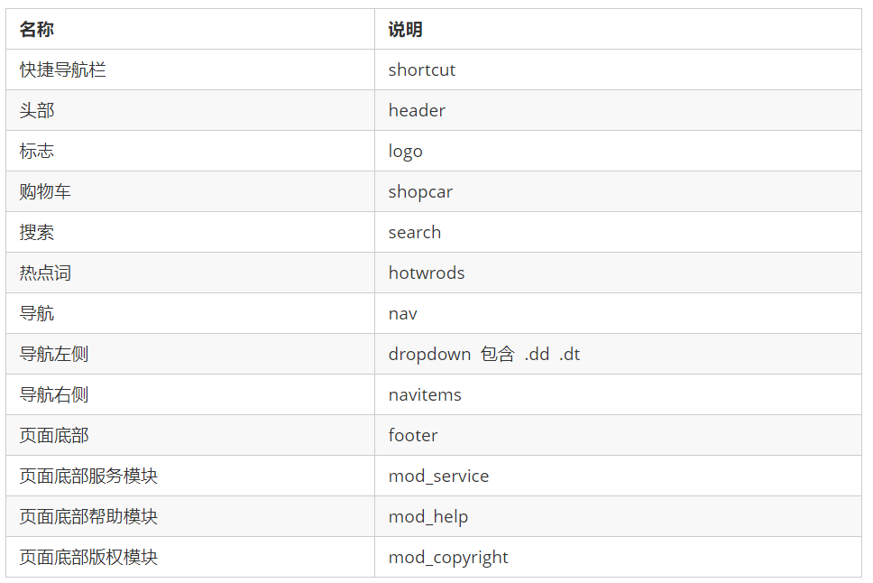

### 公共部分 -- header 头部制作

#### 快捷导航 shortcut 制作（★★）


##### 布局思路

- 通栏的盒子命名为 shortcut ，是快捷导航的意思。 注意这里的行高，可以继承给里面的子盒子
- 里面包含版心的盒子
- 版心盒子里面包含 1 号左侧盒子左浮动
  - 1 号盒子 里面包含一个`ul`，`ul`包裹li，第一个li里面包裹文字就行，因为不能点击，第二个li包含两个a标签
  - 里面的内容是水平排列，所以需要给`li`设置浮动
  - 文字要垂直居中，我们可以给 shortcut设置行高，因为行高可以继承，里面的孩子就不需要设置了
- 版心盒子里面包含 2 号右侧盒子右浮动
  - 2 号盒子 里面包含一个`ul`，`ul`包裹`li`，中间的`|`可以用样式去设置，也可以用字符 |
  - 里面内容水平排列，给`li`设置浮动
  - 找到里面所有偶数的 `li` 设置样式（偶数的 `li` 显示是一个 | 竖线，所以需要单独选择出来设置样式，利用nth-child就可以实现）
- 需要用到字体图标
  - 利用伪元素的方式来实现字体图标，给需要添加的标签设置类名为 ： `arrow-icon`
  - 先要引入字体图片的资源
  - 在样式里面利用 font-face 来进行声明
  - 在伪元素的 content属性设置 图标的编码
  - 给伪元素设置font-family属性

##### 结构示例代码

```html
<!-- 快捷导航模块 start -->
<section class="shortcut">
    <div class="w">
        <div class="fl">
            <ul>
                <li>品优购欢迎您！&nbsp;</li>
                <li>
                    <a href="#">请登录</a> &nbsp; <a href="#" class="style_red">免费注册</a>
                </li>
            </ul>
        </div>
        <div class="fr">
            <ul>
                <li>我的订单</li>
                <li></li>
                <li class="arrow-icon">我的品优购</li>
                <li></li>
                <li>品优购会员</li>
                <li></li>
                <li>企业采购</li>
                <li></li>
                <li class="arrow-icon">关注品优购</li>
                <li></li>
                <li class="arrow-icon">客户服务</li>
                <li></li>
                <li class="arrow-icon">网站导航</li>
            </ul>
        </div>
    </div>
</section>
```

##### 样式示例代码

```css
/* 声明字体图标 这里一定要注意路径的变化 */
@font-face {
  font-family: 'icomoon';
  src:  url('../fonts/icomoon.eot?tomleg');
  src:  url('../fonts/icomoon.eot?tomleg#iefix') format('embedded-opentype'),
    url('../fonts/icomoon.ttf?tomleg') format('truetype'),
    url('../fonts/icomoon.woff?tomleg') format('woff'),
    url('../fonts/icomoon.svg?tomleg#icomoon') format('svg');
  font-weight: normal;
  font-style: normal;
  font-display: block;
}
/* 快捷导航模块 */
.shortcut {
    height: 31px;
    line-height: 31px;
    background-color: #f1f1f1;
}
.shortcut ul li {
    float: left;
}
/* 选择所有的偶数的小li */
.shortcut .fr ul li:nth-child(even) {
    width: 1px;
    height: 12px;
    background-color: #666;
    margin: 9px 15px 0;
}
.arrow-icon::after {
    content: '\e91e';
    font-family: 'icomoon';
    margin-left: 6px;
}
```

#### header头部模块搭建（★★★）


-  header 盒子必须要有高度

-  1 号盒子是 `logo` 标志定位，在正常开发过程中，**logo的布局其实是有讲究的，需要进行 `logoSEO`的优化 （★★★）**

  - `logo` 里面首先放一个 `h1` 标签，目的是为了提权，告诉搜索引擎，这个地方很重要
  - `h1` 里面再放一个链接，可以返回首页的，把 `logo` 的背景图片给链接即可
  - 为了搜索引擎收录我们，我们链接里面要放文字（网站名称），但是文字不要显示出来
    - 方法1：`text-indent` 移到盒子外面（`text-indent: -9999px`) ，然后 `overflow:hidden` ，淘宝的做法
    - 方法2：直接给 `font-size: 0;`  就看不到文字了，京东的做法
  - 最后给链接一个 `title` 属性，这样鼠标放到 `logo` 上就可以看到提示文字了

  **结构代码**

  ```html
  <!-- logo模块 -->
  <div class="logo">
      <h1>
          <a href="index.html" title="品优购商城">品优购商城</a>
      </h1>
  </div>
  ```

  **样式代码**

  ```css
  /* header 头部制作 */
  .header {
      position: relative;
      height: 105px;
   
  }
  .logo {
      position: absolute;
      top: 25px;
      width: 171px;
      height: 61px;
      
  }
  .logo a {
      display: block;
      width: 171px;
      height: 61px;
      background: url(../../images/logo.png) no-repeat;
      /* font-size: 0;京东的做法*/
      /* 淘宝的做法让文字隐藏 */
      text-indent: -9999px;
      overflow: hidden;
  }
  ```

-  2 号盒子是 `search` 搜索模块定位

  - search盒子利用定位的方式放在对应的位置
  - search盒子设置绝对定位，header盒子设置相对定位
  - search盒子里面包含两个子元素，一个是输入框，一个是按钮，分别跟定固定的宽高（搜索框 宽度：454px；按钮宽度：80px）
  - 输入框和按钮本来就是行内块元素，在一行显示，但是中间会有间隙，所以我们可以让让这两个元素浮动起来

  **结构代码**

  ```html
  <!-- search搜索模块 -->
  <div class="search">
      <input type="search" name="" id="" placeholder="语言开发">
      <button>搜索</button>
  </div>
  ```

  **样式代码**

  ```css
  .search {
      position: absolute;
      left: 346px;
      top: 25px;
      width: 538px;
      height: 36px;
      border: 2px solid #b1191a;
  }
  .search input {
      float: left;
      width: 454px;
      height: 32px;
      padding-left: 10px;
  }
  .search button {
      float: left;
      width: 80px;
      height: 32px;
      background-color: #b1191a;
      font-size: 16px;
      color: #fff;
  }
  ```

-  3 号盒子是 `hotwords`  热词模块定位

  - 热词模块怎么简单怎么来，直接在里面放a标签即可
  - 给里面所有的a标签设置 左右10px的外边距
  - 给第一个a标签设置文字变红色（#c81623）

  **结构代码**

  ```html
  <!-- hotwords模块制作 -->
  <div class="hotwords">
      <a href="#" class="style_red">优惠购首发</a>
      <a href="#">亿元优惠</a>
      <a href="#">9.9元团购</a>
      <a href="#">美满99减30</a>
      <a href="#">办公用品</a>
      <a href="#">电脑</a>
      <a href="#">通信</a>
  </div>
  ```

  **样式代码**

  ```css
  .hotwords {
      position: absolute;
      top: 66px;
      left: 346px;
  }
  .hotwords a {
      margin: 0 10px;
  }
  ```

-  4 号盒子是 `shopcar` 购物车模块

  - 在`shopcar`里面添加一个before伪元素和after伪元素，分别放置 购物车的图标和 右箭头

  - count 统计部分用绝对定位做
  - count 统计部分不要给宽度，因为可能买的件数比较多，让件数撑开就好了，给一个高度
  - 一定注意左下角不是圆角，其余三个是圆角  写法： border-radius: 7px 7px 7px 0;

  **结构代码**

  ```html
  <!-- 购物车模块 -->
  <div class="shopcar">
      我的购物车
      <i class="count">8</i>
  </div>
  ```

  **样式代码**

  ```css
  .shopcar {
      position: absolute;
      right: 60px;
      top: 25px;
      width: 140px;
      height: 35px;
      line-height: 35px;
      text-align: center;
      border: 1px solid #dfdfdf;
      background-color: #f7f7f7;
  }
  .shopcar::before {
      content: '\e93a';
      font-family: 'icomoon';
      margin-right: 5px;
      color: #b1191a;
  }
  .shopcar::after {
      content: '\e920';
      font-family: 'icomoon';
      margin-left: 10px;
  }
  .count {
      position: absolute;
      top: -5px;
      left: 105px;
      height: 14px;
      line-height: 14px;
      color: #fff;
      background-color: #e60012;
      padding: 0 5px;
      border-radius: 7px 7px 7px 0;
  }
  ```

#### `nav`导航模块制作（★★★）


- `nav` 盒子通栏有高度，而且有个下边框，里面包含版心，版心里面包含 1 号盒子 和 2号盒子

  **结构代码**

  ```html
  <nav class="nav">
      <div class="w">
          <div class="dropdown">
             ...
          </div>
          <div class="navitems">
             ...
          </div>
      </div>
  </nav>
  ```

  **样式代码**

  ```css
  .nav {
      height: 47px;
      border-bottom: 2px solid #b1191a;
  }
  ```

- 1 号盒子左侧浮动，`dropdown` 

  - 1号盒子有讲究，根据相关性 里面包含 `.dt`  和 `.dd` 两个盒子
  - `.dt` 内容是全部商品分类，然后把这个盒子的宽高设置跟父亲一样，这样就把 `.dd` 挤到下面去了
  - 给 `.dd` 盒子设置宽度 和 高度，以及背景颜色
  - 给 `.dd` 盒子里面定义 无序列表 （`ul > li > a`）
  - 每个 `li` 都有一个高度（`31px`），宽度可以不用设置，让文字垂直居中，左边设置2个像素的margin值
  - 给 `li` 里面的a设置文字大小（`14px`）
  - 给 `li` 设置 `hover`，当鼠标移入的时候，让`li`的背景变成白色，让里面的文字变成红色
  - `li` 右侧的三角 就可以利用 伪元素来实现，给伪元素设置字体图标，利用定位的方式放在`li`的右侧，那么给`li`设置相对定位

  **结构代码**

  ```html
  <div class="dropdown">
       <div class="dt">全部商品分类</div>
       <div class="dd">
           <ul>
               <li><a href="#">家用电器</a> </li>
               <li><a href="#">手机</a>、 <a href="#">数码</a>、<a href="#">通信</a> </li>
               <li><a href="#">电脑、办公</a> </li>
               <li><a href="#">家居、家具、家装、厨具</a> </li>
               <li><a href="#">男装、女装、童装、内衣</a> </li>
               <li><a href="#">个户化妆、清洁用品、宠物</a> </li>
               <li><a href="#">鞋靴、箱包、珠宝、奢侈品</a> </li>
               <li><a href="#">运动户外、钟表</a> </li>
               <li><a href="#">汽车、汽车用品</a> </li>
               <li><a href="#">母婴、玩具乐器</a> </li>
               <li><a href="#">食品、酒类、生鲜、特产</a> </li>
               <li><a href="#">医药保健</a> </li>
               <li><a href="#">图书、音像、电子书</a> </li>
               <li><a href="#">彩票、旅行、充值、票务</a> </li>
               <li><a href="#">理财、众筹、白条、保险</a> </li>
           </ul>
       </div>
   </div>
  ```

  **样式代码**

  ```css
  .dropdown .dt {
      width: 100%;
      height: 100%;
      color: #fff;
      text-align: center;
      line-height: 45px;
      font-size: 16px;
  }
  .dropdown .dd {
      display: none;
      width: 210px;
      height: 465px;
      background-color: #c81623;
      margin-top: 2px;
  }
  .dropdown .dd ul li {
      position: relative;
      height: 31px;
      line-height: 31px;
      margin-left: 2px;
      padding-left: 10px;
  }
  .dropdown .dd ul li:hover {
     background-color: #fff;
  }
  .dropdown .dd ul li::after {
      position: absolute;
      top: 1px;
      right: 10px;
      color: #fff;
      font-family: 'icomoon';
      content: '\e920';
      font-size: 14px;
  }
  .dropdown .dd ul li a {
      font-size: 14px;
      color: #fff;
  }
  .dropdown .dd ul li:hover a {
      color: #c81623;
  }
  ```

- 2 号盒子左侧浮动，`navitems` 导航栏组

  - 里面结构是 `ul > li > a`
  - 导航栏都是能点击的，所以我们不能给定宽度，给`a`左右的`padding`把两侧撑开
  - 让文字垂直居中（行高等于高度）

  **结构代码**

  ```html
  <div class="navitems">
      <ul>
          <li><a href="#">服装城</a></li>
          <li><a href="#">服装城</a></li>
          <li><a href="#">服装城</a></li>
          <li><a href="#">服装城</a></li>
          <li><a href="#">服装城</a></li>
          <li><a href="#">服装城</a></li>
          <li><a href="#">服装城</a></li>
          <li><a href="#">服装城</a></li>
      </ul>
  </div>
  ```

  **样式代码**

  ```css
  .navitems ul li {
      float: left;
  }
  .navitems ul li a {
      display: block;
      height: 45px;
      line-height: 45px;
      font-size: 16px;
      padding: 0 25px;
  }
  ```

### 公共部分 -- footer 底部制作

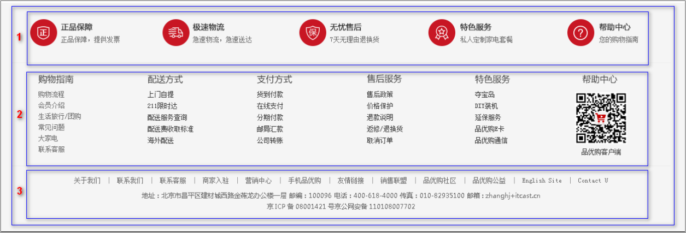

- `footer` 页面底部盒子通栏给一个高度（415px）和灰色的背景

- `footer` 里面有一个大的版心

- 版心里面包含 1 号盒子，`mod_service` 是服务模块，mod 是模块的意思

  - 给 `mod_service` 设置高度（80px）和下边框
  - 在里面定义  `ul  > li` ,每个`li` 宽度是300px 高度是 50px，给每个`li`设置35px的左内边距
  - 在每个`li`里面，放一个 `h5`（里面放图标），一个`div`（里面放`div`和`p`）
  - 给 `h5`设置浮动，让h5与这个div左右排列
  - 通过精灵图技术（核心思路：利用background-position来实现），把图标设置给h5

  **结构代码**

  ```html
  <div class="mod_service">
      <ul>
          <li>
              <h5></h5>
              <div class="service_txt">
                  <h4>正品保障</h4>
                  <p>正品保障,提供发票</p>
              </div>
          </li>
          <li>
              <h5></h5>
              <div class="service_txt">
                  <h4>正品保障</h4>
                  <p>正品保障,提供发票</p>
              </div>
          </li>
          <li>
              <h5></h5>
              <div class="service_txt">
                  <h4>正品保障</h4>
                  <p>正品保障,提供发票</p>
              </div>
          </li>
          <li>
              <h5></h5>
              <div class="service_txt">
                  <h4>正品保障</h4>
                  <p>正品保障,提供发票</p>
              </div>
          </li>
      </ul>
  </div>
  ```

  **样式代码**

  ```css
  /* 底部模块制作 */
  .footer {
      height: 415px;
      background-color: #f5f5f5;
      padding-top: 30px;
  }
  .mod_service {
      height: 80px;
      border-bottom: 1px solid #ccc;
  }
  .mod_service ul li {
      float: left;
      width: 300px;
      height: 50px;
      padding-left: 35px;
  }
  .mod_service ul li h5 {
      float: left;
      width: 50px;
      height: 50px;
      background: url(../../images/icons.png) no-repeat -252px -2px;
      margin-right: 8px;
  }
  .service_txt h4 {
      font-size: 14px;
  }
  .service_txt  p {
      font-size: 12px;
  }
  ```

- 版心里面包含 2 号盒子，mod_help 是帮助模块

  - 给 mod_help 设置 50px的左内边距和20px的上内边距，给定高度（185px）
  - 里面的布局利用 自定义列表来实现（`dl > dt + dd`）
  - 给 `dl` 设置浮动，让其可以水平排列，给每个dl盒子设置宽度
  - 给 `dt` 设置文字大小（16px），设置下外边距（10px），让`dt`和`dd`之间有些距离
  - 最后一个 dl 结构和样式不一样，需要单独设置

  ```html
  <div class="mod_help">
      <dl>
          <dt>服务指南</dt>
          <dd><a href="#">购物流程</a></dd>
          <dd><a href="#">会员介绍</a></dd>
          <dd><a href="#">生活旅行/团购</a></dd>
          <dd><a href="#">常见问题</a></dd>
          <dd><a href="#">大家电</a></dd>
          <dd><a href="#">联系客服</a></dd>
      </dl>
      <dl>
          <dt>服务指南</dt>
          <dd><a href="#">购物流程</a></dd>
          <dd><a href="#">会员介绍</a></dd>
          <dd><a href="#">生活旅行/团购</a></dd>
          <dd><a href="#">常见问题</a></dd>
          <dd><a href="#">大家电</a></dd>
          <dd><a href="#">联系客服</a></dd>
      </dl>
      <dl>
          <dt>服务指南</dt>
          <dd><a href="#">购物流程</a></dd>
          <dd><a href="#">会员介绍</a></dd>
          <dd><a href="#">生活旅行/团购</a></dd>
          <dd><a href="#">常见问题</a></dd>
          <dd><a href="#">大家电</a></dd>
          <dd><a href="#">联系客服</a></dd>
      </dl>
      <dl>
          <dt>服务指南</dt>
          <dd><a href="#">购物流程</a></dd>
          <dd><a href="#">会员介绍</a></dd>
          <dd><a href="#">生活旅行/团购</a></dd>
          <dd><a href="#">常见问题</a></dd>
          <dd><a href="#">大家电</a></dd>
          <dd><a href="#">联系客服</a></dd>
      </dl>
      <dl>
          <dt>服务指南</dt>
          <dd><a href="#">购物流程</a></dd>
          <dd><a href="#">会员介绍</a></dd>
          <dd><a href="#">生活旅行/团购</a></dd>
          <dd><a href="#">常见问题</a></dd>
          <dd><a href="#">大家电</a></dd>
          <dd><a href="#">联系客服</a></dd>
      </dl>
      <dl>
          <dt>帮助中心</dt>
          <dd>
               品优购客户端
          </dd>
      </dl>
  </div>
  ```

  **样式代码**

  ```css
  .mod_help {
      height: 185px;
      border-bottom: 1px solid #ccc;
      padding-top: 20px;
      padding-left: 50px;
  }
  .mod_help dl {
      float: left;
      width: 200px;
  }
  .mod_help dl:last-child {
      width: 90px;
      text-align: center;
  }
  .mod_help dl dt {
      font-size: 16px; 
      margin-bottom: 10px;
  }
  ```

- 版心里面包含 3 号盒子，mod_copyright 是版权模块

  - 分为上下两块，上面是 `links` 友情链接，下面是 `copyright`，给mod_copyright 大盒子设置 文字水平居中，20px的上内边距，让上面内容和下面内容之间有些间隙
  - 把内容分别复制到相应模块中
  - 给 `links` 设置 15px 的下外边距，给`links` 里面 的 `a` 标签设置 左右 3px 的外边距
  - 给`copyright` 设置 20px 的行高

  **结构代码**

  ```html
  <div class="mod_copyright">
      <div class="links">
          <a href="#">关于我们</a> | <a href="#">联系我们</a> | 联系客服 | 商家入驻 | 营销中心 | 手机品优购 | 友情链接 | 销售联盟 | 品优购社区 | 品优购公益 | English Site | Contact U
      </div>
      <div class="copyright">
          地址：北京市昌平区建材城西路金燕龙办公楼一层 邮编：100096 电话：400-618-4000 传真：010-82935100 邮箱: zhanghj+itcast.cn <br> 京ICP备08001421号京公网安备110108007702
      </div>
  </div>
  ```

  **样式代码**

  ```css
  .mod_copyright {
      text-align: center;
      padding-top: 20px;
  }
  .links {
      margin-bottom: 15px;
  }
  .links a {
      margin: 0 3px;
  }
  .copyright {
      line-height: 20px;
  }
  ```

  