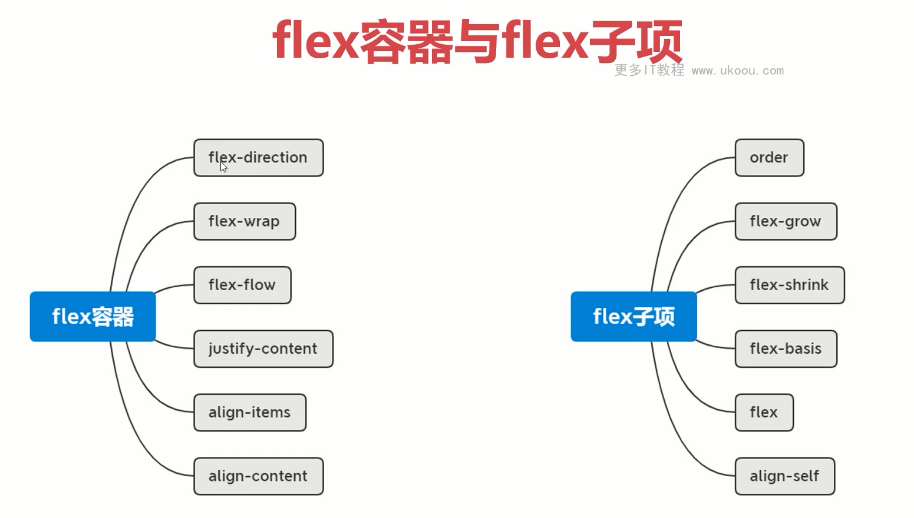
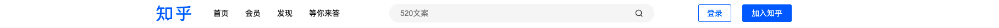
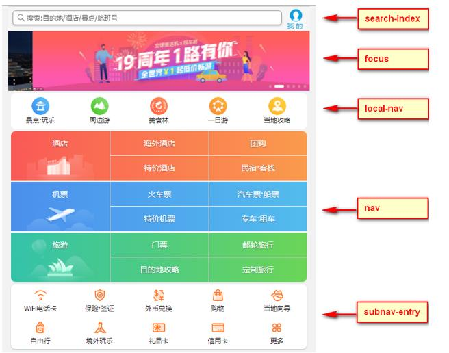

# 移动web开发——flex布局

## 1.0传统布局和flex布局对比

### 1.1传统布局

+ 兼容性好
+ 布局繁琐
+ 局限性，不能再移动端很好的布局

### 1.2 flex布局

+ 操作方便，布局极其简单，移动端使用比较广泛
+ pc端浏览器支持情况比较差
+ IE11或更低版本不支持flex或仅支持部分

### 1.3 建议

+ 如果是pc端页面布局，还是采用传统方式
+ 如果是移动端或者是不考虑兼容的pc则采用flex

::: tip 弹性布局和网格布局
+ 弹性布局挺适合做一维布局，也就是说一行一列的布局，不太适合做多行多列布局。
+ 网格布局挺适合做二维布局，也就是说多行多列的布局。
  
**总结**： 尽量不要用弹性布局去做多行多列的布局
:::

## 2.0 flex布局原理

+ flex 是 flexible Box 的缩写，意为"弹性布局"，用来为盒状模型提供最大的灵活性，任何一个容器都可以指定为 flex 布局。
+ 当我们为父盒子设为 flex 布局以后，子元素的 float、clear 和 vertical-align 属性将失效。
+ flex布局又叫伸缩布局 、弹性布局 、伸缩盒布局 、弹性盒布局 
+ 采用 Flex 布局的元素，称为 Flex 容器（flex container），简称"容器"。它的所有子元素自动成为容器成员，称为 Flex 项目（flex
item），简称"项目"。

**总结**：就是通过给父盒子添加flex属性，来控制子盒子的位置和排列方式

## 3.0 父项常见属性

+ flex-direction：设置主轴的方向
+ justify-content：设置主轴上的子元素排列方式
+ flex-wrap：设置子元素是否换行  
+ align-content：设置侧轴上的子元素的排列方式（多行）
+ align-items：设置侧轴上的子元素排列方式（单行）
+ flex-flow：复合属性，相当于同时设置了 flex-direction 和 flex-wrap



### 3.1 flex-direction设置主轴的方向

+ 在 flex 布局中，是分为主轴和侧轴两个方向，同样的叫法有 ： 行和列、x 轴和y 轴
+ 默认主轴方向就是 x 轴方向，水平向右
+ 默认侧轴方向就是 y 轴方向，水平向下


+ 注意： 主轴和侧轴是会变化的，就看 flex-direction 设置谁为主轴，剩下的就是侧轴。而我们的子元素是跟着主轴来排列的


  ​

### 3.2 justify-content 设置主轴上的子元素排列方式


**补充:** space-evenly 属性

### 3.3 flex-wrap设置是否换行

+ 默认情况下，项目都排在一条线（又称”轴线”）上。flex-wrap属性定义，flex布局中默认是不换行的。
+ nowrap 不换行
+ wrap 换行
 
### 3.4 align-items 设置侧轴上的子元素排列方式（单行 ）

+ 该属性是控制子项在侧轴（默认是y轴）上的排列方式  在子项为单项（单行）的时候使用
+ flex-start 从头部开始
+ flex-end 从尾部开始
+ center 居中显示
+ stretch 拉伸

### 3.5 align-content  设置侧轴上的子元素的排列方式（多行）

设置子项在侧轴上的排列方式 并且只能用于子项出现 换行 的情况（多行），在单行下是没有效果的。


### 3.6 align-content 和align-items区别

+ align-items  适用于单行情况下， 只有上对齐、下对齐、居中和 拉伸
+ align-content适应于换行（多行）的情况下（单行情况下无效）， 可以设置 上对齐、下对齐、居中、拉伸以及平均分配剩余空间等属性值。 
+ 总结就是单行找align-items  多行找 align-content

### 3.7 flex-flow 属性是 flex-direction 和 flex-wrap 属性的复合属性

```css
flex-flow:row wrap;
```

## 4.0 flex布局子项常见属性

+ flex子项目占的份数
+ align-self控制子项自己在侧轴的排列方式
+ order属性定义子项的排列顺序（前后顺序）

### 4.1  flex 属性

flex 属性定义子项目分配剩余空间，用flex来表示占多少份数。

```css
.item {
    flex: <number>; /* 默认值 0 */
}
```

### 4.2 align-self控制子项自己在侧轴上的排列方式

align-self 属性允许单个项目有与其他项目不一样的对齐方式，可覆盖 align-items 属性。

默认值为 auto，表示继承父元素的 align-items 属性，如果没有父元素，则等同于 stretch。

````css
span:nth-child(2) {
      /* 设置自己在侧轴上的排列方式 */
      align-self: flex-end;
}
````

### 4.3 order 属性定义项目的排列顺序

> 默认值是0、改变某一个flex子项的排序位置

数值越小，排列越靠前。

注意：和 z-index 不一样。

```css
.item {
    order: <number>;
}
```

### 4.4 flex-grow 扩展比例

flex-grow 默认是0、表示不占用剩余的空间间隙扩展自己的宽度

```html
<!DOCTYPE html>
<html lang="en">

<head>
    <meta charset="UTF-8">
    <meta http-equiv="X-UA-Compatible" content="IE=edge">
    <meta name="viewport" content="width=device-width, initial-scale=1.0">
    <title>Document</title>
    <style>
        .main {
            width: 500px;
            height: 300px;
            background: skyblue;
            display: flex;
        }

        .main div {
            width: 100px;
            height: 100px;
            background: pink;
            /* flex-grow: 0;   默认的 */
            /* 如果比例值为1，就占满剩余的所有空间 */
            /* 400 * 0.5 -> 200 + 100 -> 300 */
            /* flex-grow: 0.5; */
            /* 当比例值大于等于1的时候，都会占满整个空间 */
            flex-grow : 2;
        }

        .main2{
            width: 500px;
            height: 300px;
            background: skyblue;
            display: flex;
        }
        .main2 div:nth-of-type(1){
            width:200px;
            height:100px;
            background:pink;
            flex-grow: 0.2;
        }
        .main2 div:nth-of-type(2){
            width:100px;
            height:100px;
            background:pink;
            flex-grow: 0.1;
        }
    </style>
</head>

<body>
    <!-- <div class="main">
        <div>1</div>
    </div> -->
    <div class="main2">
        <div>1</div>
        <div>2</div>
    </div>
</body>

</html>
```

+ [tailwindcss](https://tailwindcss.com/docs/flex-grow)
+ [geeksforgeeks](https://www.geeksforgeeks.org/css-flex-grow-property/)

### 4.5 flex-shrink 收缩比例
> 默认值是1、表示flex容器空间不足时、元素的收缩比例

```html
<!DOCTYPE html>
<html lang="en">
<head>
    <meta charset="UTF-8">
    <meta http-equiv="X-UA-Compatible" content="IE=edge">
    <meta name="viewport" content="width=device-width, initial-scale=1.0">
    <title>Document</title>
    <style>
        .main{
            width:500px;
            height:200px;
            background:skyblue;
            display: flex;
        }
        .main div{
            width:600px;
            height:100px;
            background:pink;
            /* flex-shrink : 1; 自动收缩，跟容器大小相同 */

           /*  flex-shrink: 0; 不收缩、就是说不会被父盒子display:flex而收缩*/
           flex-shrink: 0.5;
        }

        .main2{
            width:500px;
            height:200px;
            background:skyblue;
            display: flex;
        }
        .main2 div:nth-of-type(1){
            width:300px;
            height:100px;
            background:pink;
            flex-shrink: 0.2;
        }
        .main2 div:nth-of-type(2){
            width:400px;
            height:100px;
            background:pink;
            flex-shrink: 0.1;
        }

        /* 300 + 400 - 500 -> 200 */

        /* 300 - 3/7 * 200   
        400 - 4/7 * 200 */

        /* 300 - 6/10 * 200
        400 - 4/10 * 200 */


    </style>
</head>
<body>
    <!-- <div class="main">
        <div>1</div>
    </div> -->

    <div class="main2">
        <div>1</div>
        <div>2</div>
    </div>
</body>
</html>
```

### 4.6 flex-basis
> 默认值是auto、指定了flex元素在主轴方向上的初始大小

### 4.7 StickyFooter布局
> 实现黏性页脚的效果

```html
<!DOCTYPE html>
<html lang="en">
<head>
    <meta charset="UTF-8">
    <meta http-equiv="X-UA-Compatible" content="IE=edge">
    <meta name="viewport" content="width=device-width, initial-scale=1.0">
    <title>Document</title>
    <style>
        body{
            margin:0;
        }
        .main{
            min-height:100vh;
            display: flex;
            flex-direction: column;
        }
        .main .header{
            height:100px;
            background:pink;
        }
        .main .content{
            flex-grow: 1;
        }
        .main .footer{
            height:100px;
            background:skyblue;
        }
    </style>
</head>
<body>
    <div class="main">
        <div class="header"></div>
        <div class="content">
            <p>测试内容</p>
            <p>测试内容</p>
            <p>测试内容</p>
            <p>测试内容</p>
            <p>测试内容</p>
            <p>测试内容</p>
            <p>测试内容</p>
            <p>测试内容</p>
            <p>测试内容</p>
            <p>测试内容</p>
            <p>测试内容</p>
            <p>测试内容</p>
            <p>测试内容</p>
            <p>测试内容</p>
            <p>测试内容</p>
            <p>测试内容</p>
            <p>测试内容</p>
            <p>测试内容</p>
            <p>测试内容</p>
            <p>测试内容</p>
            <p>测试内容</p>
        </div>
        <div class="footer"></div>
    </div>
</body>
</html>
```

### 4.8 知乎导航栏实战


> 根据flex布局编写的知乎导航实战，实战中使用到flex的 扩展比例 flex-grow及其他属性。

```html
<!DOCTYPE html>
<html lang="en">

<head>
  <meta charset="UTF-8">
  <meta http-equiv="X-UA-Compatible" content="IE=edge">
  <meta name="viewport" content="width=device-width, initial-scale=1.0">
  <title>Document</title>
  <link rel="stylesheet" href="./iconfont.css">
  <link rel="stylesheet" href="./reset.css">
  <style>
    body {
      background: #f6f6f6;
    }

    .header-container {
      background: #ffffff;
    }

    .header-wrapper {
      margin: 0 auto;
      height: 52px;
      min-width: 1000px;
      max-width: 1156px;
      display: flex;
      align-items: center;
    }

    .header-logo {
      margin-right: 40px;
    }

    .header-nav {
      display: flex;
    }

    .header-nav li {
      margin-right: 30px;
    }

    .header-search {
      flex-grow: 1;
      display: flex;
      justify-content: center;
    }

    .header-search-wrapper {
      max-width: 482px;
      height: 34px;
      flex-grow: 1;
      display: flex;
      align-items: center;
      justify-content: space-between;
      background: #f6f6f6;
      border-radius: 100px;
    }

    .header-search-input {
      border: none;
      background: none;
      margin: 0 20px;
    }

    .header-search-wrapper i {
      margin: 0 20px;
    }

    .header-btn {
      display: flex;
    }

    .header-btn-login {
      width: 60px;
      height: 32px;
      border: 1px #0066ff solid;
      border-radius: 3px;
      color: #0066ff;
      background: none;
      cursor: pointer;
      display: block;
      margin-left: 20px;
    }

    .header-btn-zhihu {
      width: 90px;
      height: 32px;
      background: #0066ff;
      color: white;
      border: none;
      border-radius: 3px;
      display: block;
      margin-left: 20px;
      cursor: pointer;
    }
  </style>
</head>

<body>
  <div class="header-container">
    <div class="header-wrapper">
      <div class="header-logo">
        <a href="#"></a>
      </div>
      <ul class="header-nav">
        <li>首页</li>
        <li>会员</li>
        <li>发现</li>
        <li>等你来答</li>
      </ul>
      <div class="header-search">
        <div class="header-search-wrapper">
          <input class="header-search-input" type="text" placeholder="520文案">
          <i class="iconfont icon-fangdajing"></i>
        </div>
      </div>
      <div class="header-btn">
        <button class="header-btn-login">登录</button>
        <button class="header-btn-zhihu">加入知乎</button>
      </div>
    </div>
  </div>
</body>

</html>
```

## 5.0 携程网首页案例制作

[携程网链接](http://m.ctrip.com)

1. 技术选型

+ 方案：我们采取单独制作移动页面方案
+ 技术：布局采取flex布局

2. 搭建相关文件夹


3.设置视口标签以及引入初始化样式

```html
<meta name="viewport" content="width=device-width, user-scalable=no,initial-scale=1.0, maximum-scale=1.0, minimum-scale=1.0">
<link rel="stylesheet" href="css/normalize.css">
<link rel="stylesheet" href="css/index.css">
```

4.常用初始化样式

```css
body {
  max-width: 540px;
  min-width: 320px;
  margin: 0 auto;
  font: normal 14px/1.5 Tahoma,"Lucida Grande",Verdana,"Microsoft Yahei",STXihei,hei;
  color: #000;
  background: #f2f2f2;
  overflow-x: hidden;
  -webkit-tap-highlight-color: transparent;
}
```

5.模块名字划分

