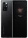

# 网格布局
:::tip
CSS网格是一个用于web的二维布局系统。利用网格，你可以把内容按照行与列的格式进行排版。另外，网格还能非常轻松地实现一些复杂的布局。
:::

+ [什么是Grid布局？](https://blog.csdn.net/weixin_45786214/article/details/106986728)

## grid容器与子项
+ 定义网格及fr单位
+ 合并网格及网格命名
+ 网格间隙及简写
+ 网格对齐方式及简写
+ 显示网格与隐式网格
+ 基于线的元素放置
+ 子项对齐方式
+ repeat()与minmax()

- 比定位更方便的叠加布局
- 多种组合排列布局
- 栅格布局
- 容器自适应行列布局

### grid容器
<div>
  
</div>

### grid子项
<div>
  
</div>

## 定义网格及fr单位

[使用fr单位的灵活网格](https://developer.mozilla.org/zh-CN/docs/Learn/CSS/CSS_layout/Grids)

> 基于网格行和列的维度，去定义网格线的名称和网格轨道的尺寸大小
> 
> grid-template-rows & grid-template-columns

```html
<!DOCTYPE html>
<html lang="en">
<head>
    <meta charset="UTF-8">
    <meta http-equiv="X-UA-Compatible" content="IE=edge">
    <meta name="viewport" content="width=device-width, initial-scale=1.0">
    <title>Document</title>
    <style>
        .main{
            width:300px;
            height:300px;
            background:skyblue;
            display: grid;
            /* grid-template-columns: 50px 50px 50px;
            grid-template-rows: 50px 50px 50px; */

            /* grid-template-columns: 50px 20% auto;
            grid-template-rows: 50px 50px; */

            grid-template-columns: 150px 1fr 1fr;
            grid-template-rows: 0.3fr 0.3fr;
        }
        .main div{
            background:pink;
        }
    </style>
</head>
<body>
    <div class="main">
        <div>1</div>
        <div>2</div>
        <div>3</div>
        <div>4</div>
        <div>5</div>
        <div>6</div>
    </div>
</body>
</html>
```

## 合并网格及网格命名
> 使用命名方式定义网格区域，需配合grid-area属性进行使用
> 
> grid-template-areas
>
> grid-template 缩写方式：grid-template-rows，grid-template-columns和grid-template-areas属性的缩写

```html
<!DOCTYPE html>
<html lang="en">
<head>
    <meta charset="UTF-8">
    <title>Document</title>
    <style>
        /* .main{
            width:300px;
            height:300px;
            background:skyblue;
            display: grid;
            grid-template-columns: 1fr 1fr 1fr;
            grid-template-rows: 1fr 1fr 1fr;
            grid-template-areas: 
            "a1 a1 a2"
            "a1 a1 a2"
            "a3 a3 a3";
        }
        .main div{
            background:pink;
            border:1px black solid;
            box-sizing: border-box;
        }
        .main div:nth-of-type(1){
            grid-area: a1;
        }
        .main div:nth-of-type(2){
            grid-area: a2;
        }
        .main div:nth-of-type(3){
            grid-area: a3;
        } */

        /* .main{
            width:300px;
            height:300px;
            background:skyblue;
            display: grid;
            grid-template-columns: 1fr 1fr 1fr;
            grid-template-rows: 1fr 1fr 1fr;
            grid-template-areas: 
            "a1 a2 a3";
        }
        .main div{
            background:pink;
            border:1px black solid;
            box-sizing: border-box;
        }
        .main div:nth-of-type(1){
            grid-area: a3;
        } */

        .main{
            width:300px;
            height:300px;
            background:skyblue;
            display: grid;
            /* grid-template-columns: 1fr 1fr 1fr;
            grid-template-rows: 1fr 1fr 1fr;
            grid-template-areas: 
            "a1 a1 a2"
            "a1 a1 a2"
            "a3 a3 a3"; */
            grid-template: 
            "a1 a1 a2" 1fr
            "a1 a1 a2" 1fr 
            "a3 a3 a3" 1fr
            / 1fr 1fr 1fr;
        }
        .main div {
            background:pink;
            border:1px black solid;
            box-sizing: border-box;
        }
        .main div:nth-of-type(1){
            grid-area: a1;
        }
        .main div:nth-of-type(2){
            grid-area: a2;
        }
        .main div:nth-of-type(3){
            grid-area: a3;
        }
    </style>
</head>
<body>
    <div class="main">
        <div>1</div>
        <div>2</div>
        <div>3</div>
    </div>
</body>
</html>
```

## 网格间隙及简写
> 使用 grid-row-gap & grid-column-gap 来设置间隙、不过这两个属性已经过时了、推荐使用row-gap，column-gap、gap

```html
<!DOCTYPE html>
<html lang="en">

<head>
  <meta charset="UTF-8">
  <title>Document</title>
  <style>
    .main {
      width: 300px;
      height: 300px;
      background-color: seagreen;
      display: grid;
      grid-template: 
      "a1 a1 a2" 1fr
      "a1 a1 a2" 1fr
      "a3 a3 a3" 1fr
      / 1fr 1fr 1fr;
      
      row-gap: 10px;
      column-gap: 10px;
    }

    .main div {
      background-color: cadetblue;
      border: 1px solid #ccc;
      box-sizing: border-box;
    }

    .main div:nth-of-type(1) {
      grid-area: a1;
    }

    .main div:nth-of-type(2) {
      grid-area: a2;
    }

    .main div:nth-of-type(3) {
      grid-area: a3;
    }

  </style>
</head>

<body>
  <div class="main">
    <div>1</div>
    <div>2</div>
    <div>3</div>
  </div>
</body>

</html>
```

## 网格对齐方式及简写
> justify-items、align-items、place-items（默认值stretch，指定了子项在网格中的对齐方式）
> 
> justify-content、align-content、place-content（默认值stretch，指定了所有网格在grid容器中的对齐方式）

```html
<!DOCTYPE html>
<html lang="en">

<head>
  <meta charset="UTF-8">
  <title>Document</title>
  <style>
    .main {
      width: 300px;
      height: 300px;
      background: skyblue;
      display: grid;
      grid-template-columns: 100px 100px 100px;
      grid-template-rows: 100px 100px 100px;
      /* justify-items: start;
            align-items: end; */
      place-items: end start;
    }

    .main div {
      width: 50px;
      height: 50px;
      background: pink;
    }

    .main2 {
      width: 500px;
      height: 500px;
      background: skyblue;
      display: grid;
      grid-template-columns: 100px 100px 100px;
      grid-template-rows: 100px 100px 100px;
      /* justify-content: space-evenly;
            align-content: end; */
      place-content: end space-evenly;
    }

    .main2 div {
      background: pink;
    }
  </style>
</head>

<body>
  <div class="main">
    <div>1</div>
    <div>2</div>
    <div>3</div>
    <div>4</div>
    <div>5</div>
    <div>6</div>
    <div>7</div>
    <div>8</div>
    <div>9</div>
  </div>

  <div class="main2">
    <div>1</div>
    <div>2</div>
    <div>3</div>
    <div>4</div>
    <div>5</div>
    <div>6</div>
    <div>7</div>
    <div>8</div>
    <div>9</div>
  </div>
</body>

</html>
```

## 显示网格与隐式网格
> grid-auto-flow、grid-auto-rows、grid-auto-columns（指定在显示网格之外的隐式网格，如何排列及尺寸大小）

```html
<!DOCTYPE html>
<html lang="en">

<head>
  <meta charset="UTF-8">
  <meta http-equiv="X-UA-Compatible" content="IE=edge">
  <meta name="viewport" content="width=device-width, initial-scale=1.0">
  <title>Document</title>
  <style>
    .main {
      width: 300px;
      height: 300px;
      background: skyblue;
      display: grid;
      /* grid-template-columns: 100px 100px 100px;
            grid-template-rows: 100px; */
      /* 默认：row 就是行产生隐式网格 */
      /* grid-auto-flow: row; */
      /* 可以调节产生隐式网格的高度 */
      /* grid-auto-rows: 100px; */

      grid-template-columns: 100px;
      grid-template-rows: 100px 100px 100px;
      /* column 就是列产生隐式网格 */
      grid-auto-flow: column;
      /* 可以调节产生隐式网格的宽度 */
      grid-auto-columns: 100px;
    }

    .main div {
      background: pink;
      border: 1px black solid;
      box-sizing: border-box;
    }

    .main2 {
      width: 300px;
      height: 300px;
      background: skyblue;
      display: grid;
      grid-template-columns: 100px 100px 100px;
      grid-template-rows: 100px;
      grid-auto-flow: row dense;
      /* dense 紧密的 */
      grid-auto-rows: 100px;
    }

    .main2 div {
      background: pink;
      border: 1px black solid;
      box-sizing: border-box;
    }

    .main2 div:nth-of-type(1) {
      grid-column-start: 2; /* 第一个元素排列起始位置 */
    }
  </style>
</head>

<body>
  <div class="main">
    <div>1</div>
    <div>2</div>
    <div>3</div>
    <div>4</div>
    <div>5</div>
  </div>
  <hr>
  <div class="main2">
    <div>1</div>
    <div>2</div>
    <div>3</div>
    <div>4</div>
    <div>5</div>
  </div>
</body>

</html>
```

## 基于线的元素放置

> grid-column-start、grid-column-end、grid-row-start、grid-row-end（表示grid子项所占据的区域的起始和终止位置，包括水平方向和垂直方向）
>  justify-self、align-self （跟place-item用法相同，只不过是操作指定的子项）

```html
<!DOCTYPE html>
<html lang="en">
<head>
    <meta charset="UTF-8">
    <style>
        .main{
            width:300px;
            height:300px;
            background:skyblue;
            display: grid;
            grid-template-columns: 1fr 1fr 1fr;
            grid-template-rows: 1fr 1fr 1fr;
        }
        .main div:nth-of-type(1){
            background:pink;
            grid-column-start: 2;
            grid-column-end: 3;
            /* 默认值：auto */
            /* grid-row-start: 1;
            grid-row-end: 2; */
        }
        .main div:nth-of-type(2){
            background:slategray;
        }
    </style>
</head>
<body>
    <div class="main">
        <div>1</div>
        <div>2</div>
    </div>
</body>
</html>
```

```html
<!DOCTYPE html>
<html lang="en">
<head>
    <meta charset="UTF-8">
    <meta http-equiv="X-UA-Compatible" content="IE=edge">
    <meta name="viewport" content="width=device-width, initial-scale=1.0">
    <title>Document</title>
    <style>
        .main{
            width:300px;
            height:300px;
            background:skyblue;
            display: grid;
            grid-template-columns:[col1] 1fr [col2] 1fr [col3] 1fr [col4];
            grid-template-rows:[row1] 1fr [row2] 1fr [row3] 1fr [row4];
        }
        .main div:nth-of-type(1){
            width:50px;
            height:50px;
            background:pink;
            justify-self: center;
            align-self: center;
            /* grid-column-start:2;
            grid-column-end:span 2; */
           /*  grid-column-start: col2;
            grid-column-end: col4; */

            /* grid-column: 2 / 3;
            grid-row: 2 / 4; */
            grid-area: 2 / 2 / 3 / 3;
        }
        .main div:nth-of-type(2){
            background:slategray;
        }
    </style>
</head>
<body>
    <div class="main">
        <div>1</div>
    </div>
</body>
</html>
```

## repeat() & minmax()
> repeat() 方法及 auto-fill 可选值、指定可重复的数值
>
> minmax()方法、设置最小和最大值的范围

### repeat()方法及 `auto-fill`
```html
<!DOCTYPE html>
<html lang="en">

<head>
  <meta charset="UTF-8">
  <style>
    .main {
      height: 400px;
      background: skyblue;
      display: grid;
      /* grid-template-columns: 100px 100px 100px; */
      /* grid-template-columns: repeat(3, 100px); */
      /* grid-template-columns: 150px 100px 100px; */
      /* grid-template-columns: 150px repeat(2, 100px); */
      grid-template-columns: repeat(auto-fill, 100px);
      grid-template-rows: 100px;
    }

    .main div {
      background: pink;
    }
  </style>
</head>

<body>
  <div class="main">
    <div>1</div>
    <div>2</div>
    <div>3</div>
    <div>4</div>
  </div>
</body>

</html>
```

### minmax()
```html
<!DOCTYPE html>
<html lang="en">
<head>
    <meta charset="UTF-8">
    <meta http-equiv="X-UA-Compatible" content="IE=edge">
    <meta name="viewport" content="width=device-width, initial-scale=1.0">
    <title>Document</title>
    <style>
        .main{
            height:400px;
            background:skyblue;
            display: grid;
            /* grid-template-columns: 100px 1fr 100px; */
            /* 最小值和最大值，页面缩小到100px以后不再缩小 */
            grid-template-columns: 100px minmax(100px, 1fr) 100px;
            grid-template-rows: 100px;
        }
        .main div{
            background:pink;
            border:1px black solid;
        }
    </style>
</head>
<body>
    <div class="main">
        <div>1</div>
        <div>2</div>
        <div>3</div>
    </div>
</body>
</html>
```

### repeat()和minmax()结合使用

```html
<!DOCTYPE html>
<html lang="en">
<head>
    <meta charset="UTF-8">
    <meta http-equiv="X-UA-Compatible" content="IE=edge">
    <meta name="viewport" content="width=device-width, initial-scale=1.0">
    <title>Document</title>
    <style>
        .main{
            background:skyblue;
            display: grid;
            grid-template-columns: repeat(auto-fill, minmax(200px, 1fr));
            grid-template-rows: 100px;
            grid-auto-rows: 100px;
            grid-gap:20px 20px;
        }
        .main div{
            background:pink;
            border:1px black solid;
        }
    </style>
</head>
<body>
    <div class="main">
        <div>1</div>
        <div>2</div>
        <div>3</div>
        <div>4</div>
        <div>5</div>
        <div>6</div>
        <div>7</div>
        <div>8</div>
        <div>9</div>
        <div>10</div>
        <div>11</div>
    </div>
</body>
</html>
```


## 比定位更方便的叠加布局
:::tip 解释
之前网页中很多层叠关系的元素通过定位来做的，学完网格布局后照样实现通过定位做的效果。
:::


```html
<!DOCTYPE html>
<html lang="en">

<head>
  <meta charset="UTF-8">
  <meta http-equiv="X-UA-Compatible" content="IE=edge">
  <meta name="viewport" content="width=device-width, initial-scale=1.0">
  <title>Document</title>
  <style>
    .main {
      width: 530px;
      height: 300px;
      background: skyblue;
      display: grid;
    }

    .main img {
      /* 
        如果听不懂的话可以参考【基于线的元素放置】章节
        这里通过基于线的元素放置原则实现了一个单元格的开始位置和结束位置
        如果图片,span,p标签都设为grid-area网格区域,他们都会在同一个区域(单元格)中
        然后通过操作指定的子项(justify-self水平，align-self垂直)方式来实现元素的位置

        grid-row-start: 1;
        grid-column-start: 1;
        grid-row-end: 1;
        grid-column-end: 1;
     */
      grid-area: 1/1/1/1;
    }

    .main span {
      grid-area: 1/1/1/1;
      justify-self: end;
      align-self: end;
      margin: 5px;
    }

    .main p {
      grid-area: 1/1/1/1;
      align-self: center;
      margin: 0;
      padding: 0;
      background: rgba(0, 0, 0, 0.5);
      height: 30px;
      line-height: 30px;
      color: white;
    }
  </style>
</head>

<body>
  <div class="main">
    
    <span>自制</span>
    <p>手机热卖中.....</p>
  </div>
</body>

</html>
```

## 多种组合排列布局


```html
<!DOCTYPE html>
<html lang="en">

<head>
  <meta charset="UTF-8">
  <style>
    .main {
      width: 300px;
      height: 300px;
      background: skyblue;
      display: grid;
      grid-template-columns: repeat(3, 1fr);
      grid-template-rows: repeat(3, 1fr);
      gap: 5px;
    }

    .main div {
      background: pink;
    }

    .main div:nth-of-type(1) {
      grid-area: 1/1/span 2/span 2;
      /* grid-area: 2/1/span 2/span 2; */
    }
  </style>
</head>

<body>
  <div class="main">
    <div>1</div>
    <div>2</div>
    <div>3</div>
    <div>4</div>
    <div>5</div>
    <div>6</div>
  </div>
</body>

</html>
```

## 栅格布局

```html
<!DOCTYPE html>
<html lang="en">

<head>
  <meta charset="UTF-8">
  <meta http-equiv="X-UA-Compatible" content="IE=edge">
  <meta name="viewport" content="width=device-width, initial-scale=1.0">
  <title>Document</title>
  <style>
    .row {
      background: skyblue;
      display: grid;
      grid-template-columns: repeat(12, 1fr);
      grid-template-rows: 50px;
      grid-auto-rows: 50px;
    }

    .row div {
      background: pink;
      border: 1px black solid;
    }

    .row .col-1 {
      grid-area: auto/auto/auto/span 1;
    }

    .row .col-2 {
      grid-area: auto/auto/auto/span 2;
    }

    .row .col-3 {
      grid-area: auto/auto/auto/span 3;
    }

    .row .col-4 {
      grid-area: auto/auto/auto/span 4;
    }

    .row .col-5 {
      grid-area: auto/auto/auto/span 5;
    }

    .row .col-6 {
      grid-area: auto/auto/auto/span 6;
    }

    .row .col-7 {
      grid-area: auto/auto/auto/span 7;
    }

    .row .col-8 {
      grid-area: auto/auto/auto/span 8;
    }

    .row .col-9 {
      grid-area: auto/auto/auto/span 9;
    }

    .row .col-10 {
      grid-area: auto/auto/auto/span 10;
    }

    .row .col-11 {
      grid-area: auto/auto/auto/span 11;
    }

    .row .col-12 {
      grid-area: auto/auto/auto/span 12;
    }
  </style>
</head>

<body>
  <div class="row">
    <div class="col-6">1</div>
    <div class="col-3">2</div>
    <div class="col-4">3</div>
    <div class="col-5">4</div>
  </div>
</body>

</html>
```

## 综合案例
### 百度热词风云榜

::: demo [vanilla]
```html
<html>
<head>
  <!-- 这里使用的CDN地址，如果能正常显示效果请使用在xiaomi文件夹下reset.css文件 -->
  <!-- <link rel="stylesheet" href="https://cdnjs.cloudflare.com/ajax/libs/meyer-reset/2.0/reset.min.css"> -->
</head>
<body>
  <div class="top">
    <div class="top-title">今日上榜</div>
    <div class="top-list">
      <div class="theme1">
        <a href="#">
          <h3>实时热点</h3>
          <p>阿里第一颗芯</p>
        </a>
      </div>
      <div class="theme1"><a href="#">
          <h3>实时热点</h3>
          <p>阿里第一颗芯</p>
        </a>
      </div>
      <div class="theme2"><a href="#">
          <h3>实时热点</h3>
          <p>阿里第一颗芯</p>
        </a>
      </div>
      <div class="theme1"><a href="#">
          <h3>实时热点</h3>
          <p>阿里第一颗芯</p>
        </a>
      </div>
      <div class="theme1"><a href="#">
          <h3>实时热点</h3>
          <p>阿里第一颗芯</p>
        </a>
      </div>
      <div class="theme3"><a href="#">
          <h3>实时热点</h3>
          <p>阿里第一颗芯</p>
        </a></div>
      <div class="theme3"><a href="#">
          <h3>实时热点</h3>
          <p>阿里第一颗芯</p>
        </a>
      </div>
    </div>
    <div class="top-page">
      <span>1</span>
      <a href="#">2</a>
      <a href="#">3</a>
    </div>
  </div>
</body>

</html>
<style>
/* 这里需要用到reset.css能正常显示案例，因为引入reset.css会影响到整个页面 */

.top {
  width: 308px;
  border: 1px solid #dadadc;
  margin: 20px auto;
}

.top-title {
  height: 30px;
  line-height: 30px;
  font-size: 14px;
  font-weight: 900;
  color: #333;
  padding-left: 10px;
}

.top-list {
  height: 352px;
  display: grid;
  padding: 0 14px;
  grid-template-columns: repeat(3, 1fr);
  grid-template-rows: repeat(4, 1fr);
  gap: 8px;
  grid-template-areas:
    "a1 a3 a3"
    "a2 a3 a3"
    "a4 a4 a5"
    "a6 a7 a7"
  ;
}

.top-list a {
  width: 100%;
  height: 100%;
  display: block;
  color: white;
  line-height: 30px;
}

.top-list h3 {
  text-align: right;
  margin-right: 4px;
}

.top-list p {
  text-align: center;
}

.top-list div {
  background-color: seagreen;
}

.top-list div:nth-of-type(2) {
  grid-area: a3;
}

.top-list div:nth-of-type(4) {
  grid-area: a4;
}

.top-list div:nth-of-type(7) {
  grid-area: a7;
}

.theme1 {
  background-image: linear-gradient(#187fe6, #32aff2);
  border: 1px #2a9adc solid;
}

.theme2 {
  background-image: linear-gradient(#f2246c, #fe5bac);
  border: 1px #da2061 solid;
}

.theme3 {
  background-image: linear-gradient(#d46300, #e5ad1c);
  border: 1px #cd9818 solid;
}

.top-page {
  height: 40px;
  margin: 0 10px;
  display: flex;
  justify-content: flex-end;
  align-items: center;
}

.top-page a {
  border: 1px #cbcbcb solid;
  margin-left: 2px;
  padding: 3px 4px;
}

.top-page span {
  padding: 3px 4px;
}
</style> 
```
:::

### 小米商品导航菜单

::: demo [vanilla]
```html
<html>
<head>
    <link rel="stylesheet" href="./xiaomi/iconfont.css">
    <link rel="stylesheet" href="./xiaomi/reset.css">
</head>
<body>
    <ul class="nav">
        <li>
            <div>
                <a href="#">手机</a>
                <a href="#">电话卡</a>
            </div>
            <i class="iconfont icon-right-arrow"></i>
            <ul class="nav-menu">
                <li>
                    
                    <p>小米 MIX FOLD</p>
                </li>
                <li>
                    
                    <p>小米 MIX FOLD</p>
                </li>
                <li>
                    
                    <p>小米 MIX FOLD</p>
                </li>
                <li>
                    
                    <p>小米 MIX FOLD</p>
                </li>
                <li>
                    
                    <p>小米 MIX FOLD</p>
                </li>
            </ul>
        </li>
        <li>
            <div>
                <a href="#">笔记本</a>
                <a href="#">显示器</a>
                <a href="#">平板</a>
            </div>
            <i class="iconfont icon-right-arrow"></i>
            <ul class="nav-menu">
                <li>
                    
                    <p>小米 MIX FOLD</p>
                </li>
                <li>
                    
                    <p>小米 MIX FOLD</p>
                </li>
                <li>
                    
                    <p>小米 MIX FOLD</p>
                </li>
                <li>
                    
                    <p>小米 MIX FOLD</p>
                </li>
                <li>
                    
                    <p>小米 MIX FOLD</p>
                </li>
                <li>
                    
                    <p>小米 MIX FOLD</p>
                </li>
                <li>
                    
                    <p>小米 MIX FOLD</p>
                </li>
                <li>
                    
                    <p>小米 MIX FOLD</p>
                </li>
                <li>
                    
                    <p>小米 MIX FOLD</p>
                </li>
            </ul>
        </li>
        <li>
            <div>
                <a href="#">手机</a>
                <a href="#">电话卡</a>
            </div>
            <i class="iconfont icon-right-arrow"></i>
            <ul class="nav-menu">
                <li>
                    
                    <p>小米 MIX FOLD</p>
                </li>
                <li>
                    
                    <p>小米 MIX FOLD</p>
                </li>
                <li>
                    
                    <p>小米 MIX FOLD</p>
                </li>
                <li>
                    
                    <p>小米 MIX FOLD</p>
                </li>
                <li>
                    
                    <p>小米 MIX FOLD</p>
                </li>
                <li>
                    
                    <p>小米 MIX FOLD</p>
                </li>
                <li>
                    
                    <p>小米 MIX FOLD</p>
                </li>
                <li>
                    
                    <p>小米 MIX FOLD</p>
                </li>
                <li>
                    
                    <p>小米 MIX FOLD</p>
                </li>
                <li>
                    
                    <p>小米 MIX FOLD</p>
                </li>
                <li>
                    
                    <p>小米 MIX FOLD</p>
                </li>
                <li>
                    
                    <p>小米 MIX FOLD</p>
                </li>
                <li>
                    
                    <p>小米 MIX FOLD</p>
                </li>
                <li>
                    
                    <p>小米 MIX FOLD</p>
                </li>
            </ul>
        </li>
        <li>
            <div>
                <a href="#">笔记本</a>
                <a href="#">显示器</a>
                <a href="#">平板</a>
            </div>
            <i class="iconfont icon-right-arrow"></i>
        </li>
        <li>
            <div>
                <a href="#">手机</a>
                <a href="#">电话卡</a>
            </div>
            <i class="iconfont icon-right-arrow"></i>
        </li>
        <li>
            <div>
                <a href="#">笔记本</a>
                <a href="#">显示器</a>
                <a href="#">平板</a>
            </div>
            <i class="iconfont icon-right-arrow"></i>
        </li>
    </ul>
</body>
</html>

<style>
    .nav{
        width:233px;
        height:100vh;
        background:rgba(0,0,0,0.5);
    }
    .nav>li{
        display: flex;
        justify-content: space-between;
        align-items: center;
        height:42px;
        padding:0 28px;
        cursor: pointer;
        color: white;
        position: relative;
    }
    .nav>li a{
        color:inherit;
    }
    .nav>li:hover{
        background:#ff6801;
    }
    .nav>li:hover .nav-menu{
        display: grid;
    }
    .nav-menu{
        display: none;
        position: absolute;
        left:100%;
        top:0;
        height: 460px;
        grid-template-rows: repeat(6, 1fr);
        grid-template-columns: 305px;
        grid-auto-flow: column;
        grid-auto-columns: 305px;
        background:white;
        border:1px #e1e1e1 solid;
        box-shadow: 5px 5px 10px #ccc;
        color: #36303c;
    }
    .nav-menu>li{
        display: flex;
        align-items: center;
    }
    .nav-menu>li>img{
        margin-left:26px;
        margin-right:21px;
    }
</style>
```
:::

### 后台管理系统网格布局 [grid-area写法说明](https://www.cnblogs.com/mengff/p/15670596.html)

::: demo [vanilla]
```html
<html>
<body>
  <div class="main">
    <div class="header">header</div>
    <div class="left">left</div>
    <div class="center">center</div>
    <div class="right">right</div>
    <div class="footer">footer</div>
  </div>
</body>
</html>

<style>
  body {
    margin: 0;
  }

  .main {
    background: skyblue;
    display: grid;
    grid-template-columns: 100px 1fr 100px;
    grid-template-rows: 100px 300px 100px;
    gap: 10px;
  }

  .main div {
    background: pink;
    display: flex;
    align-items: center;
    justify-content: center;
  }

  .main div:first-of-type {
    /* 通常的情况是我们只关心跨越几行几列，并不关心它的结束行号 span 1/span 3*/
    grid-area: 1/1/span 1/span 3;
  }

  .main div:last-of-type {
    grid-area: 3/1/span 1/span 3;
  }
</style>
```