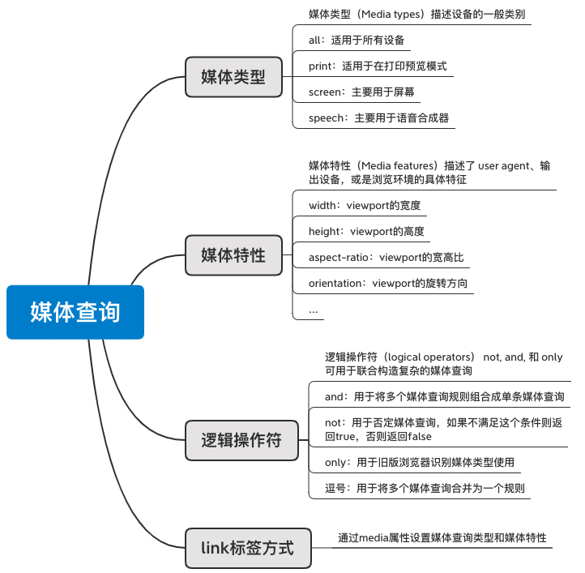
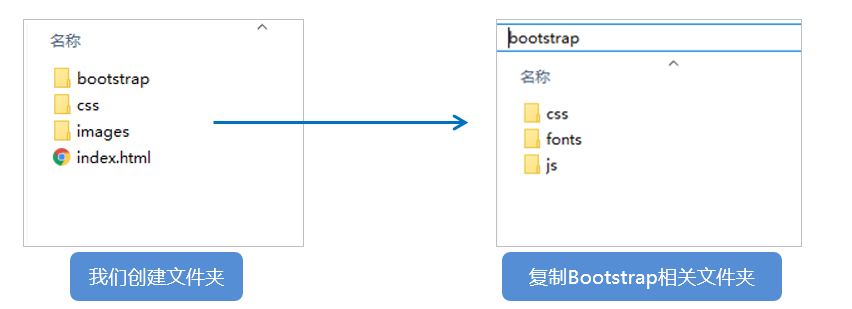

# 移动端WEB开发之响应式布局

## 1.0 响应式开发原理 

### 1.1 响应式开发原理

就是使用媒体查询针对不同宽度的设备进行布局和样式的设置，从而适配不同设备的目的。

设备的划分情况：

+ 小于768的为超小屏幕（手机）
+ 768~992之间的为小屏设备（平板）
+ 992~1200的中等屏幕（桌面显示器）
+ 大于1200的宽屏设备（大桌面显示器）

<div>
  
</div>

::: demo [vanilla]
```html
<html>

<head>
    <!-- portrait该设备是纵向的，即高度大于或等于宽度。landscape设备处于横向方向，即宽度大于高度。 -->
    <link rel="stylesheet" href="./a.css" media="(orientation: portrait)">
    <link rel="stylesheet" href="./b.css" media="(orientation: landscape)">
</head>

<body>
    <div class="box">aaaaaaaaaa</div>
</body>

</html>

<style>
  /* @media print {
      .box{
          font-size: 60px;
      }
  } */

  /* max-width: 1200px */
  /* @media ( min-width: 700px ) {  
      .box {
          width: 200px;
          height: 200px;
          background: pink;
      }
  } */

  /* orientation是手机横着排的意思（旋转） */
  /* @media (orientation: portrait) {
      .box {
          width: 200px;
          height: 200px;
          background: pink;
      }
  }

  @media (orientation: landscape) {
      .box {
          width: 200px;
          height: 200px;
          background: skyblue;
      }
  } */

  /* @media screen and ( min-width: 700px ) and (max-width: 1200px) {  
      .box {
          width: 200px;
          height: 200px;
          background: pink;
      }
  } */

  /* @media not screen and ( min-width: 700px ) {  
      .box {
          width: 200px;
          height: 200px;
          background: pink;
      }
  } */

  /* @media screen , print and ( min-width: 700px ) {  
      .box {
          width: 200px;
          height: 200px;
          background: pink;
      }
  } */
</style>
```
:::

### 1.2 媒体查询的编写位置及顺序

+ 添加到样式表的地步、对CSS进行优先级的覆盖
+ 移动端 -> PC端的设配原则：`min-width` 从小到大
+ PC端 -> 移动端的设配原则：`max-width` 从大到小

::: demo [vanilla]
```html
<html>
<body>
  <div class="box">aaaaaa</div>
</body>
</html>

<style>
  /* .box{
          width:100px;
          height:100px;
          background:blue;
      }

      @media (min-width: 700px) {
          .box{
              background: pink;
          }
      } */

  /* .box{
          width:100px;
          height:100px;
          background:blue;
      }
      */
  /* 如何多条件的时候，min-width编写顺序：从小到大进行适配 */
  /* 如果先写min-width: 1000px，然后再写min-width: 700px的话min-width: 1000px永远都不会生效的，因为它是按顺序来的*/
  /* min-width方式：移动优先的原则，先编写移动端设备，然后响应式过渡到PC端 */
  /* @media (min-width: 700px) {
          .box{
              background: pink;
          }
      }

      @media (min-width: 1000px) {
          .box{
              background: green;
          }
      } */


  /* 如何从PC端响应式过渡到移动端？ max-width , 从大到小区编写 */

  .box {
    width: 100px;
    height: 100px;
    background: blue;
  }

  @media (max-width: 1000px) {
    .box {
      background: pink;
    }
  }

  @media (max-width: 700px) {
    .box {
      background: green;
    }
  }
</style>
```
:::

### 1.3 响应断点（阈值）设定

+ Extra small < 576px
+ Small >= 576px、-sm
+ Medium >= 768px、-md
+ Large >= 992px、-lg
+ X-Large >= 1200px、-xl
+ XX-Large >= 1400px、-xxl

::: demo [vanilla]
```html
<html>
<body>
  <div class="d-none">11111</div>
  <div class="d-sm-none">22222</div>
  <div class="d-md-none">33333</div>
  <div class="d-lg-none">44444</div>
  <div class="d-xl-none">55555</div>
  <div class="d-xxl-none">66666</div>
</body>
</html>

<style>
  .d-none {
    display: none;
  }

  @media (min-width: 576px) {
    .d-sm-none {
      display: none;
    }
  }

  @media (min-width: 768px) {
    .d-md-none {
      display: none;
    }
  }

  @media (min-width: 992px) {
    .d-lg-none {
      display: none;
    }
  }

  @media (min-width: 1200px) {
    .d-xl-none {
      display: none;
    }
  }

  @media (min-width: 1400px) {
    .d-xxl-none {
      display: none;
    }
  }
</style>
```
:::

### 1.4 响应式栅格系统

+ 栅格（网格）布局 + 断点设定

::: demo [vanilla]
```html
<html>
<body>
  <!-- <div class="row">
        <div class="col-3">col-3</div>
        <div class="col-3">col-3</div>
        <div class="col-3">col-3</div>
        <div class="col-3">col-3</div>
    </div>
    <div class="row">
        <div class="col-sm-3">col-sm-3</div>
        <div class="col-sm-3">col-sm-3</div>
        <div class="col-sm-3">col-sm-3</div>
        <div class="col-sm-3">col-sm-3</div>
    </div>
    <div class="row">
        <div class="col-md-3">col-md-3</div>
        <div class="col-md-3">col-md-3</div>
        <div class="col-md-3">col-md-3</div>
        <div class="col-md-3">col-md-3</div>
    </div>
    <div class="row">
        <div class="col-lg-3">col-lg-3</div>
        <div class="col-lg-3">col-lg-3</div>
        <div class="col-lg-3">col-lg-3</div>
        <div class="col-lg-3">col-lg-3</div>
    </div>
    <div class="row">
        <div class="col-xl-3">col-xl-3</div>
        <div class="col-xl-3">col-xl-3</div>
        <div class="col-xl-3">col-xl-3</div>
        <div class="col-xl-3">col-xl-3</div>
    </div>
    <div class="row">
        <div class="col-xxl-3">col-xxl-3</div>
        <div class="col-xxl-3">col-xxl-3</div>
        <div class="col-xxl-3">col-xxl-3</div>
        <div class="col-xxl-3">col-xxl-3</div>
    </div> -->

  <div class="row">
    <div class="col-xxl-3 col-lg-4 col-sm-6">col</div>
    <div class="col-xxl-3 col-lg-4 col-sm-6">col</div>
    <div class="col-xxl-3 col-lg-4 col-sm-6">col</div>
    <div class="col-xxl-3 col-lg-4 col-sm-6">col</div>
    <div class="col-xxl-3 col-lg-4 col-sm-6">col</div>
    <div class="col-xxl-3 col-lg-4 col-sm-6">col</div>
    <div class="col-xxl-3 col-lg-4 col-sm-6">col</div>
    <div class="col-xxl-3 col-lg-4 col-sm-6">col</div>
    <div class="col-xxl-3 col-lg-4 col-sm-6">col</div>
    <div class="col-xxl-3 col-lg-4 col-sm-6">col</div>
    <div class="col-xxl-3 col-lg-4 col-sm-6">col</div>
    <div class="col-xxl-3 col-lg-4 col-sm-6">col</div>
  </div>
</body>
</html>

<style>
  .row {
    background: skyblue;
    display: grid;
    grid-template-columns: repeat(12, 1fr);
    grid-template-rows: 50px;
    grid-auto-rows: 50px;
  }

  .row div {
    background: pink;
    border: 1px black solid;
    grid-area: auto/auto/auto/span 12;
  }

  .row .col-1 {
    grid-area: auto/auto/auto/span 1;
  }

  .row .col-2 {
    grid-area: auto/auto/auto/span 2;
  }

  .row .col-3 {
    grid-area: auto/auto/auto/span 3;
  }

  .row .col-4 {
    grid-area: auto/auto/auto/span 4;
  }

  .row .col-5 {
    grid-area: auto/auto/auto/span 5;
  }

  .row .col-6 {
    grid-area: auto/auto/auto/span 6;
  }

  .row .col-7 {
    grid-area: auto/auto/auto/span 7;
  }

  .row .col-8 {
    grid-area: auto/auto/auto/span 8;
  }

  .row .col-9 {
    grid-area: auto/auto/auto/span 9;
  }

  .row .col-10 {
    grid-area: auto/auto/auto/span 10;
  }

  .row .col-11 {
    grid-area: auto/auto/auto/span 11;
  }

  .row .col-12 {
    grid-area: auto/auto/auto/span 12;
  }

  @media (min-width: 576px) {
    .row .col-sm-1 {
      grid-area: auto/auto/auto/span 1;
    }

    .row .col-sm-2 {
      grid-area: auto/auto/auto/span 2;
    }

    .row .col-sm-3 {
      grid-area: auto/auto/auto/span 3;
    }

    .row .col-sm-4 {
      grid-area: auto/auto/auto/span 4;
    }

    .row .col-sm-5 {
      grid-area: auto/auto/auto/span 5;
    }

    .row .col-sm-6 {
      grid-area: auto/auto/auto/span 6;
    }

    .row .col-sm-7 {
      grid-area: auto/auto/auto/span 7;
    }

    .row .col-sm-8 {
      grid-area: auto/auto/auto/span 8;
    }

    .row .col-sm-9 {
      grid-area: auto/auto/auto/span 9;
    }

    .row .col-sm-10 {
      grid-area: auto/auto/auto/span 10;
    }

    .row .col-sm-11 {
      grid-area: auto/auto/auto/span 11;
    }

    .row .col-sm-12 {
      grid-area: auto/auto/auto/span 12;
    }
  }

  @media (min-width: 768px) {
    .row .col-md-1 {
      grid-area: auto/auto/auto/span 1;
    }

    .row .col-md-2 {
      grid-area: auto/auto/auto/span 2;
    }

    .row .col-md-3 {
      grid-area: auto/auto/auto/span 3;
    }

    .row .col-md-4 {
      grid-area: auto/auto/auto/span 4;
    }

    .row .col-md-5 {
      grid-area: auto/auto/auto/span 5;
    }

    .row .col-md-6 {
      grid-area: auto/auto/auto/span 6;
    }

    .row .col-md-7 {
      grid-area: auto/auto/auto/span 7;
    }

    .row .col-md-8 {
      grid-area: auto/auto/auto/span 8;
    }

    .row .col-md-9 {
      grid-area: auto/auto/auto/span 9;
    }

    .row .col-md-10 {
      grid-area: auto/auto/auto/span 10;
    }

    .row .col-md-11 {
      grid-area: auto/auto/auto/span 11;
    }

    .row .col-md-12 {
      grid-area: auto/auto/auto/span 12;
    }
  }

  @media (min-width: 992px) {
    .row .col-lg-1 {
      grid-area: auto/auto/auto/span 1;
    }

    .row .col-lg-2 {
      grid-area: auto/auto/auto/span 2;
    }

    .row .col-lg-3 {
      grid-area: auto/auto/auto/span 3;
    }

    .row .col-lg-4 {
      grid-area: auto/auto/auto/span 4;
    }

    .row .col-lg-5 {
      grid-area: auto/auto/auto/span 5;
    }

    .row .col-lg-6 {
      grid-area: auto/auto/auto/span 6;
    }

    .row .col-lg-7 {
      grid-area: auto/auto/auto/span 7;
    }

    .row .col-lg-8 {
      grid-area: auto/auto/auto/span 8;
    }

    .row .col-lg-9 {
      grid-area: auto/auto/auto/span 9;
    }

    .row .col-lg-10 {
      grid-area: auto/auto/auto/span 10;
    }

    .row .col-lg-11 {
      grid-area: auto/auto/auto/span 11;
    }

    .row .col-lg-12 {
      grid-area: auto/auto/auto/span 12;
    }
  }

  @media (min-width: 1200px) {
    .row .col-xl-1 {
      grid-area: auto/auto/auto/span 1;
    }

    .row .col-xl-2 {
      grid-area: auto/auto/auto/span 2;
    }

    .row .col-xl-3 {
      grid-area: auto/auto/auto/span 3;
    }

    .row .col-xl-4 {
      grid-area: auto/auto/auto/span 4;
    }

    .row .col-xl-5 {
      grid-area: auto/auto/auto/span 5;
    }

    .row .col-xl-6 {
      grid-area: auto/auto/auto/span 6;
    }

    .row .col-xl-7 {
      grid-area: auto/auto/auto/span 7;
    }

    .row .col-xl-8 {
      grid-area: auto/auto/auto/span 8;
    }

    .row .col-xl-9 {
      grid-area: auto/auto/auto/span 9;
    }

    .row .col-xl-10 {
      grid-area: auto/auto/auto/span 10;
    }

    .row .col-xl-11 {
      grid-area: auto/auto/auto/span 11;
    }

    .row .col-xl-12 {
      grid-area: auto/auto/auto/span 12;
    }
  }

  @media (min-width: 1400px) {
    .row .col-xxl-1 {
      grid-area: auto/auto/auto/span 1;
    }

    .row .col-xxl-2 {
      grid-area: auto/auto/auto/span 2;
    }

    .row .col-xxl-3 {
      grid-area: auto/auto/auto/span 3;
    }

    .row .col-xxl-4 {
      grid-area: auto/auto/auto/span 4;
    }

    .row .col-xxl-5 {
      grid-area: auto/auto/auto/span 5;
    }

    .row .col-xxl-6 {
      grid-area: auto/auto/auto/span 6;
    }

    .row .col-xxl-7 {
      grid-area: auto/auto/auto/span 7;
    }

    .row .col-xxl-8 {
      grid-area: auto/auto/auto/span 8;
    }

    .row .col-xxl-9 {
      grid-area: auto/auto/auto/span 9;
    }

    .row .col-xxl-10 {
      grid-area: auto/auto/auto/span 10;
    }

    .row .col-xxl-11 {
      grid-area: auto/auto/auto/span 11;
    }

    .row .col-xxl-12 {
      grid-area: auto/auto/auto/span 12;
    }
  }
</style>
```
:::

### 1.5 响应式交互实现

::: demo [vanilla]
```html
<html>
<body>
  <label for="menu">
    <span>
      菜单按钮
    </span>
  </label>
  <input id="menu" type="checkbox">
  <ul>
    <li>首页</li>
    <li>教程</li>
    <li>论坛</li>
    <li>文章</li>
  </ul>
</body>
</html>

<style>
  ul {
    display: none;
  }

  input {
    display: none;
  }

  input:checked+ul {
    display: block;
  }

  @media (min-width: 700px) {
    ul {
      display: block;
    }

    span {
      display: none;
    }
  }
</style>
```
:::

### 1.6 响应式布局容器

响应式需要一个父级做为布局容器，来配合子级元素来实现变化效果。

原理就是在不同屏幕下，通过媒体查询来改变这个布局容器的大小，再改变里面子元素的排列方式和大小，从而实现不同屏幕下，看到不同的页面布局和样式变化。

父容器版心的尺寸划分

+ 超小屏幕（手机，小于 768px）：设置宽度为 100%
+ 小屏幕（平板，大于等于 768px）：设置宽度为 750px
+ 中等屏幕（桌面显示器，大于等于 992px）：宽度设置为 970px
+ 大屏幕（大桌面显示器，大于等于 1200px）：宽度设置为 1170px 

但是我们也可以根据实际情况自己定义划分

##  2.0 bootstrap的介绍

### 2.1Bootstrap简介

Bootstrap 来自 Twitter（推特），是目前最受欢迎的前端框架。Bootstrap 是基于HTML、CSS 和 JAVASCRIPT 的，它简洁灵活，使得 Web 开发更加快捷。

+ [中文网](lhttp://www.bootcss.com/)  
+ [官网](lhttp://getbootstrap.com/)  
+ [推荐网站](http://bootstrap.css88.com/) 
+ [getbootstrap](https://getbootstrap.com/)

框架：顾名思义就是一套架构，它有一套比较完整的网页功能解决方案，而且控制权在框架本身，有预制样式库、组件和插件。使用者要按照框架所规定的某种规范进行开发。

+ [响应式框架bootstrap](../source_code/chapter_7/7_7/响应式框架bootstrap.md)
+ [响应式案例：博客](../source_code/chapter_7/7_8/ghost.html)

### 2.2 bootstrap优点

+ 标准化的html+css编码规范
+ 提供了一套简洁、直观、强悍的组件
+ 有自己的生态圈，不断的更新迭代
+ 让开发更简单，提高了开发的效率

### 2.3 版本简介

2.x.x：停止维护,兼容性好,代码不够简洁，功能不够完善。

3.x.x：目前使用最多,稳定,但是放弃了IE6-IE7。对 IE8 支持但是界面效果不好,偏向用于开发响应式布局、移动设备优先的WEB 项目。

4.x.x：最新版，目前还不是很流行

### 2.4bootstrap基本使用

在现阶段我们还没有接触JS相关课程，所以我们只考虑使用它的样式库。

Bootstrap 使用四步曲： 

1. 创建文件夹结构  


   ​

2. 创建 html 骨架结构 

```html
<!DOCTYPE html>
<html lang="zh-CN">
  <head>
    <meta charset="utf-8">
    <meta http-equiv="X-UA-Compatible" content="IE=edge">
    <meta name="viewport" content="width=device-width, initial-scale=1">
    <!-- 上述3个meta标签*必须*放在最前面，任何其他内容都*必须*跟随其后！ -->
    <title>Bootstrap 101 Template</title>

    <!-- Bootstrap -->
    <link href="css/bootstrap.min.css" rel="stylesheet">

    <!-- HTML5 shim and Respond.js for IE8 support of HTML5 elements and media queries -->
    <!-- WARNING: Respond.js doesn't work if you view the page via file:// -->
    <!--[if lt IE 9]>
      <script src="//cdn.bootcss.com/html5shiv/3.7.2/html5shiv.min.js"></script>
      <script src="//cdn.bootcss.com/respond.js/1.4.2/respond.min.js"></script>
    <![endif]-->
  </head>
  <body>
    <h1>你好，世界！</h1>

    <!-- jQuery (necessary for Bootstrap's JavaScript plugins) -->
    <script src="//cdn.bootcss.com/jquery/1.11.3/jquery.min.js"></script>
    <!-- Include all compiled plugins (below), or include individual files as needed -->
    <script src="js/bootstrap.min.js"></script>
  </body>
</html>
```

3. 引入相关样式文件  

```html
<!-- Bootstrap 核心样式-->
<link rel="stylesheet" href="bootstrap/css/bootstrap.min.css">
```

4. 书写内容 

直接拿Bootstrap 预先定义好的样式来使用

修改Bootstrap 原来的样式，注意权重问题

学好Bootstrap 的关键在于知道它定义了哪些样式，以及这些样式能实现什么样的效果

### 2.5 bootstrap布局容器

Bootstrap 需要为页面内容和栅格系统包裹一个 .container 或者.container-fluid 容器，它提供了两个作此用处的类。

.container

+ 响应式布局的容器  固定宽度
+ 大屏 ( >=1200px)  宽度定为 1170px
+ 中屏 ( >=992px)   宽度定为  970px
+ 小屏 ( >=768px)   宽度定为  750px
+ 超小屏  (100%) 

.container-fluid

+ 流式布局容器 百分百宽度
+ 占据全部视口（viewport）的容器。

### 2.6 bootstrap栅格系统

Bootstrap提供了一套响应式、移动设备优先的流式栅格系统，随着屏幕或视口（viewport）尺寸的增加，系统会自动分为最多12列。

栅格系统用于通过一系列的行（row）与列（column）的组合来创建页面布局，你的内容就可以放入这些创建好的布局中。

+ 按照不同屏幕划分为1~12 等份
+ 行（row） 可以去除父容器作用15px的边距
+ xs-extra small：超小； sm-small：小；  md-medium：中等； lg-large：大；
+ 列（column）大于 12，多余的“列（column）”所在的元素将被作为一个整体另起一行排列
+ 每一列默认有左右15像素的 padding
+ 可以同时为一列指定多个设备的类名，以便划分不同份数  例如 class="col-md-4 col-sm-6"

栅格嵌套

栅格系统内置的栅格系统将内容再次嵌套。简单理解就是一个列内再分成若干份小列。我们可以通过添加一个新的 .row 元素和一系列 .col-sm-* 元素到已经存在的 .col-sm-*
元素内。

```
<!-- 列嵌套 -->
 <div class="col-sm-4">
    <div class="row">
         <div class="col-sm-6">小列</div>
         <div class="col-sm-6">小列</div>
    </div>
</div>

```

列偏移

使用 .col-md-offset-* 类可以将列向右侧偏移。这些类实际是通过使用 * 选择器为当前元素增加了左侧的边距（margin）。

```
 <!-- 列偏移 -->
  <div class="row">
      <div class="col-lg-4">1</div>
      <div class="col-lg-4 col-lg-offset-4">2</div>
  </div>

```

列排序

通过使用 .col-md-push-* 和 .col-md-pull-* 类就可以很容易的改变列（column）的顺序。

```
 <!-- 列排序 -->
  <div class="row">
      <div class="col-lg-4 col-lg-push-8">左侧</div>
      <div class="col-lg-8 col-lg-pull-4">右侧</div>
  </div>

```

响应式工具

为了加快对移动设备友好的页面开发工作，利用媒体查询功能，并使用这些工具类可以方便的针对不同设备展示或隐藏页面内容。


## 3.0 阿里百秀案例制作

### 3.1 技术选型

方案：我们采取响应式页面开发方案

技术：bootstrap框架

设计图： 本设计图采用 1280px 设计尺寸

项目结构搭建

Bootstrap 使用四步曲： 

1. 创建文件夹结构  

2. 创建 html 骨架结构  
3. 引入相关样式文件  
4. 书写内容 

container宽度修改

因为本效果图采取 1280的宽度， 而Bootstrap 里面 container宽度 最大为 1170px，因此我们需要手动改下container宽度

```
 /* 利用媒体查询修改 container宽度适合效果图宽度  */
  @media (min-width: 1280px) { 
    .container { 
	width: 1280px; 
     } 
   }

```

