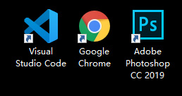

# 软件安装与课件获取方式

## 课程使用软件

1. VS Code编辑器，可官方直接下载(下载最新版或更新到最新版)，下载地址：https://code.visualstudio.com/
2. Chrome浏览器，可官方直接下载(下载最新版或更新到最新版)，下载地址：https://www.google.cn/chrome/
3. PhotoShop CC 2019工具，可官网直接下载(也可私信我，你懂的)，下载地址：https://www.adobe.com/products/photoshop.html

	
    
课程使用软件

## 课件获取方式

1. 项目组织，地址：https://git.imooc.com/coding-527
2. 源码仓库，地址：https://git.imooc.com/coding-527/source_code
3. 不会git操作的同学可发私信给我
