# 1. 起步

## 1. 1 uni-app 简介

[tet](./ts.html)


**uni-app 是一个使用 Vue.js 开发所有前端应用的框架** 。开发者编写一套代码，可发布到 iOS、Android、
H5、以及各种小程序（微信/支付宝/百度/头条/QQ/钉钉/淘宝）、快应用等多个平台。

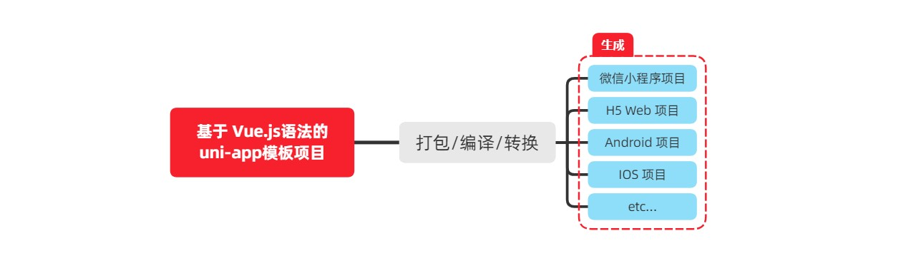
[详细的 uni-app 官方文档](https://uniapp.dcloud.net.cn/)

## 1. 2 开发工具

uni-app 官方推荐使用 **HBuilderX** 来开发 uni-app 类型的项目。主要好处：

+ 模板丰富
+ 完善的智能提示
+ 一键运行

> 当然，你依然可以根据自己的喜好，选择使用 VS Code、Sublime、记事本... 等自己喜欢的编辑器！
> 
## 1.2.1 下载 HBuilderX

1. 访问 HBuilderX 的官网首页 **https://www.dcloud.io/hbuilderx.html**
2. 点击首页的 `DOWNLOAD` 按钮
3. 选择下载 `正式版` -> `App开发版` 

## 1.2.2 安装 HBuilderX

1. 将下载的 zip包 进行解压缩
2. 将解压之后的文件夹，存放到 **纯英文** 的目录中（且不能包含括号等特殊字符）
3. 双击 `HBuilderX.exe` 即可启动 `HBuilderX`

## 1.2.3 安装 scss/sass 编译

为了方便编写样式（例如：`<style lang="scss"></style>`），建议安装 scss/sass 编译 插
件。[插件下载地址](https://ext.dcloud.net.cn/plugin?name=compile-node-sass)

进入插件下载页面之后，点击右上角的 使用 HBuilderX 导入插件 按钮进行自动安装，截图如下：

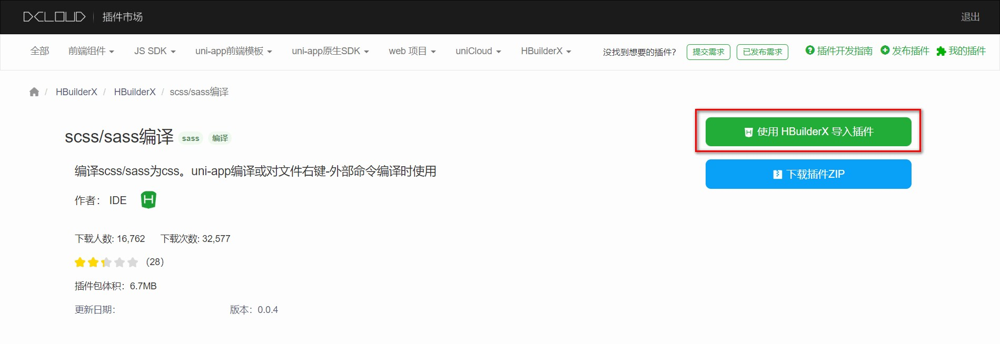

### 1. 2. 4 快捷键方案切换

操作步骤：工具 -> 预设快捷键方案切换 -> VS Code

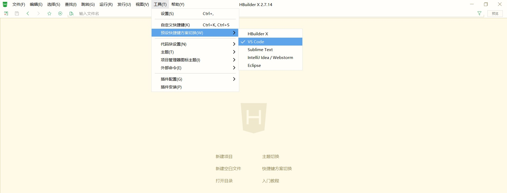

### 1. 2. 5 修改编辑器的基本设置

操作步骤：工具 -> 设置 -> 打开 Settings.json 按需进行配置

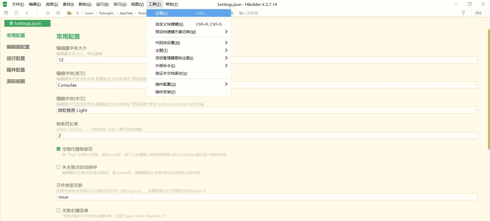

#### 源码视图 下可用的参考配置：

```json
{
 "editor.colorScheme": "Default",
 "editor.fontSize": 12,
 "editor.fontFamily": "Consolas",
 "editor.fontFmyCHS": "微软雅黑 Light",
 "editor.insertSpaces": true,
 "editor.lineHeight": "1.5",
 "editor.minimap.enabled": false,
}

// Tips：可以使用 Ctrl + 鼠标滚轮 缩放编辑器
```

## 1. 3 新建 uni-app 项目

#### 1. 文件 - > 新建 - > 项目
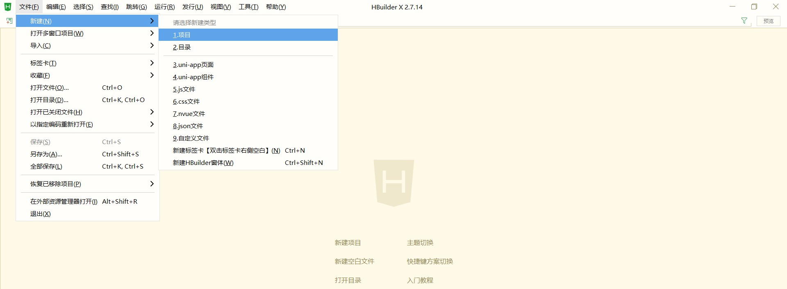

#### 2. 填写项目基本信息
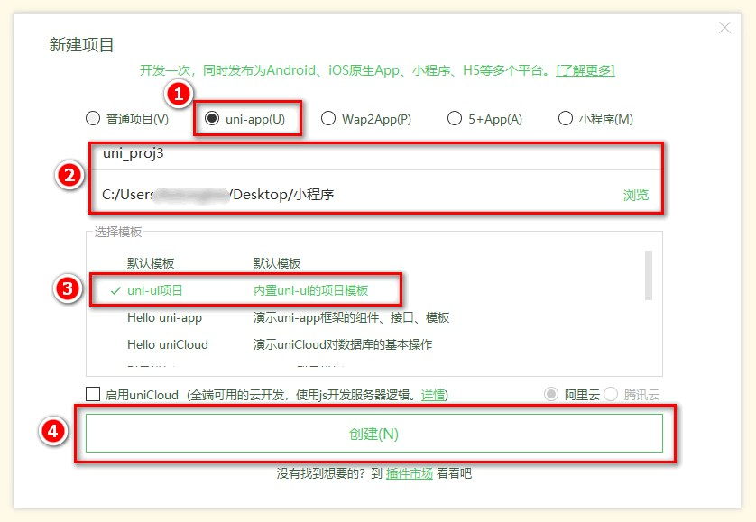

#### 3. 项目创建成功
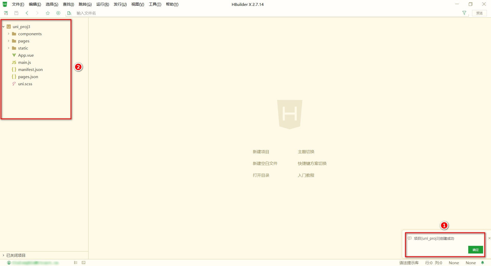

## 1. 4 目录结构

一个 uni-app 项目，默认包含如下目录及文件：

```
┌─components uni-app组件目录
│ └─comp-a.vue 可复用的a组件
├─pages 业务页面文件存放的目录
│ ├─index
│ │ └─index.vue index页面
│ └─list
│ └─list.vue list页面
├─static 存放应用引用静态资源（如图片、视频等）的目录，注意：静态资源只能存放于此
├─main.js Vue初始化入口文件
├─App.vue 应用配置，用来配置小程序的全局样式、生命周期函数等
├─manifest.json 配置应用名称、appid、logo、版本等打包信息
└─pages.json 配置页面路径、页面窗口样式、tabBar、navigationBar 等页面类信息
```

## 1. 5 把项目运行到微信开发者工具

1. 填写自己的微信小程序的 AppID：

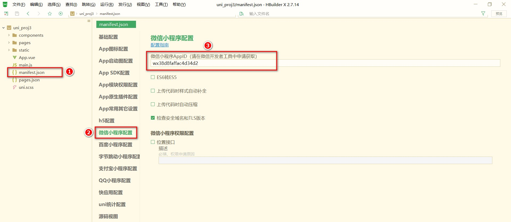

2. 在 HBuilderX 中，配置“微信开发者工具”的 **安装路径** ：

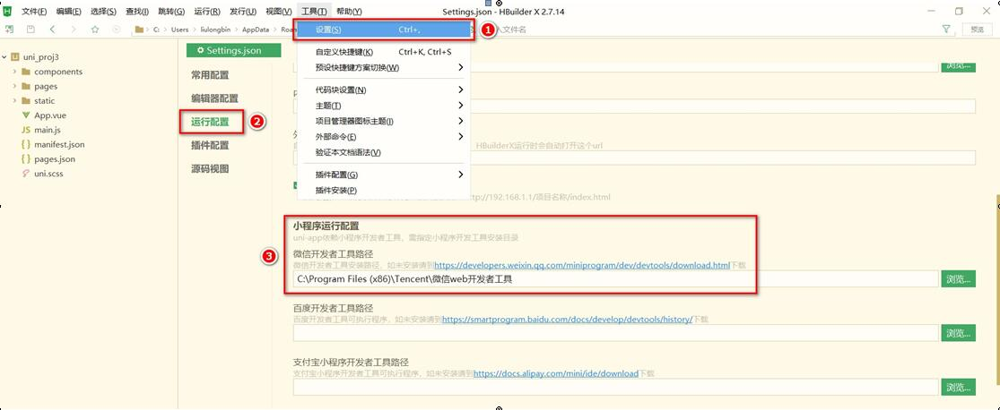

#### 3. 在微信开发者工具中，通过 `设置 - > 安全设置` 面板，开启“微信开发者工具”的 服务端口 ：

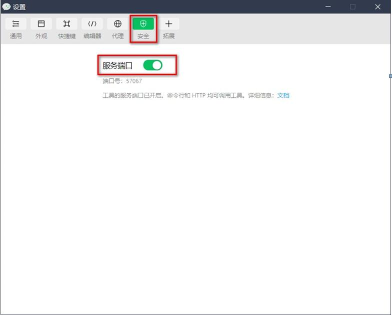

4. 在 HBuilderX 中，点击菜单栏中的 运行 - > 运行到小程序模拟器 - > 微信开发者工具，将当前 uni-app 项目编译之后，自动运行到微信开发者工具中，从而方便查看项目效果与调试：
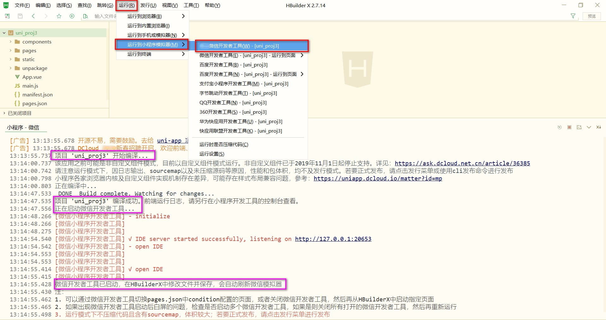

#### 5. 初次运行成功之后的项目效果：

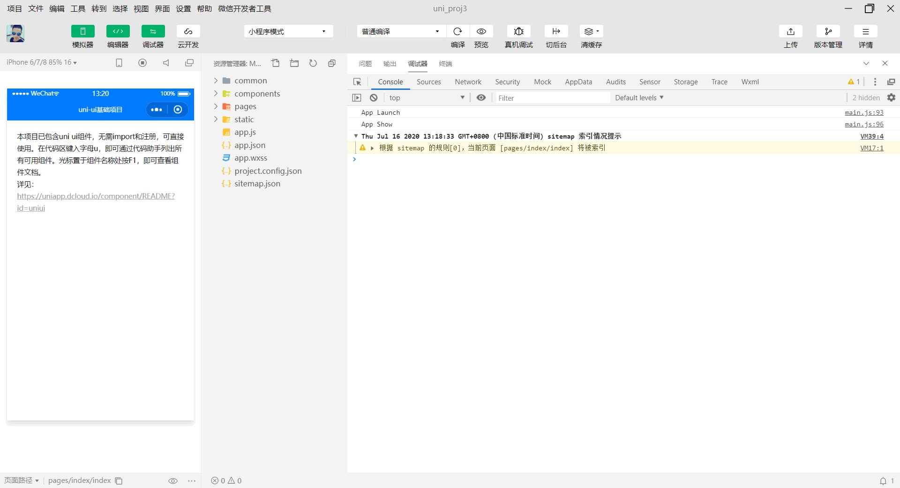

## 1.6 使用 Git 管理项目

### 1. 6. 1 本地管理

1. 在项目根目录中新建 `.gitignore` 忽略文件，并配置如下：

```js
# 忽略 node_modules 目录
/node_modules
/unpackage/dist
```

> 注意：由于我们忽略了 unpackage 目录中 仅有的 dist 目录，因此默认情况下， unpackage 目录不会被 Git 追踪

> 此时，为了让 Git 能够正常追踪 unpackage 目录，按照惯例，我们可以在 unpackage 目录下创建一个叫做 .gitkeep 的文件进行占位

1. 打开终端，切换到项目根目录中，运行如下的命令，初始化本地 Git 仓库：
> git init

#### 3. 将所有文件都加入到暂存区：
> git add .

#### 4. 本地提交更新：
> git commit -m "init project"


## 1. 6. 2 把项目托管到码云

1. 注册并激活码云账号（[注册页面地址](https://gitee.com/signup)）
2. 生成并配置 SSH 公钥
3. 创建空白的码云仓库
4. 把本地项目上传到码云对应的空白仓库中

# 2. tabBar

## 2.0 创建 tabBar 分支

运行如下的命令，基于 master 分支在本地创建 tabBar 子分支，用来开发和 tabBar 相关的功能：

> git checkout -b tabbar

## 2.1 创建 tabBar 页面

在 pages 目录中，创建首页(home)、分类(cate)、购物车(cart)、我的(my) 这 4 个 tabBar 页面。在HBuilderX 中，可以通过如下的两个步骤，快速新建页面：

1. 在 pages 目录上鼠标右键，选择 **新建页面**
2. 在弹出的窗口中，填写 **页面的名称** 、 **勾选 scss 模板** 之后，点击创建按钮。截图如下：

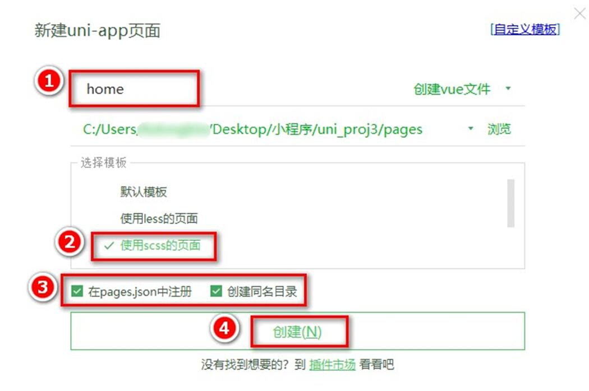

## 2.2 配置 tabBar 效果

1. 将 资料 目录下的 static 文件夹 拷贝一份，替换掉项目根目录中的 static 文件夹
2. 修改项目根目录中的 pages.json 配置文件，新增 tabBar 的配置节点如下：

```json
{
 "tabBar": {
 "selectedColor": "#C00000",
 "list": [
{
 "pagePath": "pages/home/home",
 "text": "首页",
 "iconPath": "static/tab_icons/home.png",
 "selectedIconPath": "static/tab_icons/home-active.png"
},
{
 "pagePath": "pages/cate/cate",
 "text": "分类",
 "iconPath": "static/tab_icons/cate.png",
 "selectedIconPath": "static/tab_icons/cate-active.png"
},
{
 "pagePath": "pages/cart/cart",
 "text": "购物车",
 "iconPath": "static/tab_icons/cart.png",
 "selectedIconPath": "static/tab_icons/cart-active.png"
},
{
 "pagePath": "pages/my/my",
 "text": "我的",
 "iconPath": "static/tab_icons/my.png",
 "selectedIconPath": "static/tab_icons/my-active.png"
}
]
}
}
```

## 2.3 删除默认的 index 首页

1. 在 HBuilderX 中，把 pages 目录下的 index首页文件夹 删除掉
2. 同时，把 page.json 中记录的 index 首页 路径删除掉
3. 为了防止小程序运行失败，在微信开发者工具中，手动删除 pages 目录下的 index 首页文件夹
1. 同时，把 components 目录下的 uni-link 组件文件夹 删除掉

## 2.4 修改导航条的样式效果

1. 打开 pages.json 这个全局的配置文件
2. 修改 globalStyle 节点如下：

```json
{
   "globalStyle": {
   "navigationBarTextStyle": "white",
   "navigationBarTitleText": "黑马优购",
   "navigationBarBackgroundColor": "#C00000",
   "backgroundColor": "#FFFFFF"
  }
}
```

## 2.5 分支的提交与合并

1. 将本地的 tabbar 分支进行本地的 commit 提交：
```ssh
git add.
git commit -m "完成了 tabBar 的开发"
```
2. 将本地的 tabbar 分支推送到远程仓库进行保存：
```ssh
git push -u origin tabbar
```
3. 将本地的 tabbar 分支合并到本地的 master 分支：
```ssh
git checkout master
git merge tabbar
```
4. 删除本地的 tabbar 分支：
```ssh
git branch -d tabbar
```

# 3. 首页

## 3. 0 创建 home 分支

运行如下的命令，基于 master 分支在本地创建 home 子分支，用来开发和 home 首页相关的功能：
```ssh
git checkout -b home
```

## 3. 1 配置网络请求

由于平台的限制，小程序项目中 **不支持 axios** ，而且原生的 wx.request() API 功能较为简单， **不支
持拦截器** 等全局定制的功能。因此，建议在 uni-app 项目中使用 @escook/request-miniprogram 第三方包发起网络数据请求。

> 请参考 @escook/request-miniprogram 的官方文档进行安装、配置、使用

[官方文档](https://www.npmjs.com/package/@escook/request-miniprogram)

最终，在项目的 main.js 入口文件中，通过如下的方式进行配置：

```js
  import { $http } from '@escook/request-miniprogram'

  uni.$http = $http
  // 配置请求根路径

  $http.baseUrl = 'https://www.uinav.com'
  // 请求开始之前做一些事情
  $http.beforeRequest = function (options) {
   uni.showLoading({
   title: '数据加载中...',
  })

  // 请求完成之后做一些事情
  $http.afterRequest = function () {
   uni.hideLoading()
  }
}
```

## 3. 2 轮播图区域

### 3. 2. 1 请求轮播图的数据

#### 实现步骤：

1. 在 data 中定义轮播图的数组
2. 在 onLoad 生命周期函数中调用获取轮播图数据的方法
3. 在 methods 中定义获取轮播图数据的方法

示例代码：

```js
export default {
 data() {
 return {
 // 1. 轮播图的数据列表，默认为空数组
 swiperList: [],
}
},
 onLoad() {
 // 2. 在小程序页面刚加载的时候，调用获取轮播图数据的方法
 this.getSwiperList()
},
 methods: {
 // 3. 获取轮播图数据的方法
 async getSwiperList() {
 // 3.1 发起请求
 const { data: res } = await uni.$http.get('/api/public/v1/home/swiperdata')
 // 3.2 请求失败
 if (res.meta.status !== 200) {
 return uni.showToast({
 title: '数据请求失败！',
 duration: 1500,
 icon: 'none',
})
}
 // 3.3 请求成功，为 data 中的数据赋值
 this.swiperList = res.message
},
},
}
```

### 3. 2. 2 渲染轮播图的 UI 结构

#### 1. 渲染 UI 结构：

```vue
<template>
   <view>
   <!-- 轮播图区域 -->
   <swiper :indicator-dots="true" :autoplay="true" :interval="3000"
  :duration="1000" :circular="true">
   <!-- 循环渲染轮播图的 item 项 -->
   <swiper-item v-for="(item, i) in swiperList" :key="i">
   <view class="swiper-item">
   <!-- 动态绑定图片的 src 属性 -->
   <image :src="item.image_src"></image>
   </view>
   </swiper-item>
   </swiper>
   </view>
</template>
```

#### 2. 美化 UI 结构：

```css
<style lang="scss">
  swiper {
  height: 330rpx;
  ```
  ```
  .swiper-item,
  image {
  width: 100%;
  height: 100%;
  }
}
</style>
```

### 3. 2. 3 配置小程序分包

#### 分包可以减少小程序首次启动时的加载时间

为此，我们在项目中，把 tabBar 相关的 4 个页面放到主包中，其它页面（例如：商品详情页、商品列表页）放到分包中。在 uni-app 项目中，配置分包的步骤如下：

1. 在项目根目录中，创建分包的根目录，命名为 subpkg
2. 在 pages.json 中，和 pages 节点平级的位置声明 subPackages 节点，用来定义分包相关的结构：

```json
  {
   "pages": [
  {
   "path": "pages/home/home",
   "style": {}
  },
  {
   "path": "pages/cate/cate",
   "style": {}
  },
  {
   "path": "pages/cart/cart",
   "style": {}
  },
  {
   "path": "pages/my/my",
   "style": {}
  }
  ],
   "subPackages": [
  {
   "root": "subpkg",
   "pages": []
  }
]
}
```

3. 在 subpkg 目录上鼠标右键，点击 新建页面 选项，并填写页面的相关信息：

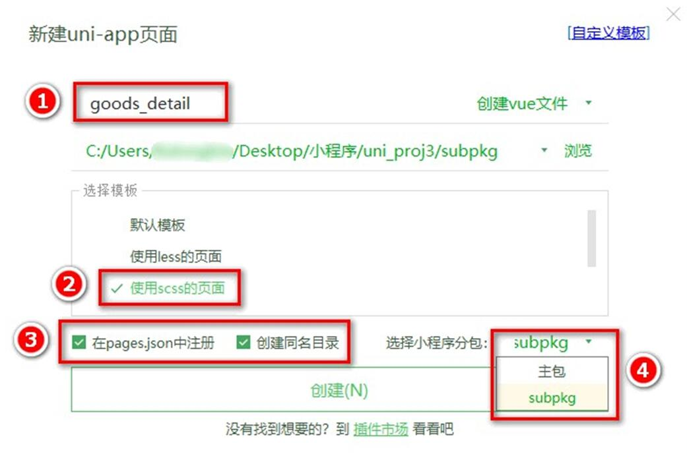

### 3. 2. 4 点击轮播图跳转到商品详情页面

将 `<swiper-item></swiper-item>` 节点内的 view 组件，改造为 navigator 导航组件，并动态绑定 url 属性 的值。

1. 改造之前的 UI 结构：

```html
<swiper-item v-for="(item, i) in swiperList" :key="i">
 <view class="swiper-item">
 <!-- 动态绑定图片的 src 属性 -->
 <image :src="item.image_src"></image>
 </view>
</swiper-item>
```
#### 2. 改造之后的 UI 结构：

```html
<swiper-item v-for="(item, i) in swiperList" :key="i">
 <navigator class="swiper-item" :url="'/subpkg/goods_detail/goods_detail?
goods_id=' + item.goods_id">
 <!-- 动态绑定图片的 src 属性 -->
 <image :src="item.image_src"></image>
 </navigator>
</swiper-item>
```

### 3. 2. 5 封装 uni.$showMsg() 方法

当数据请求失败之后，经常需要调用 uni.showToast({ /* 配置对象 */ }) 方法来提示用户。此
时，可以在全局封装一个 uni.$showMsg() 方法，来简化 uni.showToast() 方法的调用。具体的
改造步骤如下：

1. 在 `main.js` 中，为 `uni` 对象挂载自定义的 `$showMsg()` 方法：

```js
// 封装的展示消息提示的方法
uni.$showMsg = function (title = '数据加载失败！', duration = 1500) {
   uni.showToast({
   title,
   duration,
   icon: 'none',
  })
}
```

2. 今后，在需要提示消息的时候，直接调用 `uni.$showMsg()` 方法即可：

```js
async getSwiperList() {
  const { data: res } = await uni.$http.get('/api/public/v1/home/swiperdata')
  if (res.meta.status !== 200) return uni.$showMsg()
  this.swiperList = res.message
}
```

## 3. 3 分类导航区域

### 3. 3. 1 获取分类导航的数据

#### 实现思路：

1. 定义 data 数据
2. 在 onLoad 中调用获取数据的方法
3. 在 methods 中定义获取数据的方法

示例代码如下：

```js
export default {
 data() {
   return {
   // 1. 分类导航的数据列表
   navList: [],
}
},
 onLoad() {
 // 2. 在 onLoad 中调用获取数据的方法
 this.getNavList()
},
 methods: {
   // 3. 在 methods 中定义获取数据的方法
   async getNavList() {
   const { data: res } = await uni.$http.get('/api/public/v1/home/catitems')
   if (res.meta.status !== 200) return uni.$showMsg()
   this.navList = res.message
  },
},
}
```

### 3. 3. 2 渲染分类导航的 UI 结构

#### 1. 定义如下的 UI 结构：

```html
<!-- 分类导航区域 -->
<view class="nav-list">
  <view class="nav-item" v-for="(item, i) in navList" :key="i">
  <image :src="item.image_src" class="nav-img"></image>
  </view>
</view>
```

#### 2. 通过如下的样式美化页面结构：

```css
  .nav-list {
   display: flex;
   justify-content: space-around;
   margin: 15px 0;

  .nav-img {
     width: 128rpx;
     height: 140rpx;
  }
}
```

### 3. 3. 2 点击第一项，切换到分类页面

1. 为 nav-item 绑定点击事件处理函数：
```html
<!-- 分类导航区域 -->
<view class="nav-list">
   <view class="nav-item" v-for="(item, i) in navList" :key="i"
  @click="navClickHandler(item)">
   <image :src="item.image_src" class="nav-img"></image>
   </view>
</view>
```

2. 定义 navClickHandler 事件处理函数：
```js
    // nav-item 项被点击时候的事件处理函数
    navClickHandler(item) {
     // 判断点击的是哪个 nav
     if (item.name === '分类') {
     uni.switchTab({
     url: '/pages/cate/cate'
    })
  }
}
```

## 3. 4 楼层区域

### 3. 4. 1 获取楼层数据

#### 实现思路：

1. 定义 data 数据
2. 在 onLoad 中调用获取数据的方法
3. 在 methods 中定义获取数据的方法

示例代码如下：

```js
export default {
 data() {
 return {
 // 1. 楼层的数据列表
 floorList: [],
}
},
 onLoad() {
 // 2. 在 onLoad 中调用获取楼层数据的方法
 this.getFloorList()
},
 methods: {
 // 3. 定义获取楼层列表数据的方法
 async getFloorList() {
 const { data: res } = await uni.$http.get('/api/public/v1/home/floordata')
 if (res.meta.status !== 200) return uni.$showMsg()
 this.floorList = res.message
},
},
}
```

### 3. 4. 2 渲染楼层的标题

#### 1. 定义如下的 UI 结构：

```html
<!-- 楼层区域 -->
<view class="floor-list">
 <!-- 楼层 item 项 -->
 <view class="floor-item" v-for="(item, i) in floorList" :key="i">
 <!-- 楼层标题 -->
 <image :src="item.floor_title.image_src" class="floor-title"></image>
 </view>
</view>
```

#### 2. 美化楼层标题的样式：
```css
.floor-title {
 height: 60rpx;
 width: 100%;
 display: flex;
}
```

### 3.4.3 渲染楼层里的图片

#### 1. 定义楼层图片区域的 UI 结构：

```html
<!-- 楼层图片区域 -->
<view class="floor-img-box">
 <!-- 左侧大图片的盒子 -->
 <view class="left-img-box">
 <image :src="item.product_list[0].image_src" :style="{width:
item.product_list[0].image_width + 'rpx'}" mode="widthFix"></image>
 </view>
 <!-- 右侧 4 个小图片的盒子 -->
 <view class="right-img-box">
 <view class="right-img-item" v-for="(item2, i2) in item.product_list"
:key="i2" v-if="i2 !== 0">
 <image :src="item2.image_src" mode="widthFix" :style="{width:
item2.image_width + 'rpx'}"></image>
 </view>
 </view>
</view>
```

#### 2. 美化楼层图片区域的样式：

```css
.right-img-box {
 display: flex;
 flex-wrap: wrap;
 justify-content: space-around;
}
.floor-img-box {
 display: flex;
 padding-left: 10rpx;
}
```

### 3. 4. 4 点击楼层图片跳转到商品列表页

1. 在 `subpkg` 分包中，新建 `goods_list` 页面

<div>
  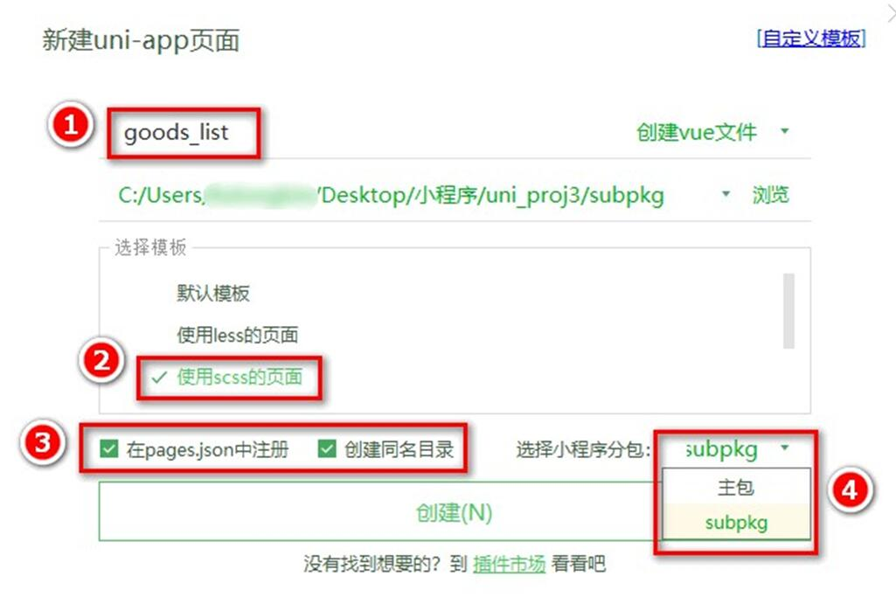
</div>

2. 楼层数据请求成功之后，通过双层 forEach 循环，处理 URL 地址：

```js
// 获取楼层列表数据
async getFloorList() {
 const { data: res } = await uni.$http.get('/api/public/v1/home/floordata')
 if (res.meta.status !== 200) return uni.$showMsg()
 // 通过双层 forEach 循环，处理 URL 地址
 res.message.forEach(floor => {
     floor.product_list.forEach(prod => {
     prod.url = '/subpkg/goods_list/goods_list?' +
    prod.navigator_url.split('?')[1]
  })
})
 this.floorList = res.message
}
```

3. 把图片外层的 view 组件，改造为 navigator 组件，并动态绑定 url 属性 的值：

```html
<!-- 楼层图片区域 -->
<view class="floor-img-box">
 <!-- 左侧大图片的盒子 -->
 <navigator class="left-img-box" :url="item.product_list[0].url">
 <image :src="item.product_list[0].image_src" :style="{width:
item.product_list[0].image_width + 'rpx'}" mode="widthFix"></image>
 </navigator>
 <!-- 右侧 4 个小图片的盒子 -->
 <view class="right-img-box">
 <navigator class="right-img-item" v-for="(item2, i2) in item.product_list"
:key="i2" v-if="i2 !== 0" :url="item2.url">
 <image :src="item2.image_src" mode="widthFix" :style="{width:
item2.image_width + 'rpx'}"></image>
 </navigator>
 </view>
</view>
```

## 3. 5 分支的合并与提交

1. 将本地的 home 分支进行本地的 commit 提交：

```
git add.
git commit -m "完成了 home 首页的开发"
```

2. 将本地的 home 分支推送到远程仓库进行保存：
```
git push -u origin home
```

3. 将本地的 home 分支合并到本地的 master 分支：

```
git checkout master
git merge home
```

4. 删除本地的 home 分支：
```
git branch -d home
```


