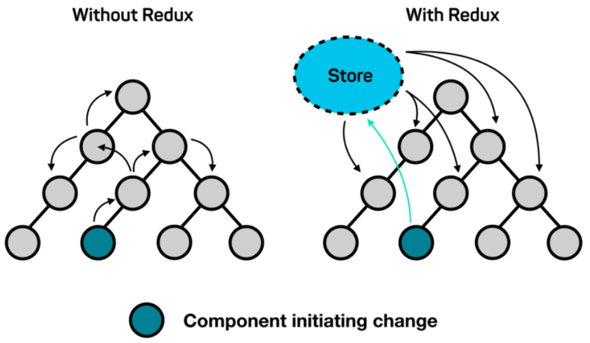
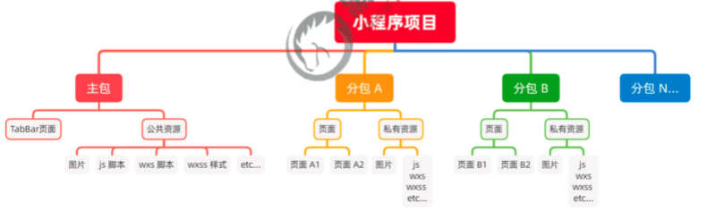
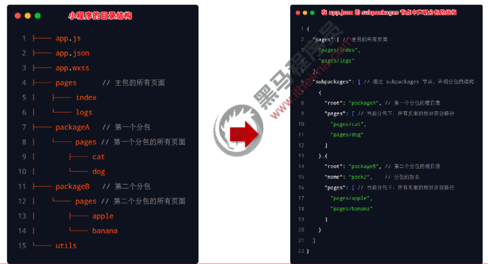
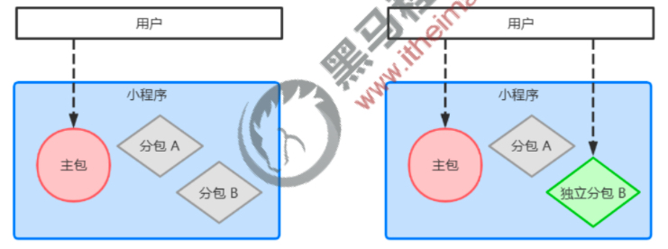
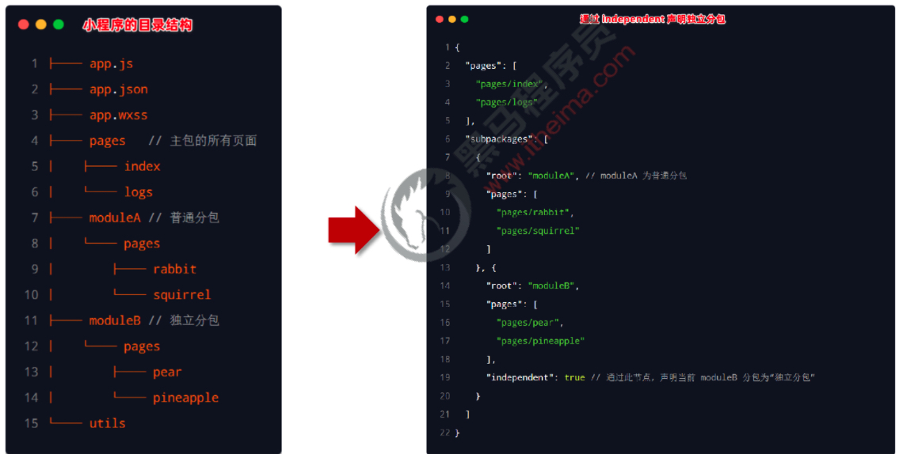
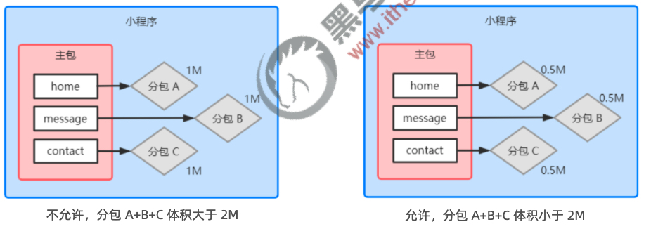

# 高级

## 组件样式隔离

默认情况下，自定义组件的样式只对当前组件生效，不会影响到组件之外的UI 结构，如图所示：
+ 组件 A 的样式不会影响组件 C 的样式
+ 组件 A 的样式不会影响小程序页面的样式
+ 小程序页面的样式不会影响组件 A 和C 的样式

### 好处
+ 防止外界的样式影响组件内部的样式
+ 防止组件的样式破坏外界的样式

### 组件样式隔离的注意点

1. app.wxss 中的全局样式对组件无效
2. 只有 class 选择器会有样式隔离效果，id 选择器、属性选择器、标签选择器不受样式隔离的影响

>建议：在组件和引用组件的页面中建议使用 class 选择器，不要使用 id、属性、标签选择器！

### 修改组件的样式隔离选项

默认情况下，自定义组件的样式隔离特性能够防止组件内外样式互相干扰的问题。但有时，我们希望在外界能够控制组件内部的样式，此时，可以通过 `styleIsolation` 修改组件的样式隔离选项，用法如下：

```js
// 在组件的.js文件中新增如下配置
Component({
  options: {
    styleIsolation: 'shared'
  }
})

// 或在组件的.json文件中新增如下配置
{
  "styleIsolation": "isolated"
}

```

[组件样式隔离](https://developers.weixin.qq.com/miniprogram/dev/framework/custom-component/wxml-wxss.html#%E7%BB%84%E4%BB%B6%E6%A0%B7%E5%BC%8F%E9%9A%94%E7%A6%BB)

## properties 属性
在小程序组件中，properties 是组件的对外属性，用来接收外界传递到组件中的数据，示例代码如下：

```js
Component({
  properties: {
    // 第一种方式：简化的方式
    // max: Number
    // 第二种方式：完整的定义方式
    max: {
      type: Number,
      value: 10
    }
  }
})

// 父组件调用
<my-test1 max="9"></my-test1>
```

## data 和properties 的区别

在小程序的组件中，properties 属性和 data 数据的用法相同，它们都是可读可写的，只不过：
+ data 更倾向于存储组件的私有数据
+ properties 更倾向于存储外界传递到组件中的数据

```js
Component({
  /**
   * 组件的方法列表
   */
  methods: {
    showInfo() {
      console.log(this.data)
      console.log(this.properties)
      console.log(this.data === this.properties) // true
    }
  }
})
```

> 由于 data 数据和properties 属性在本质上没有任何区别，因此 properties 属性的值也可以用于页面渲染，或使用 setData 为properties 中的属性重新赋值

## 数据监听器

### 什么是数据监听器
数据监听器用于监听和响应任何属性和数据字段的变化，从而执行特定的操作。它的作用类似于 vue 中的watch 侦听器。在小程序组件中，数据监听器的基本语法格式如下：
```js
Component({
  observers: {
    'n1, n2': function (newN1, newN2) {
      this.setData({
        sum: newN1 + newN2
      })
    }
  }
})
```

1. 数据监听器的基本用法
```html
<view>{{n1}} + {{n2}} = {{sum}}</view>

<button bindtap="addN1">n1+1</button>
<button bindtap="addN2">n2+1</button>
```

2. 数据监听器的基本用法
```js
Component({
  /**
   * 组件的初始数据
   */
  data: {
    n1: 0,
    n2: 0,
    sum: 0
  },

  /**
   * 组件的方法列表
   */
  methods: {
    addN1() {
      this.setData({
        n1: this.data.n1 + 1
      })
    },
    addN2() {
      this.setData({
        n2: this.data.n2 + 1
      })
    }
  },
  observers: {
    'n1, n2': function (newN1, newN2) {
      this.setData({
        sum: newN1 + newN2
      })
    }
  }
})
```

3. 数据监听器支持监听对象中单个或多个属性的变化，示例语法如下：
```js
observers: {
  // '_rgb.r, _rgb.g, _rgb.b': function (r, g, b) {
  //   this.setData({
  //     fullColor: `${r}, ${g}, ${b}`
  //   })
  // },

  // 如果某个对象中需要被监听的属性太多，为了方便，可以使用通配符 ** 来监听对象中所有属性的变化
  '_rgb.**': function (obj) {
    this.setData({
      fullColor: `${obj.r}, ${obj.g}, ${obj.b}`
    })
  }
},
```

## 纯数据字段

### 什么是纯数据字段

概念：纯数据字段指的是那些不用于界面渲染的 data 字段。

应用场景：例如有些情况下，某些 data 中的字段既不会展示在界面上，也不会传递给其他组件，仅仅在当前组件内部使用。带有这种特性的 data 字段适合被设置为纯数据字段。

好处：纯数据字段有助于提升页面更新的性能。

### 使用规则

在`Component` 构造器的 o`ptions` 节点中，指定 `pureDataPattern` 为一个正则表达式，字段名符合这个正则表达式的字段将成为纯数据字段，示例代码如下：

```js
Component({
  options: {
    // 指定所有 _ 开头的数据字段为纯数据字段
    pureDataPattern: /^_/
  },
  /**
   * 组件的初始数据
   */
  data: {
    _rgb: {
      r: 0,
      g: 0,
      b: 0
    },
    fullColor: '0, 0, 0'
  },
})
```

## 组件的生命周期

### lifetimes 节点

在小程序组件中，生命周期函数可以直接定义在 `Component` 构造器的第一级参数中，可以在 `lifetimes` 字段内进行声明（这是推荐的方式，其优先级最高）。示例代码如下：

```js
  // 旧式的定义方式
 // created() {
  //   console.log('created')
  // },
  // attached() {
  //   console.log('attached')
  // },

  // 推荐用法
  lifetimes: {
    created() {
      console.log('created ~~~~~')
    },
    attached() {
      console.log('attached ~~~~~')
    },
  },
```

### pageLifetimes 节点

组件所在页面的生命周期函数，需要定义在 pageLifetimes 节点中，示例代码如下：
```js
pageLifetimes: {
  show() {
    console.log('show')
    this._randomColor()
  },
  hide() {
    console.log('hide')
  },
  resize() {
    console.log('resize')
  }
}
```

## 插槽
### 什么是插槽
在自定义组件的 `wxml` 结构中，可以提供一个 `<slot>` 节点（插槽），用于承载组件使用者提供的 wxml 结构。

### 单个插槽
在小程序中，默认每个自定义组件中只允许使用一个 `<slot>` 进行占位，这种个数上的限制叫做单个插槽。

### 启用多个插槽

在小程序的自定义组件中，需要使用多 `<slot>` 插槽时，可以在组件的 `.js` 文件中，通过如下方式进行启用。

示例代码如下：
```js
options: {
  multipleSlots: true
},
```

### 定义/使用多个插槽

可以在组件的 .wxml 中使用多个 `<slot>` 标签，以不同的 `name` 来区分不同的插槽。示例代码如下：

```html
<!-- 子组件定义多个插槽 -->
<view>
  <slot name="before"></slot>
  <view>这里是组件的内部结构</view>
  <slot name="after"></slot>
</view>

<!-- 父组件调用 -->
<!-- 在使用带有多个插槽的自定义组件时，需要用 slot 属性来将节点插入到不同的 <slot> 中 -->
<my-test4>
	<view slot="before">这是通过插槽填充的内容</view>
  <view slot="after">~~~~~~~</view>
</my-test4>
```

## 父子组件之间的通信

### 父子组件之间通信的 3 种方式

1. 属性绑定
    + 用于父组件向子组件的指定属性设置数据，仅能设置 JSON 兼容的数据
2. 事件绑定
    + 用于子组件向父组件传递数据，可以传递任意数据
3. 获取组件实例
    + 父组件还可以通过 this.selectComponent("id或class选择器") 获取子组件实例对象
    + 这样就可以直接访问子组件的任意数据和方法

## behaviors

### 什么是 behaviors
behaviors 是小程序中，用于实现组件间代码共享的特性，类似于 Vue.js 中的 `mixins`。

### behaviors 的工作方式

+ 每个 behavior 可以包含一组属性、数据、生命周期函数和方法。组件引用它时，它的属性、数据和方法会被合并到组件中。
+ 每个组件可以引用多个 behavior，behavior 也可以引用其它 behavior。

### 创建 behavior
调用 Behavior(Object object)方法即可创建一个共享的 behavior 实例对象，供所有的组件使用：
```js
module.exports = Behavior({
  data: {
    username: 'zs'
  },
  properties: {},
  methods: {}
})
```

### 导入并使用 behavior

在组件中，使用 require() 方法导入需要的 behavior，挂载后即可访问 behavior 中的数据或方法，示例代码如下：
```js
const myBehavior = require('../../behaviors/my-behavior')

Component({
  behaviors: [myBehavior],
})
```

### 同名字段的覆盖和组合规则

组件和它引用的 behavior 中可以包含同名的字段，此时可以参考如下 3 种同名时的处理规则：
+ 同名的数据字段 (data)
+ 同名的属性 (properties) 或方法 (methods)
+ 同名的生命周期函数

[微信小程序官方文档](https://developers.weixin.qq.com/miniprogram/dev/framework/custom-component/behaviors.html)

## 小程序对 npm 的支持与限制

目前，小程序中已经支持使用 npm 安装第三方包，从而来提高小程序的开发效率。但是，在小程序中使用npm 包有如下 3 个限制：
1. 不支持依赖于 Node.js 内置库的包
2. 不支持依赖于浏览器内置对象的包
3. 不支持依赖于 C++ 插件的包

## 定制全局主题样式

+ [MDN 文档](https://developer.mozilla.org/zh-CN/docs/Web/CSS/Using_CSS_custom_properties)
+ [Vant Weapp定制全局主题样式](https://github.com/youzan/vant-weapp/blob/dev/packages/common/style/var.less)

```css
page {
  --button-danger-background-color: #C00000;
  --button-danger-border-color: #D60000;

  --button-primary-background-color: #13A7A0;
  --button-primary-border-color: #15B4AA;
}
```

## API Promise化

### 什么是 API Promise 化

API Promise化，指的是通过额外的配置，将官方提供的、基于回调函数的异步 API，升级改造为基于Promise 的异步 API，从而提高代码的可读性、维护性，避免回调地狱的问题。

### 实现 API Promise 化

在小程序中，实现 API Promise 化主要依赖于 miniprogram-api-promise 这个第三方的 npm 包。

它的安装和使用步骤如下：
```js
npm install --save miniprogram-api-promise
```

在程序入口（app.js）调用promisifyAll方法，只需要调用一次。

```js
import { promisifyAll, promisify } from 'miniprogram-api-promise';

const wxp = {}
// promisify all wx's api
promisifyAll(wx, wxp)
console.log(wxp.getSystemInfoSync())
wxp.getSystemInfo().then(console.log)
wxp.showModal().then(wxp.openSetting())

// compatible usage
wxp.getSystemInfo({success(res) {console.log(res)}})

// promisify single api
promisify(wx.getSystemInfo)().then(console.log)
```
[小程序-api-promise](https://www.npmjs.com/package/miniprogram-api-promise)

### 调用 Promise 化之后的异步 API

```html
<van-button type="primary" bindtap="getInfo">按钮</van-button>
```

```js
async getInfo() {
  const {data: res} = await wx.p.request({
    method: 'GET',
    url: 'https://www.escook.cn/api/get',
    data: {
      name: 'zs',
      age: 20
    }
  })
}
```

## 全局数据共享

### 什么是全局数据共享

+ 全局数据共享（又叫做：状态管理）是为了解决组件之间数据共享的问题。
+ 开发中常用的全局数据共享方案有：Vuex、Redux、MobX 等。

<div>
  
</div>

### 小程序中的全局数据共享方案

在小程序中，可使用 mobx-miniprogram 配合 mobx-miniprogram-bindings 实现全局数据共享。其中：
+ mobx-miniprogram 用来创建 Store 实例对象
+ mobx-miniprogram-bindings 用来把Store 中的共享数据或方法，绑定到组件或页面中使用

#### 安装 MobX 相关的包
在项目中运行如下的命令，安装 MobX 相关的包：
```js
npm install --save mobx-miniprogram mobx-miniprogram-bindings
```

> 注意：MobX 相关的包安装完毕之后，记得删除 miniprogram_npm 目录后，重新构建 npm。

+ [MobX](https://cn.mobx.js.org/)
+ [小程序的 MobX 绑定辅助库](https://www.npmjs.com/package/mobx-miniprogram-bindings)

### 创建 MobX 的Store 实例
```js
// store.js
// 在这个 JS 文件中，专门来创建 Store 的实例对象
import { observable, action } from 'mobx-miniprogram'

export const store = observable({
  // 数据字段
  numA: 1,
  numB: 2,
  activeTabBarIndex: 0,
  // 计算属性
  get sum() {
    return this.numA + this.numB
  },
  // actions 函数，专门来修改 store 中数据的值
  updateNum1: action(function (step) {
    this.numA += step
  }),
  updateNum2: action(function (step) {
    this.numB += step
  }),
  updateActiveTabBarIndex: action(function(index) {
    this.activeTabBarIndex = index
  })
})
```

### 将Store 中的成员绑定到页面中
```js
import { createStoreBindings } from 'mobx-miniprogram-bindings'
import { store } from '../../store/store'

Page({
  /**
   * 生命周期函数--监听页面加载
   */
  onLoad: function (options) {
    this.storeBindings = createStoreBindings(this, {
      store,
      fields: ['numA', 'numB', 'sum'],
      actions: ['updateNum1']
    })
  },
  btnHandler1(e) {
    // console.log(e)
    this.updateNum1(e.target.dataset.step)
  },
  /**
   * 生命周期函数--监听页面卸载
   */
  onUnload: function () {
    this.storeBindings.detroyStoreBindings()
  }
})
```

### 在页面上使用 Store 中的成员
```html
<view>{{numA}} + {{numB}} = {{sum}}</view>
<van-button type="primary" bindtap="btnHandler1" data-step="{{1}}">numA + 1</van-button>
<van-button type="danger" bindtap="btnHandler1" data-step="{{-1}}">numA - 1</van-button>

<view>~~~~~~</view>

<my-numbers></my-numbers>
```

### 将Store 中的成员绑定到组件中
```js
// components/numbers/numbers.js
import { storeBindingsBehavior } from 'mobx-miniprogram-bindings'
import { store } from '../../store/store'

Component({
  behaviors: [storeBindingsBehavior],
  storeBindings: {
    // 数据源
    store,
    fields: {
      numA: 'numA',
      numB: 'numB',
      sum: 'sum'
    },
    actions: {
      updateNum2: 'updateNum2'
    }
  },
  /**
   * 组件的方法列表
   */
  methods: {
    btnHandler2(e) {
      this.updateNum2(e.target.dataset.step)
    }
  }
})
```

### 在组件中使用 Store 中的成员
```html
<view>{{numA}} + {{numB}} = {{sum}}</view>
<van-button type="primary" bindtap="btnHandler2" data-step="{{1}}">numB + 1</van-button>
<van-button type="danger" bindtap="btnHandler2" data-step="{{-1}}">numB - 1</van-button>
```

## 分包

### 什么是分包
分包指的是把一个完整的小程序项目，按照需求划分为不同的子包，在构建时打包成不同的分包，用户在使用时按需进行加载。

### 分包的好处

对小程序进行分包的好处主要有以下两点：
1. 可以优化小程序首次启动的下载时间
2. 在多团队共同开发时可以更好的解耦协作

### 分包前项目的构成

分包前，小程序项目中所有的页面和资源都被打包到了一起，导致整个项目体积过大，影响小程序首次启动的下载时间。

### 分包后项目的构成

分包后，小程序项目由 1 个主包 + 多个分包组成：
+ 主包：一般只包含项目的启动页面或TabBar 页面、以及所有分包都需要用到的一些公共资源
+ 分包：只包含和当前分包有关的页面和私有资源

<div>
  
</div>

### 分包的加载规则

1. 在小程序启动时，默认会下载主包并启动主包内页面
    + tabBar 页面需要放到主包中
2. 当用户进入分包内某个页面时，客户端会把对应分包下载下来，下载完成后再进行展示
    + 非tabBar 页面可以按照功能的不同，划分为不同的分包之后，进行按需下载

### 分包的体积限制

目前，小程序分包的大小有以下两个限制：
+ 整个小程序所有分包大小不超过 16M（主包 + 所有分包）
+ 单个分包/主包大小不能超过 2M

### 配置方法

<div style="margin-top: 20px">
  
</div>

### 打包原则

1. 小程序会按 subpackages 的配置进行分包，subpackages 之外的目录将被打包到主包中
2. 主包也可以有自己的 pages（即最外层的 pages 字段）
3. tabBar 页面必须在主包内
4. 分包之间不能互相嵌套

### 引用原则

1. 主包无法引用分包内的私有资源
2. 分包之间不能相互引用私有资源
3. 分包可以引用主包内的公共资源

<div>
  
</div>

## 独立分包

### 什么是独立分包
独立分包本质上也是分包，只不过它比较特殊，可以独立于主包和其他分包而单独运行。

<div>
  
</div>

### 独立分包和普通分包的区别

最主要的区别：是否依赖于主包才能运行
+ 普通分包必须依赖于主包才能运行
+ 独立分包可以在不下载主包的情况下，独立运行

### 独立分包的应用场景

开发者可以按需，将某些具有一定功能独立性的页面配置到独立分包中。原因如下：
+ 当小程序从普通的分包页面启动时，需要首先下载主包
+ 而独立分包不依赖主包即可运行，可以很大程度上提升分包页面的启动速度

> 注意：一个小程序中可以有多个独立分包。

### 独立分包的配置方法

<div style="margin-top: 20px">
  
</div>

### 引用原则

独立分包和普通分包以及主包之间，是相互隔绝的，不能相互引用彼此的资源！例如：
1. 主包无法引用独立分包内的私有资源
2. 独立分包之间，不能相互引用私有资源
3. 独立分包和普通分包之间，不能相互引用私有资源
4. 特别注意：独立分包中不能引用主包内的公共资源

## 分包预下载

### 什么是分包预下载
分包预下载指的是：在进入小程序的某个页面时，由框架自动预下载可能需要的分包，从而提升进入后续分包页面时的启动速度。

### 配置分包的预下载
预下载分包的行为，会在进入指定的页面时触发。在 app.json 中，使用 preloadRule 节点定义分包的预下载规则，示例代码如下：

```json
"preloadRule": {
  "pages/contact/contact": {
    "packages": [
      "p1"
    ],
    "network": "wifi"
  }
}
```

### 分包预下载的限制
同一个分包中的页面享有共同的预下载大小限额 2M，例如：

<div>
  
</div>

## 自定义 tabBar

[自定义 tabBar](https://developers.weixin.qq.com/miniprogram/dev/framework/ability/custom-tabbar.html)