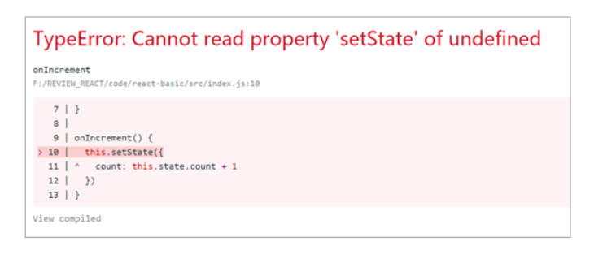

# day01-React 概述&脚手架搭建&JSX&组件

## 什么是 React （★★★）

React 是一个用于构建用户界面的 javaScript 库，起源于 facebook 的内部项目，后续在 13 年开源了出来

### 特点

- 声明式

你只需要描述 UI 看起来是什么样式，就跟写 HTML 一样，React 负责渲染 UI

- 基于组件

组件时 React 最重要的内容，组件表示页面中的部分内容

- 学习一次，随处使用

使用 React 可以开发 Web 应用，使用 React 可以开发移动端，可以开发 VR 应用

## React 基本使用

### React 的安装

npm i react react-dom

- react 包是核心，提供创建元素，组件等功能
- react-dom 包提供 DOM 相关功能

### React 的使用

- 引入 react 和 react-dom 的两个 js 文件

```html
<script src="./node_modules/react/umd/react.development.js"></script>
<script src="./node_modules/react-dom/umd/react-dom.development.js"></script>
```

- 创建 React 元素
  > 了解即可，后面会学到更简单的方法

```javascript
// 创建元素节点
// 1. 元素名称
// 2. 元素属性 传递的是个对象
// 3. 元素内容
let title = React.createElement('li', null, 'hellow react')
```

- 渲染到页面

```javascript
// 渲染到页面
ReactDOM.render(title, root)
```

## React 脚手架（★★★）

### React 脚手架意义

- 脚手架是开发现代 Web 应用的必备
- 充分利用 Webpack，Babel，ESLint 等工具辅助项目开发
- 零配置，无需手动配置繁琐的工具即可使用
- 关注业务，而不是工具配置

### 使用 React 脚手架初始化项目

- 初始化项目，命令： npx create-react-app my-pro
  - npx 目的：提升包内提供的命令行工具的使用体验
  - 原来：先安装脚手架包，再使用这个包中提供的命令
  - 现在：无需安装脚手架包，就可以直接使用这个包提供的命令
  - create-react-app 这个是脚手架名称 不能随意更改
  - my-pro 自己定义的项目名称
- 启动项目，在项目根目录执行命令： npm start

yarn 命令简介

- yarn 是 Facebook 发布的包管理器，可以看做是 npm 的替代品，功能与 npm 相同
- yarn 具有快速，可靠和安全的特点
- 初始化新项目：yarn init
- 安装包： yarn add 包名称
- 安装项目依赖： yarn

### 脚手架中使用 React

- 导入 react 和 react-dom 两个包

```js
import React from 'react'
import ReactDOM from 'react-dom'
```

- 创建元素

```js
let h1 = React.createElement('h1', null, '我是标题')
```

- 渲染到页面

```js
ReactDOM.render(h1, document.getElementById('root'))
```

# JSX 的使用

## 概述

#### JSX 产生的原因

由于通过 createElement()方法创建的 React 元素有一些问题，代码比较繁琐，结构不直观，无法一眼看出描述的结构，不优雅，用户体验不爽

#### JSX 的概述

JSX 是 JavaScript XML 的简写，表示在 JavaScript 代码中写 HTML 格式的代码

优势：声明式语法更加直观，与 HTML 结构相同，降低了学习成本，提升开发效率

## 简单入门使用（★★★）

#### 使用步骤

- 使用 JSX 语法创建 react 元素

```js
let h1 = <h1>我是通过JSX创建的元素</h1>
```

- 使用 ReactDOM 来渲染元素

```js
ReactDOM.render(h1, document.getElementById('root'))
```

#### 为什么在脚手架中可以使用 JSX 语法

- JSX 不是标准的 ECMAScript 语法，它是 ECMAScript 的语法拓展
- 需要使用 babel 编译处理后，才能在浏览器环境中使用
- create-react-app 脚手架中已经默认有该配置，无需手动配置
- 编译 JSX 语法的包： @bable/preset-react

#### 注意点

- React 元素的属性名使用驼峰命名法
- 特殊属性名：class -> className，for -> htmlFor，tabindex -> tabIndex
- 如果没有子节点的 React 元素可以用 `/>` 来结束
- 推荐：使用 小括号包裹 JSX，从而避免 JS 中自动插入分号报错

## JSX 语法（★★★）

JSX 是来描述页面的结构，我们一般在编写业务逻辑渲染页面的时候，需要涉及到传递值，调用函数，判断条件，循环等，这一些在 JSX 中都能得到支持

#### 嵌入 JS 表达式

语法：{JavaScritpt 表达式}

例子：

```js
let content = '插入的内容'
let h1 = <h1>我是通过JSX创建的元素+ {content}</h1>
```

##### 注意点

- 只要是合法的 js 表达式都可以进行嵌入
- JSX 自身也是 js 表达式
- 注意：js 中的对象是一个例外，一般只会出现在 style 属性中
- 注意：在{}中不能出现语句

#### 条件渲染

根据不同的条件来渲染不同的 JSX 结构

```js
let isLoading = true
let loading = () => {
  if (isLoading) {
    return <div>Loading...</div>
  }
  return <div>加载完成</div>
}
```

可以发现，写 JSX 的条件渲染与我们之前编写代码的逻辑是差不多的，根据不同的判断逻辑，返回不同的 JSX 结构，然后渲染到页面中

#### 列表渲染

- 如果需要渲染一组数据，我们应该使用数组的 map () 方法
- 注意：渲染列表的时候需要添加 key 属性，key 属性的值要保证唯一
- 原则：map()遍历谁，就给谁添加 key 属性
- 注意：尽量避免使用索引号作为 key

```js
let arr = [
  {
    id: 1,
    name: '三国演义',
  },
  {
    id: 2,
    name: '水浒传',
  },
  {
    id: 3,
    name: '西游记',
  },
  {
    id: 4,
    name: '红楼梦',
  },
]
let ul = (
  <ul>
    {arr.map((item) => (
      <li key={item.id}>{item.name}</li>
    ))}
  </ul>
)
ReactDOM.render(ul, document.getElementById('root'))
```

#### 样式处理

##### 行内样式 -style

在 style 里面我们通过对象的方式传递数据

```js
<li key={item.id} style={{ color: 'red', backgroundColor: 'pink' }}>
  {item.name}
</li>
```

这种方式比较的麻烦，不方便进行阅读，而且还会导致代码比较的繁琐

##### 类名 -className

创建 CSS 文件编写样式代码

```css
.container {
  text-align: center;
}
```

在 js 中进行引入，然后设置类名即可

```js
import './css/index.css'
;<li
  className="container"
  key={item.id}
  style={{ color: 'red', backgroundColor: 'pink' }}
>
  {item.name}
</li>
```

### 小结

- JSX 是 React 的核心内容
- JSX 表示在 JS 代码中写 HTML 结构，是 React 声明式的体现
- 使用 JSX 配合嵌入的 JS 表达式、条件渲染、列表渲染、可以描述任意 UI 结构
- 推荐使用 className 的方式给 JSX 添加样式
- React 完全利用 JS 语言自身的能力来编写 UI，而不是造轮子增强 HTML 功能

## React 组件

### 目标

- 能够使用函数创建组件
- 能够使用 class 创建组件
- 能够给 React 元素绑定事件
- 能够使用 state 和 setState()
- 能够处理事件中的 this 指向问题

### React 组件介绍

- 组件是 React 的一等公民，使用 React 就是在用组件
- 组件表示页面中的部分功能
- 组合多个组件实现完整的页面功能
- 特点：可复用、独立、可组合


### 组件的创建方式

---

#### 函数创建组件

- 函数组件：使用 JS 的函数创建组件
- **约定 1：** 函数名称必须以大写字母开头
- **约定 2：** 函数组件必须有返回值，表示该组件的结构
- 如果返回值为 null，表示不渲染任何内容

##### 示例 demo

编写函数组件

```js
function Hello() {
  return <div>这是第一个函数组件</div>
}
```

利用 ReactDOM.render()进行渲染

```js
ReactDOM.render(<Hello />, document.getElementById('root'))
```

### 类组件（★★★）

- 使用 ES6 语法的 class 创建的组件
- 约定 1：类名称也必须要大写字母开头
- 约定 2：类组件应该继承 React.Component 父类，从而可以使用父类中提供的方法或者属性
- 约定 3：类组件必须提供 render 方法
- 约定 4：render 方法中必须要有 return 返回值

#### 示例 demo

创建 class 类，继承 React.Component，在里面提供 render 方法，在 return 里面返回内容

```js
class Hello extends React.Component {
  render() {
    return <div>这是第一个类组件</div>
  }
}
```

通过 ReactDOM 进行渲染

```js
ReactDOM.render(<Hello />, document.getElementById('root'))
```

### 抽离成单独的 JS 文件（★★★）

- 思考：项目中组件多了之后，该如何组织这些组件？
- 选择一：将所有的组件放在同一个 JS 文件中
- 选择二：将每个组件放到单独的 JS 文件中
- **组件作为一个独立的个体，一般都会放到一个单独的 JS 文件中**

#### 示例 demo

- 创建 Hello.js
- 在 Hello.js 中导入 React，创建组件，在 Hello.js 中导出

```js
import React from 'react'

export default class extends React.Component {
  render() {
    return <div>单独抽离出来的 Hello</div>
  }
}
```

- 在 index.js 中导入 Hello 组件，渲染到页面

```js
import Hello from './js/Hello'
ReactDOM.render(<Hello />, document.getElementById('root'))
```

## React 事件处理（★★★）

### 事件绑定

- React 事件绑定语法与 DOM 事件语法相似
- 语法：on+事件名称=事件处理函数，比如 onClick = function(){}
- 注意：React 事件采用驼峰命名法

#### 示例 demo

```js
export default class extends React.Component {
  clickHandle(e) {
    console.log('点了')
  }
  render() {
    return (
      <div>
        <button onClick={this.clickHandle}>点我点我点我</button>
      </div>
    )
  }
}
```

#### 小结

- 在 React 中绑定事件与原生很类似
- 需要注意点在于，在 React 绑定事件需要遵循驼峰命名法
- 类组件与函数组件绑定事件是差不多的，只是在类组件中绑定事件函数的时候需要用到 this，代表指向当前的类的引用，在函数中不需要调用 this

### 事件对象

- 可以通过事件处理函数的参数获取到事件对象
- React 中的事件对象叫做：合成事件
- 合成事件：兼容所有浏览器，无需担心跨浏览器兼容问题
- 除兼容所有浏览器外，它还拥有和浏览器原生事件相同的接口，包括 `stopPropagation()`和 `preventDefault()`
- 如果你想获取到原生事件对象，可以通过 `nativeEvent` 属性来进行获取

#### 示例 demo

```js
export default class extends React.Component {
  clickHandle(e) {
    // 获取原生事件对象
    console.log(e.nativeEvent)
  }
  render() {
    return (
      <div>
        <button onClick={this.clickHandle}>点我点我点我</button>
      </div>
    )
  }
}
```

### 支持的事件（有兴趣的课下去研究）

- Clipboard Events 剪切板事件

  - 事件名 ：onCopy onCut onPaste
  - 属性 ：DOMDataTransfer clipboardData

- compositionEvent 复合事件

  - 事件名： onCompositionEnd onCompositionStart onCompositionUpdate
  - 属性： string data

- Keyboard Events 键盘事件

  - 事件名：onKeyDown onKeyPress onKeyUp
  - 属性： 例如 number keyCode 太多就不一一列举

- Focus Events 焦点事件 （这些焦点事件在 React DOM 上的所有元素都有效，不只是表单元素）

  - 事件名： onFocus onBlur
  - 属性： DOMEventTarget relatedTarget

- Form Events 表单事件

  - 事件名： onChange onInput onInvalid onSubmit

- Mouse Events 鼠标事件

  - 事件名：

    ```js
    onClick onContextMenu onDoubleClick onDrag onDragEnd onDragEnter onDragExit
    onDragLeave onDragOver onDragStart onDrop onMouseDown onMouseEnter onMouseLeave
    onMouseMove onMouseOut onMouseOver onMouseUp
    ```

- Pointer Events 指针事件

  - 事件名：

    ```js
    onPointerDown onPointerMove onPointerUp onPointerCancel onGotPointerCapture
    onLostPointerCapture onPointerEnter onPointerLeave onPointerOver onPointerOut
    ```

- Selection Events 选择事件

  - 事件名：onSelect

- Touch Events 触摸事件

  - 事件名：onTouchCancel onTouchEnd onTouchMove onTouchStart

- UI Events UI 事件

  - 事件名： onScroll

- Wheel Events 滚轮事件

  - 事件名：onWheel

  - 属性：

    ```js
    number deltaMode
    number deltaX
    number deltaY
    number deltaZ
    ```

- Media Events 媒体事件

  - 事件名：

    ```js
    onAbort onCanPlay onCanPlayThrough onDurationChange onEmptied onEncrypted
    onEnded onError onLoadedData onLoadedMetadata onLoadStart onPause onPlay
    onPlaying onProgress onRateChange onSeeked onSeeking onStalled onSuspend
    onTimeUpdate onVolumeChange onWaiting
    ```

- Image Events 图像事件

  - 事件名：onLoad onError

- Animation Events 动画事件

  - 事件名：onAnimationStart onAnimationEnd onAnimationIteration

- Transition Events 过渡事件

  - 事件名：onTransitionEnd

- Other Events 其他事件

  - 事件名： onToggle

## 有状态组件和无状态组件

- 函数组件又叫做 `无状态组件`，类组件又叫做 `有状态组件`
- 状态(state) 即数据
- 函数组件没有自己的状态，只负责数据展示（静态）
- 类组件有自己的状态，负责更新 UI，让页面动起来

> 一般在网页中有状态组件和无状态组件配合使用。各自有各自的用处


## State 和 SetState（★★★）

### state 基本使用

- 状态(state)即数据，是组件内部的私有数据，只能在组件内部使用
- state 的值是对象，表示一个组件中可以有多个数据
- 通过 this.state 来获取状态

#### 示例 demo

```js
export default class extends React.Component {
  constructor() {
    super()

    // 第一种初始化方式
    this.state = {
      count: 0,
    }
  }
  // 第二种初始化方式（简化语法）
  // **推荐**
  state = {
    count: 1,
  }

  render() {
    return <div>计数器 :{this.state.count}</div>
  }
}
```

### setState() 修改状态

- 状态是可变的
- 语法：this.setState({要修改的数据})
- **注意：不要直接修改 state 中的值，这是错误的**
- setState() 作用：1.修改 state 2.更新 UI
- 思想：数据驱动视图


#### 示例 demo

```js
export default class extends React.Component {
  // 第二种初始化方式
  state = {
    count: 1,
  }
  render() {
    return (
      <div>
        <div>计数器 :{this.state.count}</div>
        <button
          onClick={() => {
            this.setState({
              count: this.state.count + 1,
            })
          }}
        >
          +1
        </button>
      </div>
    )
  }
}
```

#### 小结

- 修改 state 里面的值我们需要通过 this.setState() 来进行修改
- React 底层会有监听，一旦我们调用了 setState 导致了数据的变化，就会重新调用一次 render 方法，重新渲染当前组件

### 抽取事件处理函数

- 当我们把上面代码的事件处理程序抽取出来后，会报错，找不到 this



#### 原因

- 在 JSX 中我们写的事件处理函数可以找到 this，原因在于在 JSX 中我们利用箭头函数，箭头函数是不会绑定 this，所以会向外一层去寻找，外层是 render 方法，在 render 方法里面的 this 刚好指向的是当前实例对象

## 事件绑定 this 指向

### 箭头函数

- 利用箭头函数自身不绑定 this 的特点


### 利用 bind 方法（★★★）

利用原型 bind 方法是可以更改函数里面 this 的指向的，所以我们可以在构造中调用 bind 方法，然后把返回的值赋值给我们的函数即可

```js
class App extends React.Component {
  constructor() {
    super()
	...
    // 通过bind方法改变了当前函数中this的指向
    this.onIncrement = this.onIncrement.bind(this)
  }
  // 事件处理程序
  onIncrement() {
    ...
  }

  render() {
    ...
  }
}
```

### class 的实例方法（★★★）推荐

- 利用箭头函数形式的 class 实例方法
- 注意：该语法是实验性语法，但是，由于 babel 的存在可以使用

```js
// 事件处理程序
onIncrement = () => {
  console.log('事件处理程序中的this：', this)
  this.setState({
    count: this.state.count + 1,
  })
}
```

### 小结

- 推荐：使用 class 的实例方法，也是依赖箭头函数不绑定 this 的原因
