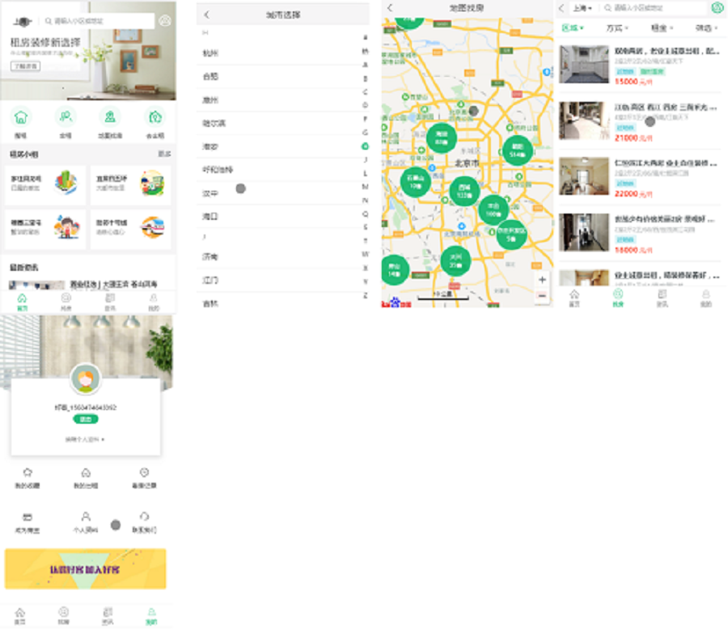
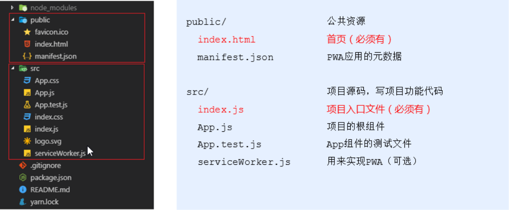
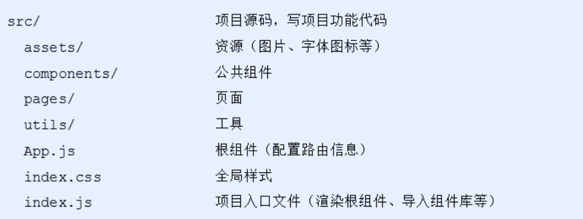
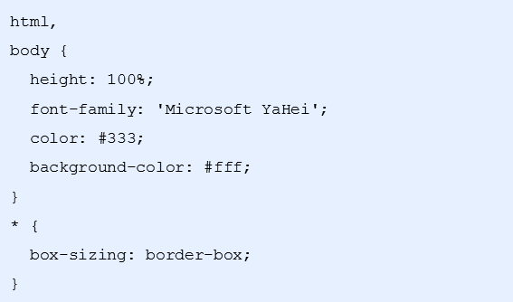
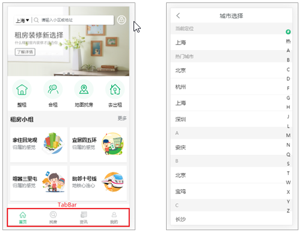

# 好客租房移动Web - 上

## 目标

- 能够初始化项目
- 能够使用 antd-mobile 组件库
- 能够完成项目整体布局
- 能够理解嵌套路由
- 能够使用antd-mobile提供的TabBar组件
- 能够对TabBar进行定制
- 能够实现首页路由的处理

## 项目介绍

- 好客租房 - 移动 Web 端
- 项目介绍：本项目是一个在线租房项目，实现了类似链家等项目的功能，解决了用户租房的需求
- 核心业务：在线找房（地图、条件搜索）、用户登录、房源发布等



## 技术栈

- React核心库：react、react-dom、react-router-dom
- 脚手架：create-react-app
- 数据请求：axios
- UI组件库：antd-mobile
- 其他组件库：react-virtualized、formik+yup、react-spring等
- 百度地图API

## 项目准备

### 项目搭建（★★★）

- 本地接口部署
  - 创建并导入数据：数据库名称hkzf(固定名称)
- 使用脚手架初始化项目
  - 使用 npx create-react-app hkzf-mobile
  - 进入到项目根目录 使用 npm start

### 项目目录结构（★★★）



- 调整项目结构



### antd-mobile 组件库（★★★）

#### 介绍与使用

- 打开 antd-mobile的[文档](https://mobile.ant.design/index-cn)
- `antd-mobile` 是 [Ant Design](http://ant.design/) 的移动规范的 React 实现，服务于蚂蚁及口碑无线业务。

#### 特性

- UI 样式高度可配置，拓展性更强，轻松适应各类产品风格
- 基于 React Native 的 iOS / Android / Web 多平台支持，组件丰富、能全面覆盖各类场景 (antd-mobile-rn)
- 提供 "组件按需加载" / "Web 页面高清显示" / "SVG Icon" 等优化方案，一体式开发
- 使用 TypeScript 开发，提供类型定义文件，支持类型及属性智能提示，方便业务开发
- 全面兼容 react / preact

#### 适用场景

- 适合于中大型产品应用
- 适合于基于 react / preact / react-native 的多终端应用
- 适合不同 UI 风格的高度定制需求的应用

#### 快速上手

- 创建一个项目

- 安装

  - npm install antd-mobile --save

- 使用

  - 导入组件
  - 导入样式

  ```js
  // 导入组件
  import { Button } from 'antd-mobile';
  // 导入样式
  import 'antd-mobile/dist/antd-mobile.css';  // or 'antd-mobile/dist/antd-mobile.less'
  ReactDOM.render(<Button>Start</Button>, mountNode);
  ```

### 配置路由

- 安装 yarn add react-router-dom
- 导入路由组件：Router / Route / Link
- 在pages文件夹中创建 Home/index.js 和 CityList/index.js 两个组件
- 使用Route组件配置首页和城市选择页面


### 外观和样式调整

- 修改页面标题，在index.html里面修改
- 基础样式调整，在index.css 中调整



## 项目整体布局

### 两种页面布局

- 有TabBar的页面： 首页、找房、资讯、我的
- 无TabBar的页面：城市选择等
- TabBar 的菜单也可以实现路由切换，也就是路由内部切换路由（嵌套路由）



### 嵌套路由（★★★）

- 嵌套路由：路由内部包含路由
- 用Home组件表示父路由的内容
- 用News组件表示子路由的内容

#### 使用步骤

- 在pages文件夹中创建News/index.js 组件
- 在Home组件中，添加一个Route作为子路由的出口
- 设置嵌套路由的path，格式以父路由path开头(父组件展示了，子组件才会展示)
- 修改pathname为 /home/news，News组件的内容就会展示在Home组件中了


### 实现TabBar（★★★）

#### 拷贝TabBar组件结构

- 打开 antd-mobile 组件库中TabBar的组件文档
- 选择APP型选项卡菜单，点击 `</>`显示源码
- 拷贝核心代码到 Home 组件中（Home是父路由组件）
- 调整代码

#### 修改TabBar组件样式

- 修改TabBar菜单项文字标题
  - TabBar的文字标题在TabBar.Item 的title属性中，所以我们修改对应四个title属性即可

```js
<TabBar.Item
    title="首页"
    ...
>
</TabBar.Item>
<TabBar.Item
    title="找房"
    ...
>
</TabBar.Item>
<TabBar.Item
    title="咨询"
    ...
>
</TabBar.Item>
<TabBar.Item
    title="我的"
    ...
>
</TabBar.Item>
```

- 修改TabBar菜单文字标题颜色
  - TabBar菜单选中的文字颜色在 TabBar的 tintColor 属性中设置
  - 未选中文字颜色用默认的即可，删除 TabBar中的 unselectedTintColor 属性

```js
<TabBar
    tintColor="#21b97a"
    barTintColor="white"
>
...
</TabBar>
```

- 使用字图图标，修改TabBar菜单的图标
  - 字体图标的 资源在课件的素材中，直接复制过来即可
  - 在 index.js里面引入字体图标的 css样式文件，这样我们只需要在组件中设置对应的类名即可,icon代表是默认图标，selectedIcon代表是选中的图标

```js
<TabBar.Item
    {/*默认的图标*/}
    icon={
        <i className="iconfont icon-ind"></i>
    }
     {/*选中图标*/}
    selectedIcon={<i className="iconfont icon-ind"></i>
    }
    ...
>
</TabBar.Item>
<TabBar.Item
    icon={
        <i className="iconfont icon-findHouse"></i>
    }
    selectedIcon={
        <i className="iconfont icon-findHouse"></i>
    }
    ...
>
</TabBar.Item>
<TabBar.Item
    icon={
        <i className="iconfont icon-infom"></i>
    }
    selectedIcon={
        <i className="iconfont icon-infom"></i>
    }
    ...
>
</TabBar.Item>
<TabBar.Item
    icon={
        <i className="iconfont icon-my"></i>
    }
    selectedIcon={<i className="iconfont icon-my"></i>}
    ...
>
</TabBar.Item>
```


- 修改TabBar菜单项的图标大小
  - 在当前组件对应文件夹中创建index.css文件，修改一下字体图标的大小，设置为20px（注意，在home.js中记得导入当前的样式）

- 调整TabBar的位置，固定在最底部
  - 通过调试工具我们发现，底部的TabBar的类名叫 am-tab-bar-bar，所以我们只需要设置一下这个类名的属性即可
- 去掉TabBar的徽章
  - 找到TabBar.Item里面对应的 badge 属性，删除即可 

#### TabBar配合路由实现

- 根据TabBar组件文档设置不渲染内容（只保留菜单项，不显示内容）
  - 给TabBar设置 noRenderContent  属性即可

```js
<TabBar
    ...
    noRenderContent = "true"
>
```

- 给TabBar.Item 绑定点击事件，在点击事件逻辑里面利用编程式导航，进行路由的切换
  - 利用 this.props.history,push() 来实现

```
 <TabBar.Item
    ...
    onPress={() => {
        this.setState({
            selectedTab: 'blueTab',
        });
        {/* 切换路由 */}
        this.props.history.push('/home/index')
    }}
>
</TabBar.Item>
<TabBar.Item
    ...
    onPress={() => {
        this.setState({
            selectedTab: 'redTab',
        });
        this.props.history.push('/home/list')
    }}
>
</TabBar.Item>
<TabBar.Item
    ...
    onPress={() => {
        this.setState({
            selectedTab: 'greenTab',
        });
        this.props.history.push('/home/news')
    }}
>
</TabBar.Item>
<TabBar.Item
    ...
    onPress={() => {
        this.setState({
            selectedTab: 'yellowTab',
        });
        this.props.history.push('/home/profile')
    }}
>
</TabBar.Item>
```

- 创建TabBar组件菜单项对应的其他3个组件，并在Home组件中配置路由信息
  - 创建对应的组件，然后在 home.js中进行导入，最后配置一下路由

```js
{/* 配置路由信息 */}
<Route path="/home/index" component={Index}></Route>
<Route path="/home/list" component={HouseList}></Route>
<Route path="/home/news" component={News}></Route>
<Route path="/home/profile" component={Profile}></Route>
```

- 给菜单项添加selected属性，设置当前匹配的菜单项高亮

  - 通过 this.props.location.pathname 就能拿到当前的路由的path
  - 在TabBarItem里面设置 selected的属性，判断是否等于当前的pathname
  - 在state中记录当前的pathname

  ```js
   state = {
       // 选中的菜单项,记录当前的pathname来匹配对应的tab
       selectedTab: this.props.location.pathname,
  
   }
  ```

  - 在每个TabBar.Item里面利用selected属性判断一下

```js
<TabBar.Item
     selected={this.state.selectedTab === '/home/index'}
     onPress={() => {
         this.setState({
             selectedTab: '/home/index',
         });
         this.props.history.push('/home/index')
     }}
     ...
 >
 </TabBar.Item>
 <TabBar.Item
     selected={this.state.selectedTab === '/home/list'}
     onPress={() => {
         this.setState({
             selectedTab: '/home/list',
         });
         this.props.history.push('/home/list')
     }}
     ...
 >
 </TabBar.Item>
 <TabBar.Item
     selected={this.state.selectedTab === '/home/news'}
     onPress={() => {
         this.setState({
             selectedTab: '/home/news',
         });
         this.props.history.push('/home/news')
     }}
     ...
 >
 </TabBar.Item>
 <TabBar.Item
     selected={this.state.selectedTab === '/home/profile'}
     onPress={() => {
         this.setState({
             selectedTab: '/home/profile',
         });
         this.props.history.push('/home/profile')
     }}
     ...
 >
 </TabBar.Item>
```

#### TabBar代码的重构

- 发现TabBar的Iitem里面的内容几乎是一致的，只是里面内容不同
- 所以我们可以封装一下
- 提供菜单数据


- 使用map来进行遍历

声明一下数据源

```js
const tabItems = [{
    title: '首页',
    icon: 'icon-ind',
    path: '/home/index'
},
{
    title: '找房',
    icon: 'icon-findHouse',
    path: '/home/list'
},
{
    title: '资讯',
    icon: 'icon-infom',
    path: '/home/news'
},
{
    title: '我的',
    icon: 'icon-my',
    path: '/home/profile'
}]
```

封装一个函数来遍历渲染

```js
renderTabBarItem() {
   return tabItems.map(item => {
        return (
            <TabBar.Item
                title={item.title}
                key={item.title}
                icon={
                    <i className={`iconfont ${item.icon}`}></i>
                }
                selectedIcon={<i className={`iconfont ${item.icon}`}></i>
                }
                selected={this.state.selectedTab === item.path}
                onPress={() => {
                    this.setState({
                        selectedTab: item.path,
                    });
                    this.props.history.push(item.path)
                }}
            >
            </TabBar.Item>

        )
    })
}
```

在render方法中调用即可

```js
render() {
    return (<div>
        {/* 配置路由信息 */}
        <Route path="/home/index" component={Index}></Route>
        <Route path="/home/list" component={HouseList}></Route>
        <Route path="/home/news" component={News}></Route>
        <Route path="/home/profile" component={Profile}></Route>
        {/* 底部导航栏 */}
        <TabBar
            tintColor="#21b97a"
            barTintColor="white"
            noRenderContent="true"
        >
            {this.renderTabBarItem()}
        </TabBar>
    </div>)
}
```

## 首页实现（★★★）

- 首页的路由是需要去处理的
- 修改首页路由的配置： /home(去掉后面的index)；这里需要添加 exact属性
- 如果是默认路由需要跳转到 /home 


```js
{/* 配置默认路由 */}
<Route path="/" exact render={() => <Redirect to="/home"></Redirect>}></Route>
```

