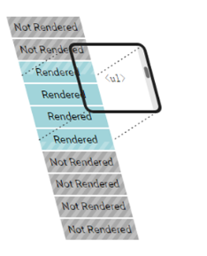
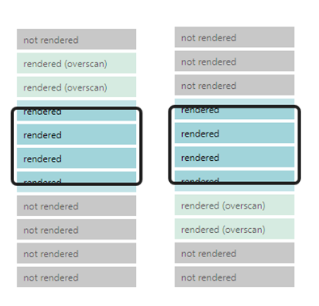

# 城市选择模块

## 目标

- 能够实现顶部导航栏
- 能够获取城市列表数据，热门城市数据，当前定位城市数据，并且对数据进行重新封装
- 知道什么是长列表，以及带来的缺陷
- 说出长列表性能优化的两种方式
- 能够使用 react-virtualized进行城市列表的渲染
- 能够渲染右侧索引列表

## 功能分析

- 切换城市，查看该城市下的房源信息
- 功能
  - 顶部导航栏
  - 城市列表展示
  - 使用索引快速切换城市
  - 点击城市名称切换城市

## 顶部导航栏（★★★）

- 打开antd-mobile 组件库的NavBar 导航栏组件 文档
- 从文档中拷贝组件示例代码到项目中，让其正确运行
- 修改导航栏样式和结构

**示例**

- 引入 组件库

```js
import {NavBar, Icon} from 'antd-mobile'
```

- 拷贝代码结构

```js
<div>
    <NavBar
        // 模式 默认值是 dark
        mode="light"
        // 左侧小图片
        icon={<Icon type="left" />}
        // 左侧按钮的点击事件
        onLeftClick={() => console.log('onLeftClick')}
        // 右侧按按钮图标
        rightContent={[
            <Icon key="0" type="search" style={{ marginRight: '16px' }} />,
            <Icon key="1" type="ellipsis" />,
        ]}
    >城市列表</NavBar>
</div>
```

- 修改结构代码

```js
<div>
    <NavBar
        // 模式 默认值是 dark
        mode="light"
        // 左侧小图片
        icon={<i className='iconfont icon-back' />}
        // 左侧按钮的点击事件
        onLeftClick={() => this.props.history.go(-1)}
    >城市列表</NavBar>
</div>
```

- 设置相应的样式

```scss
.citylist {
    .navbar {
        color: #333;
        background-color: #f6f5f6;
    }
    // navbar 标题颜色
    .am-navbar-title {
        color: #333;
    }
}
```

## 获取处理数据（★★★）

- 页面加载时候，根据接口获取到城市列表数据
- 分析当前数据格式以及该功能需要的数据格式
- 转换当前数据格式为所需要的数据格式‘

### 获取数据

- 根据接口文档提供的url进行网络请求
- 获取到相应的数据信息

```js
// 当组件被挂载的时候调用
componentDidMount() {
   this.getCityList()
}
async getCityList() {
    let {data:res} = await axios.get('http://localhost:8080/area/city?level=1')
    console.log(res);
}
```

### 处理数据格式

我们需要把服务器返回的数据进行格式化处理，我们可以通过首字母来进行城市的定位，所以我们需要把格式转换成以下格式


- 我们需要遍历  list数组
- 获取到每一个城市的首字母
- 判断我们定义的数组中是否有这个分类，如果有，那么直接push数据进来，如果没有，添加这个分类
- 当城市列表数据按照首字母分好类了之后，还需要实现热门城市数据和定位城市数据
- 获取热门城市数据，添加到`cityList` 列表数据中，将索引数据添加到 `cityIndex` 索引数据中
- 获取当前城市数据，添加到`cityList` 列表数据中，将索引数据添加到 `cityIndex` 索引数据中

封装一个函数，来处理这个数据

```js
/**
 * 格式化返回的数据
 * @param {*} list 
 */
function formatCityData(list) {
    // 键是首字母，值是一个数组：对应首字母的城市信息
    let cityList = {}
    list.forEach(item => {
        // 通过简写获取到第一个首字母
        let first = item.short.substr(0, 1)
        // 判断对象中是否有这个key 我们可以利用对象取值的第二种方式 中括号的方式
        if(cityList[first]){
            // 如果进入if 代表有这个值，我们只需要直接push进去
            cityList[first].push(item)
        }else{
            // 如果进入else 代表没有这个值，我们初始化这个属性，并且把当前数据设置进去
            cityList[first] = [item]
        }
    })
    // 接下来我们需要把 cityList里面所有的key取出来，放在数组中，充当城市列表右侧的首字母导航条
    let cityIndex = Object.keys(cityList).sort() 
    return {
        cityList,
        cityIndex
    }
}
```

在`getCityList()`方法中调用这个函数，来格式化数据

```js
async getCityList() {
    let { data: res } = await axios.get('http://localhost:8080/area/city?level=1')
    // 格式化返回的数据
    let { cityList, cityIndex } = formatCityData(res.body)
}
```

**获取热门数据**，并且添加到 `cityList`和`cityListIndex`中，注意，对象里面的属性是无序的，可以直接插入，但是数组是有序的，我们需要添加到前面

```js
// 获取热门城市数据
let {data: hotRes} = await axios.get('http://localhost:8080/area/hot')
// 将热门数据添加到 cityList
cityList['hot'] = hotRes.body
// 将热门数据添加到 cityIndex 
cityIndex.unshift('hot')
```

**获取当前城市信息**，我们将获取定位城市的代码封装到一个函数中，哪个页面需要获取定位城市，直接调用该方法即可

- 在utils目录中，创建一个文件，在这个文件中进行封装
- 创建并且导出获取定位城市的函数 getCurrentCity
- 判断localStorage中是否有定位信息
- 如果没有，我们通过获取定位信息来获取当前定位城市，获取完了需要存到本地存储中
- 如果有，直接使用就好

```js
import axios from 'axios'
export const getCurrentCity = () => {
    // 获取本地存储中是否有
    let localCity = JSON.parse(localStorage.getItem('localCity'))
    if (!localCity) {
        // 如果没有，就需要获取当前定位城市
        // 利用 promis 来解决异步数据的返回
        return new Promise((resolve, reject) => {
            try {
                // 获取当前城市信息
                var myCity = new window.BMap.LocalCity();
                myCity.get(async res => {
                    // 当获取到对应的城市信息了后，我们需要请求我们自己的服务器
                    const { data: infoRes } = await axios.get('http://localhost:8080/area/info', {
                        params: {
                            name: res.name
                        }
                    })
                    if (infoRes.status != 200) {
                        console.error(infoRes.description)
                        return
                    }
                    console.log(infoRes);

                    // res.data.body
                    // 保存在本地存储中
                    localStorage.setItem('localCity', JSON.stringify(infoRes.body))
                        // 返回城市的数据
                    resolve(infoRes.body)
                });
            } catch (error) {
                // 进入到catch代码块 说明调用失败了
                reject(error)
            }
        })

    }
    // 如果有，我们直接返回城市信息就好,返回一个成功的promis对象即可
    return Promise.resolve(localCity)
}
```

- 将定位的城市信息添加到 `cityList`和`cityIndex`中

```js
// 获取当前城市定位信息
let curCity = await getCurrentCity()
// 将当前城市数据添加到 cityList
cityList['#'] = curCity
// 将当前城市数据添加到 cityIndex 
cityIndex.unshift('#')
```

## 长列表性能优化（★★）

### 概述

在展示大型列表和表格数据的时候（城市列表、通讯录、微博等），会导致页面卡顿，滚动不流畅等性能问题，这样就会导致移动设备耗电加快，影响移动设备的电池寿命

产生性能问题的元素：大量DOM节点的重绘和重排

优化方案：

- 懒渲染
- 可视区域渲染

### 懒渲染

- 懒加载，常见的长列表优化方案，常见于移动端
- 原理：每次只渲染一部分，等渲染的数据即将滚动完时，再渲染下面部分
- 优点：每次渲染一部分数据，速度快
- 缺点：数据量大时，页面中依然存在大量DOM节点，占用内存过多，降低浏览器渲染性能，导致页面卡顿
- 使用场景：数据量不大的情况下

### 可视区渲染（React-virtualized）

原理： 只渲染页面可视区域的列表项，非可视区域的数据 **完全不渲染(预加载前面几项和后面几项)** ，在滚动列表时动态更新列表项





**使用场景：** 一次性展示大量数据的情况

## react-virtualized（★★★）

### 概述

- 在项目中的应用：实现城市选择列表页面的渲染
- react-virtualized 是React组件，用来高效渲染大型列表和表格数据
- GitHub地址： [react-virtualized](https://github.com/bvaughn/react-virtualized)

### 基本使用

- 安装： yarn add react-virtualized
- 在项目入口文件 index.js 中导入样式文件
- 打开 [文档](https://github.com/bvaughn/react-virtualized/blob/master/docs)， 点击List组件，进入List的文档中
- 拷贝示例代码到我们项目中，分析示例代码

```js
import React from 'react';
import ReactDOM from 'react-dom';
import { List } from 'react-virtualized';

// 列表数据
const list = [
  'Brian Vaughn'
  // And so on...
];
// 渲染每一行的内容
function rowRenderer ({
  key,         // Unique key within array of rows
  index,       // 索引号
  isScrolling, // 当前项是否正在滚动中
  isVisible,   // 当前项在List中是可见的
  style        // 重点属性：一定要给每一个行数添加该样式
}) {
  return (
    <div
      key={key}
      style={style}
    >
      {list[index]}
    </div>
  )
}

// 渲染list列表
ReactDOM.render(
  <List
    // 组件的宽度
    width={300}
    // 组件的高度
    height={300}
    rowCount={list.length}
    // 每行的高度
    rowHeight={20}
    rowRenderer={rowRenderer}
  />,
  document.getElementById('example')
);
```

## 渲染城市列表（★★★）

### 让List组件占满屏幕

- 利用 `AutoSizer` 组件来调整子元素的宽高
- 导入 `AutoSizer` 组件
- 通过 render-props 模式，获取到`AutoSizer` 组件暴露的 width 和 height 属性
- 设置List组件的 width  和 height 属性


- 设置城市选择页面根元素高度 100%，让List组件占满整个页面

```scss
.citylist {
    height: 100%;
    padding-top: 45px;
    .navbar {
        margin-top: -45px;
        color: #333;
        background-color: #f6f5f6;
    }
    // navbar 标题颜色
    .am-navbar-title {
        color: #333;
    }
}
```

### 渲染城市列表

- 将获取到的cityList和cityIndex添加为组建的状态数据

```
    state = {
        cityList: null,
        cityIndex: []
    }
```

- 修改List组件的rowCount为cityIndex数组的长度

```js
{/* 城市列表 */}
<AutoSizer>
    {
        ({ width, height }) => {
            return <List
                // 组件的宽度
                width={width}
                // 组件的高度
                height={height}
                rowCount={this.state.cityIndex.length}
                // 每行的高度
                rowHeight={this.getRowHeight}
                rowRenderer={this.rowRenderer}
            />
        }
    }
</AutoSizer>
```

- 修改List组件的rowRender方法中渲染的结构和样式

```js
// 渲染每一行的内容
rowRenderer({
    key,         // Unique key within array of rows
    index,       // 索引号
    isScrolling, // 当前项是否正在滚动中
    isVisible,   // 当前项在List中是可见的
    style        // 重点属性：一定要给每一个行数添加该样式
}) {
    let letter = this.state.cityIndex[index]
    let citys = this.state.cityList[letter]
    return (
        <div
            key={key}
            style={style}
            className="city"
        >
            <div className="title">{this.formatCityIndex(letter)}</div>
            {citys.map(item => {
                return (
                    <div className="name" key={item.value}>{item.label}</div>
                )
            })}</div>
    )
}
```

- 修改List的rowHeight为函数，动态计算每行的高度

```js
// 动态计算高度
getRowHeight = ({ index }) => {
    // 索引的高度 + 数量 * 每个城市的高度
    let { cityIndex, cityList } = this.state;

    return cityList[cityIndex[index]].length * NAME_HEIGHT + TITLE_HEIGHT;
}
```

### 渲染右侧索引列表

- 封装`renderCityIndex`方法，用来渲染城市索引列表
- 在方法中，获取到索引数组 `cityIndex`，遍历`cityIndex`，渲染索引列表
- 将索引hot替换成 热
- 在state中添加状态 activeIndex，用来指定当前高亮的索引
- 在遍历cityIndex时，添加当前字母索引是否是高亮

结构代码

```js
{/* 右侧索引列表 */}
<ul className="city-index">
    {
        this.renderCityIndex()
    }
</ul>
```

样式代码

```scss
.city-index {
    position: absolute;
    display: flex;
    flex-direction: column;
    right: 5px;
    z-index: 1;
    height: 90%;
    box-sizing: border-box;
    padding-top: 20px;
    text-align: center;
    list-style: none;
    .city-index-item {
        flex: 1;
    }
    .index-active {
        color: #fff;
        background-color: #21b97a;
        border-radius: 100%;
        display: inline-block;
        font-size: 12px;
        width: 15px;
        height: 15px;
        line-height: 15px;
    }
}
```

渲染右侧索引的函数

```js
renderCityIndex() {
    return this.state.cityIndex.map((item,index) => {
        console.log(item,index);
        
        return (
            <li className="city-index-item" key={item}>
                {/*判断一下，如果高亮状态的索引等于当前索引，那么就设置高亮样式*/}
                <span className={this.state.activeIndex == index? 'index-active' : ''}>{item == 'hot' ? '热' : item.toUpperCase()}</span>
            </li>
        )
    })
}
```

