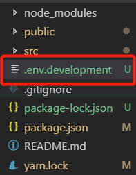
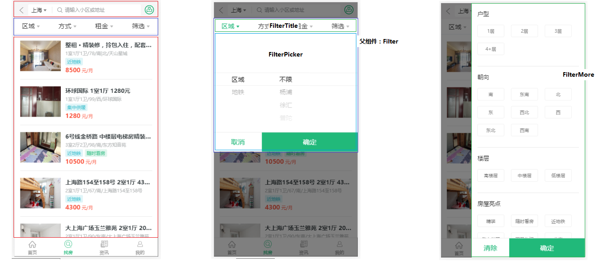

# axios优化&环境变量

## 目标

- 能够通过 axios.create() 方法来构建axios实例对象，并且配置baseURL
- 能够知道 .env.development 和 .env.production 两个文件的作用
- 能够配置开发环境变量
- 能够在代码中引入配置的环境变量的值

每一次我们请求接口的时候，每一次都需要写相同的baseUrl。例如：http://localhost:8080，这样太繁琐，所以我们可以对网络请求进行优化，接口域名、图片域名、分为开发环境和生产环境，直接写在代码中，项目发布时，很难替换

## 配置统一的URL（★★）

```js
axios.defaults.baseURL = 'http://localhost:8080'
// 或者
const instance = axios.create({
    baseURL: 'http://localhost:8080'
})
```

## 配置生产环境和开发环境（★★★）

```
// 通过脚手架的环境变量来解决 开发环境
在开发环境变量文件 .env.development 中，配置 REACT_APP_URL= http://localhost:8080

// 通过脚手架的环境变量解决， 生成环境
在生产环境变量文件 .env.production 中，配置 REACT_APP_URL=线上接口地址
```

## 使用环境变量（★★★）

在react官网中，有详细说明环境变量的配置


在里面会发现对应的文件还有个 .local 后缀的文件，这个文件的优先级更高，以下就是你输入不同命令，执行文件的优先级


- 在项目根目录中创建文件 .env.development



- 在该文件中添加环境变量 REACT_APP_URL（注意：环境变量约定REACT_APP 开头）,设置 REACT_APP_URL=http://localhost:8080

```js
REACT_APP_URL =http://localhost:8080
```

- 重新启动脚手架，脚手架在运行的时候就会解析这个文件
- 在utils/url.js 中，创建 BASE_URL 变量，设置值为 process.env.REACT_APP_URL
- 导出BASE_URL

```js
// 配置baseURL
export const BASE_URL = process.env.REACT_APP_URL
```

- 在我们页面引入就能使用了

```js
import {BASE_URL} from '../../utils/url.js'
```

## axios 优化（★★★）

- 在utils/api.js 中，导入 axios和BASE_URL
- 调用 axios.create() 方法创建一个axios实例
- 给 create 方法，添加配置baseURL，值为 BASE_URL
- 导出API对象

```js
import axios from 'axios'
import { BASE_URL } from './url.js'

// 创建axios的配置文件，里面配置baseURL路径
const config = {
    baseURL: BASE_URL
}

// 根据create 方法来构建axios对象
const instance = axios.create(config)

export { instance }
```

- 导入API，代替之前直接利用axois请求的代码

```js
import {instance} from '../../utils/api.js'
```

# 列表找房功能

## 目标

- 说出抽取搜索导航栏的好处
- 能够说出抽取搜索导航栏的思路，并且参照老师代码能够实现抽取功能
- 能够说出条件筛选功能的大致思路，Filter组件作用，FilterTitle组件作用，FilterPicker组件作用，FilterFooter组件作用
- 能够参照老师代码实现FilterTitle组件中的逻辑代码
- 能够参照老师代码实现FilterPicker组件的逻辑代码

## 功能分析

- 搜索导航栏组件的封装
- 条件筛选栏组件封装
- 条件筛选栏吸顶功能
- 房屋列表

## 顶部搜索导航栏

### 封装搜索导航栏组件（★★★）

- 在components 目录中创建组件 SearchHeader/index.js
- 把之前写过的结构拷贝到这个文件中
- 然后把跟首页相关的数据去掉，标题，城市名称
- 通过props来进行传递

```js
import { Flex } from 'antd-mobile';
import React from 'react'
import {withRouter} from 'react-router-dom'
import './index.scss'
import PropTypes from 'prop-types'

function SearchHeader({ history, cityName}) {
    return (
        <Flex className='search-box'>
            {/* 左侧白色区域 */}
            <Flex className="search">
                {/* 位置 */}
                <div className="location" onClick={() => history.push('/citylist')}>
                    <span className="name">{cityName}</span>
                    <i className="iconfont icon-arrow" />
                </div>

                {/* 搜索表单 */}
                <div className="form" onClick={() => history.push('/search')}>
                    <i className="iconfont icon-seach" />
                    <span className="text">请输入小区或地址</span>
                </div>
            </Flex>
            {/* 右侧地图图标 */}
            <i className="iconfont icon-map" onClick={() => history.push('/map')} />
        </Flex>
    )
}
// 设置校验
SearchHeader.propTypes = {
    cityName: PropTypes.string.isRequired
}
export default withRouter(SearchHeader)
```

### 把搜索导航栏引入到HouseList中,调整相应样式

```js
import React from "react";
import SearchHeader from "../../components/SearchHeader";

let {label} = JSON.parse(localStorage.getItem('localCity'))

export default class HouseList extends React.Component {
 componentDidMount(){
     console.log('houseList')
 }
  render() {
    return (
      <div>
        <SearchHeader cityName={label}> </SearchHeader>
      </div>
    );
  }
}
```

- 在找房页面SearHeader组件基础上，调整结构

  - 我们需要SearHeader组件样式，所以我们还需要传递className的属性进去，调整一下SearchHeader组件

  ```js
  function SearchHeader({ history, cityName, className }) {
    return (
        // search-box 这个样式不能去掉，所以我们可以先通过数组的方式，添加多个类名，然后利用 join 方法转成字符串
      <Flex className={["search-box", className || ""].join(" ")}>
      ...
      </Flex>
      )
  }
  ```

- 给SearchHeader组件传递className属性，来调整组件样式，让其适应找房页面效果，下面是HouseList的头布局

```js
<Flex className={style.header}>
  <i className='iconfont icon-back' onClick={() => this.props.history.go(-1)}></i>
  <SearchHeader cityName={label} className={style.searchHeader}> </SearchHeader>
</Flex>
```

- 创建 index.module.css,设置相应的样式，修改了一些组件中的全局样式，所以我们需要通过 :global来设置

```css
/* 覆盖 searchHeader的样式 */

.header {
    height: 45px;
    background-color: #f5f6f5;
    padding: 0 10px;
}


/* 控制左侧小箭头 */

.header :global(.icon-back) {
    font-size: 16px!important;
    color: #999;
}


/* 控制右侧的图标 */

.header :global(.icon-map) {
    color: #00ae66;
}


/* 控制search输入框 */

.header :global(.search) {
    height: 30px;
}

.searchHeader {
    position: relative;
    top: 0;
    padding: 0;
}
```

## 条件筛选



### 结构分析

- 父组件：Filter
- 子组件：FilterTitle 标题菜单组件
- 子组件：FilterPicker 前三个菜单对应的内容组件
- 子组件：FilterMore 最后一个菜单对应的内容组件

###  功能分析

- 点击FilterTitle组件菜单，展开该条件筛选对话框，被点击的标题高亮
- 点击取消按钮或空白区域，隐藏对话框，取消标题高亮
- 选择筛选条件后，点击确定按钮，隐藏对话框，当前标题高亮
- 打开对话框时，如果有选择的条件，那么默认显示已选择的条件
- 打开对话框已经隐藏对话框有动画效果
- 吸顶功能

### FilterTitle组件实现（★★★）

#### 思路

- 根据标题菜单数据，渲染标题列表
- 标题可以被点击
- 标题高亮
  - 点击时高亮
  - 有筛选条件选中时
  - 标题高亮状态：提升至父组件Filter中，由父组件提供高亮状态，子组件通过props接受状态来实现高亮
  - 原则：单一数据源，也就是说，状态只应该有一个组件提供并且提供操作状态的方法，其他组件直接使用组件中状态和操作状态的方法即可

#### 步骤

- 通过props接受，高亮状态对象 titleSelectedStatus
- 遍历titleList数组，渲染标题列表
- 判断高亮对象中当前标题是否高亮，如果是，添加高亮类

```js
// FilterTitle
// 条件筛选栏标题数组：
const titleList = [
  { title: "区域", type: "area" },
  { title: "方式", type: "mode" },
  { title: "租金", type: "price" },
  { title: "筛选", type: "more" }
];

export default function FilterTitle({titleSelectedStatus}) {
  return (
    <Flex align="center" className={styles.root}>
      {/* 遍历标题数组 */}
      {titleList.map(item => {
        // 获取父组件传递过来的状态
        let isSelected = titleSelectedStatus[item.type];
        return (
          <Flex.Item key={item.type}>
            {/* 选中类名： selected */}{" "}
            <span
              className={[
                styles.dropdown,
                // 判断当前的标题是否是选中状态，如果是，设置选中的样式
                isSelected ? styles.selected : ""
              ].join(" ")}
            >
              <span>{item.title}</span> <i className="iconfont icon-arrow" />
            </span>
          </Flex.Item>
        );
      })}
    </Flex>
  );
}

// Filter
/**
 * 标题高亮状态
 */
const titleSelectedStatus = {
  area: false,
  mode: false,
  price: true,
  more: false
}
export default class Filter extends Component {
  state = {
    titleSelectedStatus
  };
  render() {
    let { titleSelectedStatus } = this.state;
    return (
      <div className={styles.root}>
        {/* 前三个菜单的遮罩层 */}
        <div className={styles.content}>
          {/* 标题栏 */}{" "}
          <FilterTitle titleSelectedStatus={titleSelectedStatus} />
          ...
        </div>
      </div>
    );
  }
}
```

- 给标题项绑定单击事件，在事件中调用父组件传过来的方法 onClick
- 将当前标题type，通过onClick的参数，传递给父组件
- 父组件中接受到当前type，修改改标题的选中状态为true

```js
// Filter 
/**
 * 标题高亮状态
 */
const titleSelectedStatus = {
  area: false,
  mode: false,
  price: false,
  more: false
};

export default class Filter extends Component {
  ...
  // 父元素提供子元素调用的函数
  onTitleClick = type => {
    this.setState({
      titleSelectedStatus: {
        ...titleSelectedStatus,
        [type]: true
      }
    });
  };
  render() {
    let { titleSelectedStatus } = this.state;
    return (
      <div className={styles.root}>
        {" "}
        {/* 前三个菜单的遮罩层 */}
        <div className={styles.content}>
          {" "}
          {/* 标题栏 */}{" "}
          <FilterTitle
            ...
            onClick={this.onTitleClick}
          />
          ...
        </div>{" "}
      </div>
    );
  }
}

// FilterTitle
export default function FilterTitle({titleSelectedStatus,onClick}) {
  return (
    <Flex align="center" className={styles.root}>
      {/* 遍历标题数组 */}
      {titleList.map(item => {
        ...
        return (
          <Flex.Item key={item.type} onClick={() => onClick(item.type)}>
            {/* 选中类名： selected */}{" "}
            <span
              className={[
                styles.dropdown,
                // 判断当前的标题是否是选中状态，如果是，设置选中的样式
                isSelected ? styles.selected : ""
              ].join(" ")}
            >
              <span>{item.title}</span> <i className="iconfont icon-arrow" />
            </span>
          </Flex.Item>
        );
      })}
    </Flex>
  );
}
```

### FilterPicker 组件（★★★）

#### 思路分析

- 点击前三个标题展示该组件，点击取消的时候隐藏
- 使用PickerView组件来实现页面效果
- 获取到PickerView组件中，选中的筛选条件值
- 点击确定按钮，隐藏该组件，将获取到的筛选条件值传递给父组件
- 展示或隐藏对话框的状态：由父组件提供，通过props传递给子组件
- 筛选条件数据：由父组件提供（因为所有筛选条件是通过一个接口来获取的），通过props传递给子组件

#### 使用步骤

##### 定义openType，实现FilterPicker显示隐藏

- 在Filter组件中，提供组件展示或隐藏的状态：openType

```js
  state = {
    ...
    // 控制FilterPicker或 FilterMore组件的展示和隐藏
    openType: ""
  };
```

- 在render方法中判断 openType的值为 area/mode/price 时，就显示 FilterPicker组件，以及遮罩层

```js
{/* 前三个菜单的遮罩层 */} 
{ openType === "area" || openType === "mode" || openType === "price" ? (<div className={styles.mask}></div>) : ("")}
...
{/* 前三个菜单对应的内容： */}
{openType === "area" || openType === "mode" || openType === "price" ? (<FilterPicker />) : ("")}
```

- 在 onTitleClick方法中，修改状态 openType为当前 type，展示对话框

```js
// 父元素提供子元素调用的函数
onTitleClick = type => {
  this.setState({
    titleSelectedStatus: {
      ...titleSelectedStatus,
      [type]: true
    },
    openType: type
  });
};
```

- 在Filter组件中，提供onCancel方法（作为取消按钮和遮罩层的事件）

```js
// 取消,
onCancel = () => {
  // 隐藏对话框
  this.setState({
    openType:''
  })
};
```

- 在onCancel方法中，修改状态 openType为空，隐藏对话框
- 讲onCancel通过props传递给FilterPicker组件，在取消按钮的单击事件中调用该方法
- 在Filter组件中，提供onSave方法，作为确定按钮的事件处理

```js
// 在父组件 Filter中定义 确定和取消的函数
// 取消
onCancel = () => {
  // 隐藏对话框
  this.setState({
    openType: ""
  });
};
// 保存，隐藏对话框
onSave = () => {
  this.setState({
    openType: ""
  });
};
// 传递给FilterPicker
render(){
    return (
       ...
       <FilterTitle
		  titleSelectedStatus={titleSelectedStatus}
		  onClick={this.onTitleClick}
		/>
    )
}

// 在FilterPicker里面进行一次中转，最后这个按钮是在FilterFooter里面
render() {
  let { onCancel ,onSave} = this.props;
  return (
    <>
      {/* 选择器组件： */}
      <PickerView data={province} value={null} cols={3} />

      {/* 底部按钮 */}
      <FilterFooter onCancel={onCancel} onOk={onSave}/>
    </>
  );
}

// 在FilterFooter里面调用
function FilterFooter({
  cancelText = '取消',
  okText = '确定',
  onCancel,
  onOk,
  className
}) {
  return (
    <Flex className={[styles.root, className || ''].join(' ')}>
      {/* 取消按钮 */}
      <span
        className={[styles.btn, styles.cancel].join(' ')}
        onClick={onCancel}
      >
        {cancelText}
      </span>

      {/* 确定按钮 */}
      <span className={[styles.btn, styles.ok].join(' ')} onClick={onOk}>
        {okText}
      </span>
    </Flex>
  )
}
```

##### 获取筛选条件数据

- 在Filter组件中，发送请求，获取所有筛选条件数据
- 将数据保存为状态：filtersData

```js
// 获取筛选数据
  async getFilterData() {
    let { value } = JSON.parse(localStorage.getItem("localCity"));
    let res = await instance.get(`/houses/condition?id=${value}`);
    console.log(res);
    this.setState({
      filtersData: res.data.body
    });
  }
```

- 封装方法 renderFilterPicker 来渲染FilterPicker组件

```js
// 渲染FilterPicker组件的方法
  renderFilterPicker() {
    const { openType } = this.state;
    if (openType !== "area" && openType !== "mode" && openType !== "price")
      return null;
    return <FilterPicker onCancel={this.onCancel} onSave={this.onSave} />;
  }
render(){
    return (
       ...
       {this.renderFilterPicker()}
    )
}
```

- 在方法中，根据openType的类型，从filtersData中获取需要的数据
- 讲数据通过props传递给FilterPicker组件

```js
// 渲染FilterPicker组件的方法
  renderFilterPicker() {
    const {
      openType,
      filtersData: { area, subway, rentType, price }
    } = this.state;
    if (openType !== "area" && openType !== "mode" && openType !== "price")
      return null;
    // 拼接数据
    let data = [];
    // pickerView显示的列数
    let cols = 3
    switch (openType) {
      case "area":
        // 区域数据
        data = [area, subway];
        break;
      case "mode":
        // 方式数据
        data = rentType;
        cols = 1
        break;
      case "price":
        // 租金数据
        data = price;
        cols =1
        break;
    }
    return (
      <FilterPicker onCancel={this.onCancel} onSave={this.onSave} data={data} cols={cols}/>
    );
  }
```

- FilterPicker组件接收到数据后，讲其作为PickerView组件的data

```js
export default class FilterPicker extends Component {
  render() {
    let { onCancel, onSave, data ,cols} = this.props;
    return (
      <>
        {/* 选择器组件： */}
        <PickerView data={data} value={null} cols={cols} />

        {/* 底部按钮 */}
        <FilterFooter onCancel={onCancel} onOk={onSave} />
      </>
    );
  }
}
```

