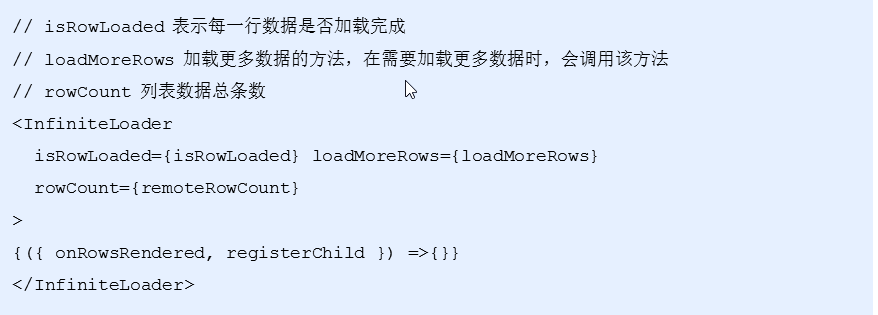

# 列表找房模块-房屋列表

## 目标

- 能够使用windowScroller组件解决整个页面无法滚动的问题
- 能够使用InfiniteLoader组件来实现加载更多逻辑

## 使用`WindowScroller` 跟随页面滚动（★★★）

- **默认：**List组件只让组件自身出现滚动条，无法让整个页面滚动，也就无法实现标题吸顶功能
- **解决方式：**使用`WindowScroller`高阶组件，让List组件跟随页面滚动（为List组件提供状态，同时还需要设置List组件的autoHeight属性）
- **注意：**`WindowScroller`高阶组件只能提供height，无法提供width
- **解决方式：**在WindowScroller组件中使用AutoSizer高阶组件来为List组件提供width


```js
<WindowScroller>
  {({ height, isScrolling, scrollTop }) => (
    <AutoSizer>
      {({ width }) => (
        <List
          autoHeight // 设置高度为 WindowScroller 最终渲染的列表高度
          // 组件的宽度
          width={width} // 视口宽度
          // 组件的高度
          height={height} // 视口高度
          rowCount={this.state.count} // List列表项总条目数
          // 每行的高度
          rowHeight={120} // 每一行高度
          rowRenderer={this.renderHouseList}
          isScrolling={isScrolling}
          scrollTop={scrollTop}
        />
      )}
    </AutoSizer>
  )}
</WindowScroller>
```

## `InfiniteLoader` 组件（★★★）

- 滚动房屋列表时候，动态加载更多房屋数据
- 使用`InfiniteLoader` 组件，来实现无限滚动列表，从而加载更多房屋数据
- 根据 `InfiniteLoader` 文档示例，在项目中使用组件



```js
<InfiniteLoader
  isRowLoaded={this.isRowLoaded}
  loadMoreRows={this.loadMoreRows}
  rowCount={count}
>
  {({ onRowsRendered, registerChild }) => (
    <WindowScroller>
      {({ height, isScrolling, scrollTop }) => (
        <AutoSizer>
          {({ width }) => (
            <List
              onRowsRendered={onRowsRendered}
              ref={registerChild}
              autoHeight // 设置高度为 WindowScroller 最终渲染的列表高度
              // 组件的宽度
              width={width} // 视口宽度
              // 组件的高度
              height={height} // 视口高度
              rowCount={count} // List列表项总条目数
              // 每行的高度
              rowHeight={120} // 每一行高度
              rowRenderer={this.renderHouseList}
              isScrolling={isScrolling}
              scrollTop={scrollTop}
            />
          )}
        </AutoSizer>
      )}
    </WindowScroller>
  )}
</InfiniteLoader>
 // 判断每一行数据是否加载完毕
  isRowLoaded = ({ index }) => {
    return !!this.state.list[index];
  };
  // 用来获取更多房屋列表数据
  // 注意，该方法的返回值是一个 Promise 对象，并且，这个对象应该在数据加载完成时，来调用 resolve让 Promise对象的状态变为已完成
  loadMoreRows = ({ startIndex, stopIndex }) => {
    return new Promise(resolve => {
       ...
    });
  };
```


## 加载更多房屋列表数据

- 在loadMoreRows方法中，根据起始索引和结束索引，发送请求，获取更多房屋数据
- 获取到最新的数据后，与当前list中的数据合并，再更新state，并调用Promise的resolve

```js
 loadMoreRows = ({ startIndex, stopIndex }) => {
    return new Promise(resolve => {
      instance
        .get("/houses", {
          params: {
            cityId: value,
            ...this.filters,
            start: startIndex,
            end: stopIndex
          }
        })
        .then(res => {
          this.setState({
            list: [...this.state.list, ...res.data.body.list]
          });

          // 加载数据完成时，调用resolve即可
          resolve();
        });
    });
  };
```

- 在renderHouseList方法中，判断house是否存在
- 不存在的时候，就渲染一个loading元素
- 存在的时候，再渲染HouseItem组件

```js
// 渲染每一行的内容
  renderHouseList = ({
    key, // Unique key within array of rows
    index, // 索引号
    style // 重点属性：一定要给每一个行数添加该样式
  }) => {
    // 当前这一行的
    const { list } = this.state;
    const house = list[index];
    // 如果不存在，需要渲染loading元素占位
    if (!house) {
      return (
        <div key={key} style={style}>
          <p className={styles.loading}></p>
        </div>
      );
    }
    return (
      ...
    );
  };
```

# 列表找房模块-吸顶功能（★★★）

## 目标

- 能够完成吸顶的功能
- 能够封装通用的Sticky组件

## 实现思路

- 在页面滚动的时候，判断筛选栏上边是否还在可视区域内
- 如果在，不需要吸顶
- 如果不在，就吸顶
- 吸顶之后，元素脱标，房屋列表会突然往上调动筛选栏的高度，解决这个问题，我们用一个跟筛选栏相同的占位元素，在筛选栏脱标后，代替它撑起高度

## 实现步骤

- 封装Sticky组件
- 在HouseList页面中，导入Sticky组件
- 使用Sticky组件包裹要实现吸顶功能的Filter组件

```js
<Sticky>
  <Filter onFilter={this.onFilter} />
</Sticky>
```

- 在Sticky组件中，创建两个ref对象（placeholder，content），分别指向占位元素和内容元素

```js
class Sticky extends Component {
  // 创建ref对象
  placeholder = createRef()
  content = createRef()
  ...
  render() {
   return (
     <div>
       {/* 占位元素 */}
       <div ref={this.placeholder} />
       {/* 内容元素 */}
       <div ref={this.content}>{this.props.children}</div>
     </div>
   )
}
```

- 在组件中，监听浏览器的scroll事件

```js
// 监听 scroll 事件
componentDidMount() {
  window.addEventListener('scroll', this.handleScroll)
}
componentWillUnmount() {
  window.removeEventListener('scroll', this.handleScroll)
}
```

- 在scroll事件中，通过getBoundingClientRect()方法得到筛选栏占位元素当前位置
- 判断top是否小于0（是否在可视区内）
- 如果小于，就添加需要吸顶样式（fixed），同时设置占位元素高度
- 否则，就移除吸顶样式，同时让占位元素高度为0

```js
// scroll 事件的事件处理程序
handleScroll = () => {
  // 获取DOM对象
  const placeholderEl = this.placeholder.current
  const contentEl = this.content.current

  const { top } = placeholderEl.getBoundingClientRect()
  if (top < 0) {
    // 吸顶
    contentEl.classList.add(styles.fixed)
    placeholderEl.style.height = '40px'
  } else {
    // 取消吸顶
    contentEl.classList.remove(styles.fixed)
    placeholderEl.style.height = '0px'
  }
}
```

## 通用性优化

- 现在Sticky组件中占位元素的高度是写死的，这样就不通用了，我们可以把这个高度通过参数来进行传递，组件内部通过props就可以来进行获取了

```js
// HouseList组件
<Sticky height={40}>
  <Filter onFilter={this.onFilter} />
</Sticky>

// Sticky 组件
  handleScroll = () => {
    const { height } = this.props;
    ...
    const { top } = placeholderEl.getBoundingClientRect();
    if (top < 0) {
      // 吸顶
      contentEl.classList.add(styles.fixed);
      placeholderEl.style.height = `${height}px`;
    } else {
      // 取消吸顶
      contentEl.classList.remove(styles.fixed);
      placeholderEl.style.height = "0px";
    }
  };
```

# 列表找房模块-优化（★★★）

## 目标

- 学习在已有代码上寻找bug的思路（定位bug原因，思考解决办法）

## 加载提示

- 实现加载房源数据时：加载中、加载完成的提示（需要解决：没有房源数据时，不弹提示框）
  - 判断一下count是否为0，如果为0，就不加载提示信息
- 找不到房源数据时候的提示（需要解决：进入页面就展示该提示的问题）
  - 判断一下是否是第一次进入，可以用一个变量来进行记录，然后只要进行了数据请求，就把这个标识更改

## 条件筛选栏优化

- 点击条件筛选栏，展示FilterPicker组件时，样式错乱问题（需要解决：样式问题）
  - 把FilterPicker组件修改成绝对定位，脱标了，就不会挤下面的结构了
- 使用条件筛选查询数据时，页面没有回到顶部（需要解决：每次重新回到页面顶部）
  - 在点击条件查询确定按钮的时候，利用window.scroll(0 ,0) 来回到页面顶部
- 点击条件筛选栏，展示对话框后，页面还会滚动（需要解决：展示对话框后页面不滚动）
  - 展示对话框的时候，给body添加 overflow: hidden 的样式，这样页面就不能进行滚动，等到对话框消失的时候，取消body的 overflow: hidden 样式

## 切换城市显示房源优化

- 切换城市或，该页面无法展示当前定位城市名称和当前城市房源数据，刷新页面后才会生效（需要解决：切换城市后立即生效）
  - 在组件的 componentDidMount构造函数中，进行获取当前定位城市名称

# react-spring动画库（★★★）

## 目标

- 知道react-spring组件库的优势
- 能够参照官方文档，使用react-spring进行简单的透明度变化的动画
- 能够实现遮罩层动画效果

## 概述

- 场景：展示筛选对话框的时候，实现动画效果，增强用户体验
- react-spring是基于spring-physics（弹簧物理）的react动画库，动画效果更加流畅、自然
- 优势：
  - 几乎可以实现任意UI动画效果
  - 组件式使用方式（render-props模式），简单易用，符合react的声明式特性，性能高
- [github地址](https://github.com/react-spring/react-spring)
- [官方文档](https://www.react-spring.io/docs/props/spring)

## 基本使用

- 安装： yarn add react-spring
- 打开Spring组件文档
- 导入Spring文档，使用Spring组件包裹要实现动画效果的遮罩层div
- 通过render-props模式，讲参数props设置为遮罩层div的style
- 给Spring组件添加from属性，指定：组件第一次渲染时的动画状态
- 给Spring组件添加to属性，指定：组件要更新的新动画状态
- props就是透明度有0~1中变化的值


## 实现遮罩层动画

- 创建方法 renderMask来渲染遮罩层 div
- 修改渲染遮罩层的逻辑，保证Spring组件一直都被渲染（Spring组件被销毁了，就无法实现动画效果）
- 修改to属性的值，在遮罩层隐藏时为0，在遮罩层展示为1
- 在render-props的函数内部，判断props.opacity是否等于0
- 如果等于0，就返回null，解决遮罩层遮挡页面导致顶部点击事件失效
- 如果不等于0，渲染遮罩层div

```js
renderMask() {
    const { openType } = this.state

    const isHide = openType === 'more' || openType === ''

    return (
      <Spring from={{ opacity: 0 }} to={{ opacity: isHide ? 0 : 1 }}>
        {props => {
          // 说明遮罩层已经完成动画效果，隐藏了
          if (props.opacity === 0) {
            return null
          }

          return (
            <div
              style={props}
              className={styles.mask}
              onClick={() => this.onCancel(openType)}
            />
          )
        }}
      </Spring>
    )
```

