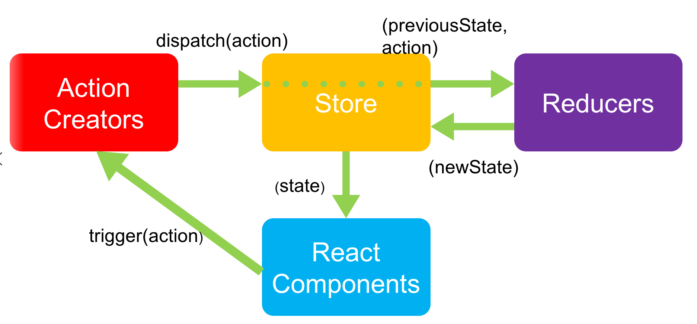

# Redux基础

+ [ ] redux基本介绍
+ [ ] react-redux的使用
+ [ ] redux核心概念

# redux

## redux 基本介绍

### 概念

redux是一个用来管理状态（数据）的框架。

React 只是 DOM 的一个抽象层（UI 库），并不是 Web 应用的完整解决方案。因此react在涉及到数据的处理以及组件之间的通信时会比较复杂

- 对于大型的复杂应用来说，这两方面恰恰是最关键的。因此，只用 React，写大型应用比较吃力。
- 2014 年 Facebook 提出了 Flux 架构的概念，引发了很多的实现。
- 2015 年，Redux 出现，将 Flux 与函数式编程（reducer）结合一起，很短时间内就成为了最热门的前端架构。 
- Flux 是最早的状态管理 工具，它提供了状态管理的思想，也提供对应的实现
- 除了 Flux、Redux 之外，还有：Mobx 等状态管理工具

### 为什么要用redux？

例如，一个组建的数据共享到其他组建，A1-1组建的数据要在A2和A2-1中使用，用以往的方式通过组建间传递也能实现，但是太过麻烦，如果项目较大，数据交互较多的场景，数据维护更为复杂，所以更适合将公共的数据放到公共的仓库中。


以下摘自阮一峰文章！

事实上，大多数情况，你可以不用它，只用 React 就够了。

曾经有人说过这样一句话。

> "如果你不知道是否需要 Redux，那就是不需要它。"

Redux 的创造者 Dan Abramov 又补充了一句。

> "只有遇到 React 实在解决不了的问题，你才需要 Redux 。"

简单说，如果你的UI层非常简单，没有很多互动，Redux 就是不必要的，用了反而增加复杂性。

> - 用户的使用方式非常简单
> - 用户之间没有协作
> - 不需要与服务器大量交互，也没有使用 WebSocket
> - 视图层（View）只从单一来源获取数据

上面这些情况，都不需要使用 Redux。

我不做大型项目，那么我还要去学习吗？

当然要学，现在不做大型项目，不代表以后不做大型项目，要为未来铺路，面试关于react技术栈，几乎必问redux，所以也为面试增砖添瓦。

## 准备工作

+ 利用create-react-app快速初始化项目

  ```js
  create-react-app redux-demo
  ```

+ 清理项目结构

+ 安装redux

  ```js
  npm i redux
  ```

## redux快速上手

### 创建store仓库

+ 在src下创建store文件夹，在store下创建index.js

+ 创建redux仓库

  ```js
  import { createStore } from 'redux'
  const defaultState = {
    count: 1
  }
  const store =  createStore((state = defaultState) => {
    return state
  })
  
  export default store
  ```

### getState

+ 通过getState获取仓库的数据并展示

  ```js
  import store from './store/index.js'
  const App = () => {
    const { count } = store.getState()
    return <div>计数器：{count}</div>
  }
  
  export default App
  
  ```

## 计数器案例

### 准备工作

+ 准备Add组建

  ```jsx
  const Add = () => {
    return <button>加</button>
  }
  
  export default Add
  
  ```

+ 准备sub组建

  ```jsx
  const Sub = () => {
    return <button>减</button>
  }
  
  export default Sub
  
  ```

+ 在App中使用

  ```js
  import store from './store/index.js'
  import Add from './components/Add'
  import Sub from './components/Sub'
  const App = () => {
    const { count } = store.getState()
    return (
      <div>
        <Add />
        计数器：{count}
        <Sub />
      </div>
    )
  }
  
  export default App
  
  ```

### 实现累加

#### 累加+1

+ add组建注册点击事件,通过dispatch触发修改state的操作，进行数据修改，参数是action

  ```jsx
  import store from '../store'
  const Add = () => {
    return (
      <button
        onClick={() =>
          store.dispatch({
            type: 'ADD'
          })
        }
      >
        加
      </button>
    )
  }
  
  export default Add
  
  ```

  

+ 在reducer纯函数中的第二个参数为action，action可以获取到dispatch操作的类型和数据

  ```js
  import { createStore } from 'redux'
  const defaultState = {
    count: 0
  }
  const store = createStore((state = defaultState, action) => {
    switch (action.type) {
      case 'ADD':
        return {
          ...state,
          count: state.count + 1
        }
      default:
        return state
    }
  })
  export default store
  
  
  ```

+ 监听数据发生变化重新渲染

  ```jsx
  store.subscribe(() => {
    ReactDOM.render(
      <React.StrictMode>
        <App />
      </React.StrictMode>,
      document.getElementById('root')
    )
  })
  ```

#### 累加+N

+ 传递数据

  ```jsx
  <button
    onClick={() =>
    store.dispatch({
      type: 'ADDN',
      payload: 2
    })
            }
    >
    加N
  </button>
  ```

  

+ 接收数据

  ```js
  import { createStore } from 'redux'
  const defaultState = {
    count: 0
  }
  const store = createStore((state = defaultState, action) => {
    switch (action.type) {
      case 'ADD':
        return {
          ...state,
          count: state.count + 1
        }
      case 'ADDN':
        return {
          ...state,
          count: state.count + action.payload
        }
      default:
        return state
    }
  })
  export default store
  
  ```

  

### 实现累减

同上。。。

### 安装redux-devtools

+ 极简插件下载安装 redux-devtools

+ 配置

  ```js
  const store = createStore(
     reducer, /* preloadedState, */
  +  window.__REDUX_DEVTOOLS_EXTENSION__ && window.__REDUX_DEVTOOLS_EXTENSION__()
   );
  ```


## Redux核心概念-action

将dispatch触发的行为进行抽离封装

```js
import store from '../store'
import { add, addN } from '../store/action'
const Add = () => {
  return (
    <div>
      <button onClick={() => store.dispatch(add)}>加1</button>
      <button onClick={() => store.dispatch(addN)}>加N</button>
    </div>
  )
}

export default Add
```

Action.js

```js
export const add = {
  type: 'ADD'
}
export const addN = {
  type: 'ADDN',
  payload: 2
}

```


**action内容：**

- action 行动（名词）
- action：描述要做的事情，项目中的每一个功能都是一个 action
  - 比如，
    - 计数器案例：计数器加1、减1
    - todomvc 案例：添加任务、删除任务等
    - 项目：登录，退出等
- 特点：
  - 只描述做什么
  - JS 对象，必须带有 `type` 属性，用于区分动作的类型
  - 根据功能的不同，可以携带额外的数据(payload)，配合该数据来完成相应功能

## Redux核心概念-action creator

**目标**：使用函数去创建一个action

**内容**：

1.  直接使用对象来创建action不灵活，参数写死了。一般会使用函数来创建action，我们把创建action的函数叫做actionCreator
2.  action creator创建函数只是简单的返回一个 action
3.  action creator创建函数的好处是更容易被移植和测试

**核心代码**

```js
export const add = () => ({
  type: 'ADD'
})
export const addN = payload => ({
  type: 'ADDN',
  payload
})

add()
addN(2)
```


## Redux核心概念-reducer

Reducer.js

```js
const defaultState = {
  count: 0
}
const reducer = (state = defaultState, action) => {
  switch (action.type) {
    case 'ADD':
      return {
        ...state,
        count: state.count + 1
      }
    case 'ADDN':
      return {
        ...state,
        count: state.count + action.payload
      }
    default:
      return state
  }
}

export default reducer

```

Index.js

```js
import { createStore } from 'redux'
import reducer from './reducer'
const store = createStore(
  reducer,
  window.__REDUX_DEVTOOLS_EXTENSION__ &&
    window.__REDUX_DEVTOOLS_EXTENSION__()
)
export default store

```


**内容：**

- 这个名字是参考了 JS 数组中的 `reduce` 这个方法  
  - 数组中的 `reduce` 方法，可以来实现累积（比如，累加或者累减）
- reducer：函数，**用来处理action,更新状态，是 Redux 状态更新的地方**
- 特点：
  - 函数签名为：`(prevState, action) => newState`
  - 接收上一次的状态和 action 作为参数，根据 action 的类型，执行不同操作，最终返回新的状态
  - reducer 就是一个`纯函数`，接收旧的 state 和 action，返回新的 state
  - 原则：不要在reducer函数内部直接修改state

## Redux核心概念-纯函数

**目标：**了解纯函数的特点

**内容：**

- 纯函数是*函数式编程*中的概念，对于纯函数来说，**相同的输入总是得到相同的输出**

```jsx
function add (a, b) {
    return a + b
}
add(1, 2)

function add (a, b) {
    return a + b + Math.random()
}
add(1,2)
add(1,2)

// 数组中
const arr = [1,2,3,4,5]
arr.slice(1, 2)
arr.slice(1, 2)
arr.slice(1, 2)

arr.splice(1, 2)
arr.splice(1, 2)
```

- 原则：（一定要遵守！！！）
  - 不得改写参数
  - 不能调用 Date.now()或者 Math.random()等不纯的方法，因为每次会得到不一样的结果
  - 不能使用全局变量
- reducer 必须是一个纯函数
- 纯函数主要的含义就是它不可以修改影响输入值
- 没有副作用，副作用指的是例如函数中一些异步调用或者会影响函数作用域之外的变量一类的操作

## redux工作流程

+ 定义store数据仓库
+ 通过store.getState()获取仓库数据
+ 视图更改数据，创建action，通过dispatch发送action触发修改state的操作
+ 在reducer中通过action获取修改操作和数据对store数据进行更新
+ 组建内部通过通过store.subscribe的回调监听数据发生变化从而重新更新试图



## Action Type的使用

- Action Type 指的是：action 对象中 type 属性的值
- Redux 项目中会多次使用 action type，比如，action 对象、reducer 函数、dispatch(action) 等
- 目标：**集中处理 action type，保持项目中 action type 的一致性**

处理方式：

1. 在 store 目录中创建 `actionTypes` 目录或者 `constants` 目录，集中处理
2. 使用**常量**来存储 action type
3. action type 的值采用：`'domain/action'(功能/动作)形式`，进行分类处理，比如，
   - 计数器：`'counter/increment'` 表示 Counter 功能中的 increment 动作
   - TodoMVC：`'todos/add'` 表示 TodoMVC 案例中 add 动作等
   - 登录：`login/getCode` 表示登录获取验证码的动作；`login/submit` 表示登录功能
   - 个人信息：`profile/get` 表示获取个人资料；`profile/updateName` 表示修改昵称
4. 将项目中用到 action type 的地方替换为这些常量，从而保持项目中 action type 的一致性

```js
export const SET_NAME = 'user/setName'
export const SUB_MORE = 'money/subMore'

```

## 优化action处理

因为在修改数据的时候，要通过store.dispath创建的type类型的值，和action中约定的值，从而实现数据修改，但是如果store.dispath创建的type类型的值或者action中约定的值写错，此时并不会报错，功能也不会实现，进而对调试有了难度。

+ 创建actionTypes

  ```js
  const ADD_COUNT = 'ADD_COUNT'
  const SUB_COUNT = 'SUB_COUNT'
  
  export {
    ADD_COUNT,
    SUB_COUNT
  }
  ```

+ 修改reducer.js

  ```js
  import { ADD_COUNT, SUB_COUNT } from './actionTypes'
  // 仓库数据
  const defaultState = {
    count: 1
  }
  const reducer = (state = defaultState, action) => {
    // reducer 不允许直接修改 state的数据
    if (action.type === ADD_COUNT) {
      const newState = {
        ...state,
        count: state.count + action.value
      }
      return newState
    }
  
    if (action.type === SUB_COUNT) {
      const newState = {
        ...state,
        count: state.count - action.value
      }
      return newState
    }
    return state
  }
  
  export default reducer
  ```

## React-redux基本介绍

**目标：**能够说出为什么需要使用react-redux

**内容：**

- 问题:为什么要使用 React-Redux 绑定库?
- 回答:React 和 Redux 是两个独立的库，两者之间职责独立。因此，为了实现在 React 中使用 Redux 进行状态管理 ，就需要一种机制，将这两个独立的库关联在一起。这时候就用到 React-Redux 这个绑定库了。
- 作用:为 React 接入 Redux，实现在 React 中使用 Redux 进行状态管理。 
- react-redux 库是 Redux 官方提供的 React 绑定库。

## react-redux-基本使用

**目标**：使用[react-redux](https://react-redux.js.org/introduction/getting-started)简化redux在react项目中的使用 

**内容**：

1. 介绍react-redux => `yarn add react-redux`
2. 安装并且配置react-redux => 参考文档
3. 优化刚才的代码

**核心代码**

`index.js`

```js
import ReactDOM from 'react-dom'
import App from './App.js'
import store from './store/store.js'
import { Provider } from 'react-redux'
ReactDOM.render(
  <Provider store={store}>
    <App />
  </Provider>,
  document.querySelector('#root')
)

```

## react-redux-useSelector

**目标**：结合hooks使用react-redux

**内容**：

1. react-redux提供了useSelector
2. useSelector： 从Redux 的 store 中获取 状态(state) 数据。
3. selector 函数应该是个纯函数

**核心代码**

`App.js`

```js
import Add from './components/Add'
import Sub from './components/Sub'
import { useSelector } from 'react-redux'
const App = () => {
  const { count } = useSelector(state => state)
  return (
    <div>
      <Add />
      计数器：{count}
      <Sub />
    </div>
  )
}

export default App

```

`要点`：

- Provider组件依然需要使用

## react-redux-useDispatch

**目标**：结合hooks使用react-redux，修改数据

**内容**：

1. react-redux提供了useDispatch
2. useDispatch：修改数据的hooks

**核心代码**

`App.js`

```js
import { useDispatch } from 'react-redux'
import { add, addN } from '../store/action'
const Add = () => {
  const dispatch = useDispatch()
  return (
    <div>
      <button onClick={() => dispatch(add())}>加1</button>
      <button onClick={() => dispatch(addN(2))}>加N</button>
    </div>
  )
}

export default Add

```

## Reducer 的分离与合并

- 随着项目功能变得越来越复杂，需要 Redux 管理的状态也会越来越多
- 此时，有两种方式来处理状态的更新：
  1. 使用一个 reducer：处理项目中所有状态的更新
  2. 使用多个 reducer：按照项目功能划分，每个功能使用一个 reducer 来处理该功能的状态更新
- 推荐：**使用第二种方案(多个 reducer)**，每个 reducer 处理的状态更单一，职责更明确
- 此时，项目中会有多个 reducer，但是 **store 只能接收一个 reducer**，因此，需要将多个 reducer 合并为一根 reducer，才能传递给 store
- 合并方式：使用 Redux 中的 `combineReducers` 函数
- 注意：**合并后，Redux 的状态会变为一个对象，对象的结构与 combineReducers 函数的参数结构相同**
  - 比如，此时 Redux 状态为：`{ a： aReducer 处理的状态, b： bReducer 处理的状态 }`
- 注意：虽然在使用 `combineReducers` 以后，整个 Redux 应用的状态变为了`对象`，但是，对于每个 reducer 来说，每个 reducer 只负责整个状态中的某一个值。也就是每个 reducer 各司其职，最终，由多个 reducer 合作完成整个应用状态的更新。
  - 也就是：**每个reducer只负责整个应用状态中的某一部分**，每个 reducer 都很自私只关注自己的数据
  - 举个例子：
    - 登录功能：`loginReducer` 处理的状态只应该是跟登录相关的状态
    - 个人资料：`profileReducer` 处理的状态只应该是跟个人资料相关的状态
    - 文章列表、文章详情、文章评论 等

```jsx
import { combineReducers } from 'redux'

const count = (state = 1, action) => {
  switch (action.type) {
    case 'ADD':
      return {
        ...state,
        count: state.count + 1
      }
    case 'ADDN':
      return {
        ...state,
        count: state.count + action.payload
      }
    default:
      return state
  }
}

const user = (state = { token: '21312' }, action) => {
  switch (action.type) {
    case 'SET_NAME':
      return {
        ...state,
        token: action.payload
      }
    default:
      return state
  }
}

const rootRuducer = combineReducers({
  count,
  user
})

export default rootRuducer

```

# 综合案例-todomvc

## 准备工作

+ 复制src即可

+ 创建redux目录架构

  + store/index.js

    ```js
    import { createStore } from 'redux'
    const store = createStore((state = 1) => state)
    export default store
    
    ```

  + actions

  + reducers

+ Index.js中引入store，并交给Provider

  ```js
  import ReactDom from 'react-dom'
  import App from './App'
  import store from './store'
  import { Provider } from 'react-redux'
  console.log(store.getState())
  ReactDom.render(
    <Provider store={store}>
      <App />
    </Provider>,
    document.getElementById('root')
  )
  
  ```

## 定义todos数据

### 定义数据

+ 在reducers中初始化todos默认数据

  ```jsx
  import { combineReducers } from 'redux'
  const initState = [
    { id: 1, name: '干饭', done: false },
    { id: 2, name: '学习', done: false },
    { id: 3, name: '休息', done: false }
  ]
  function todos(state = initState) {
    return state
  }
  const rootReducer = combineReducers({
    todos
  })
  export default rootReducer
  
  ```

### 查看todos数据

+ redux开发者工具中查看数据

  ```js
  import { createStore } from 'redux'
  import reducer from './reducers'
  const store = createStore(
    reducer,
    window.__REDUX_DEVTOOLS_EXTENSION__ &&
      window.__REDUX_DEVTOOLS_EXTENSION__()
  )
  export default store
  ```

​		

+ 或在组件中引入useSelecter

  ```js
  import React from 'react'
  import TodoHeader from './components/TodoHeader'
  import TodoMain from './components/TodoMain'
  import TodoFooter from './components/TodoFooter'
  import './index.css'
  import { useSelector } from 'react-redux'
  export default function App() {
    const state = useSelector(state => state)
    return (
      <section className="todoapp">
        <TodoHeader />
        <TodoMain />
        <TodoFooter />
      </section>
    )
  }
  
  ```

  

  


### 抽离todos reducer

+ 新建todos.js

  ```js
  const initState = [
    { id: 1, name: '干饭', done: false },
    { id: 2, name: '学习', done: false },
    { id: 3, name: '休息', done: false }
  ]
  function todos(state = initState) {
    return state
  }
  
  export default todos
  
  ```

+ 引入

  ```js
  import { combineReducers } from 'redux'
  import todos from './todos'
  const rootReducer = combineReducers({
    todos
  })
  export default rootReducer
  
  ```

## 渲染数据

直接在main组件中引入，不需要在App中引入

```jsx
import { useSelector } from 'react-redux'
const TodoMain = () => {
  const { todos } = useSelector(state => state)
  console.log(todos)
  return (
    <section className="main">
      <input id="toggle-all" className="toggle-all" type="checkbox" />
      <label htmlFor="toggle-all">Mark all as complete</label>
      <ul className="todo-list">
        {/* className="completed" */}
        {todos.map(item => (
          <li>
            <div className="view">
              <input
                className="toggle"
                checked={item.done}
                type="checkbox"
              />
              <label>{item.name}</label>
              <button className="destroy"></button>
            </div>
            <input className="edit" value="Rule the web" />
          </li>
        ))}
      </ul>
    </section>
  )
}

export default TodoMain

```

## 删除任务

+ 定义actions/todos

  ```js
  import { DEL_TODO } from '../actionTypes/todos'
  
  /**
   * 删除任务的action
   * @param {*} payload 删除的id
   */
  export const delTodo = payload => ({
    type: DEL_TODO,
    payload
  })
  
  ```

+ 定义actionTypes/todos

  ```js
  export const DEL_TODO = 'DEL_TODO'
  
  ```

+ reducer中获取action进行业务逻辑判断

  ```js
  import { DEL_TODO } from '../actionTypes/todos.js'
  const initState = [
    { id: 1, name: '干饭', done: false },
    { id: 2, name: '学习', done: false },
    { id: 3, name: '休息', done: false }
  ]
  function todos(state = initState, actions) {
    if (actions.type === DEL_TODO) {
      console.log('删除', actions)
    }
    return state
  }
  
  export default todos
  
  ```

+ todoMain中触发

  ```jsx
  import { useSelector, useDispatch } from 'react-redux'
  
  ```

  ```jsx
  <button className="destroy" onClick={() => dispatch(delTodo(item.id))}></button>
  ```

+ 完善删除逻辑

  ```jsx
  function todos(state = initState, actions) {
    if (actions.type === DEL_TODO) {
      console.log(actions.id)
      return state.filter(item => item.id !== actions.payload)
    }
    return state
  }
  ```

## 修改状态

+ 定义actions

  ```js
  export const changeDone = payload => ({
    type: CHANGE_DONE,
    payload
  })
  ```

+ 定义actionTypes

  ```js
  export const CHANGE_DONE = 'CHANGE_DONE'
  ```

+ reducer中获取action进行业务逻辑判断

  ```js
  import { DEL_TODO, CHANGE_DONE } from '../actionTypes/todos.js'
  const initState = [
    { id: 1, name: '干饭', done: false },
    { id: 2, name: '学习', done: false },
    { id: 3, name: '休息', done: false }
  ]
  function todos(state = initState, actions) {
    if (actions.type === DEL_TODO) {
      return state.filter(item => item.id !== actions.payload)
    } else if (actions.type === CHANGE_DONE) {
      return state.map(item => {
        if (item.id === actions.payload) {
          return {
            ...item,
            done: !item.done
          }
        }
        return item
      })
    }
    return state
  }
  
  export default todos
  
  ```

+ 点击状态触发

  ```jsx
  import { useSelector, useDispatch } from 'react-redux'
  import { delTodo, changeDone } from '../store/actions/todos.js'
  <input
                  className="toggle"
                  checked={item.done}
                  type="checkbox"
                  onChange={() => dispatch(changeDone(item.id))}
                />
  ```

## 添加任务

### 输入框受控

+ 将头部输入框变为受控组件

  ```js
  import React, { useState } from 'react'
  
  export default function TodoHeader() {
    const [name, setName] = useState('')
    return (
      <header className="header">
        <h1>todos</h1>
        <input
          className="new-todo"
          placeholder="What needs to be done?"
          autoFocus
          value={name}
          onChange={e => setName(e.target.value)}
        />
      </header>
    )
  }
  
  ```

+ 敲回车，判断是否为空

  ```js
  import React, { useState } from 'react'
  
  export default function TodoHeader() {
    const [name, setName] = useState('')
    const addTodo = () => {
      if (!name) alert('任务不能为空')
    }
    return (
      <header className="header">
        <h1>todos</h1>
        <input
          className="new-todo"
          placeholder="What needs to be done?"
          autoFocus
          value={name}
          onChange={e => setName(e.target.value)}
          onKeyUp={addTodo}
        />
      </header>
    )
  }
  
  ```

### 添加数据

+ 定义actions

  ```js
  export const addTodo = payload => ({
    type: ADD_TODO,
    payload
  })
  ```

+ 定义actionTypes

  ```js
  export const ADD_TODO = 'ADD_TODO'
  ```

+ reducer中进行逻辑判断

  ```js
  if (actions.type === ADD_TODO) {
    return [...state, actions.payload]
  }
  ```

+ 触发

  ```js
  import React, { useState } from 'react'
  import { useDispatch, useSelector } from 'react-redux'
  import { addTodo } from '../store/actions/todos.js'
  
  export default function TodoHeader() {
    const dispatch = useDispatch()
    const { todos } = useSelector(state => state)
    const [name, setName] = useState('')
    const add = e => {
      if (e.keyCode !== 13) return
      if (!name) alert('任务不能为空')
      dispatch(
        addTodo({
          id: todos.length,
          name,
          done: false
        })
      )
      setName('')
    }
    return (
      <header className="header">
        <h1>todos</h1>
        <input
          className="new-todo"
          placeholder="What needs to be done?"
          autoFocus
          value={name}
          onChange={e => setName(e.target.value)}
          onKeyUp={add}
        />
      </header>
    )
  }
  
  ```

  

## 全选功能

### 默认状态

+ 是否全选

  ```js
  import { useSelector, useDispatch } from 'react-redux'
  import { delTodo, changeDone } from '../store/actions/todos.js'
  const TodoMain = () => {
    const { todos } = useSelector(state => state)
    const isCheckAll = todos.every(item => item.done)
    const dispatch = useDispatch()
    return (
      <section className="main">
        <input
          checked={isCheckAll}
          id="toggle-all"
          className="toggle-all"
          type="checkbox"
        />
        <label htmlFor="toggle-all">Mark all as complete</label>
      </section>
    )
  }
  
  export default TodoMain
  
  ```

### 全选切换

+ 定义actions

  ```js
  export const changeCheckAll = () => ({
    type: CHANGE_ALL
  })
  ```

+ 定义actionsType

  ```js
  export const CHANGE_ALL = 'CHANGE_ALL'
  ```

+ reducer根据逻辑判断

  ```js
  if (actions.type === CHANGE_ALL) {
    console.log(123)
    return state.map(item => ({
      ...item,
      done: !item.done
    }))
  }
  ```

+ 触发

  ```jsx
  <input
    checked={isCheckAll}
    id="toggle-all"
    className="toggle-all"
    type="checkbox"
    onChange={() => dispatch(changeCheckAll())}
    />
  ```

## 修改任务

+ 记录修改项

  ```js
  const [currentId, setCurrentId] = useState('')
  ```

  ```jsx
  <label onDoubleClick={() => setCurrentId(item.id)}>
    {item.name}
  </label>
  ```

### 显示修改框

+ 下包

  ```js
  npm i classnames
  ```

+ 引入

  ```js
  import classnames from 'classnames'
  ```

+ 控制高亮

  ```jsx
  <li
    key={item.id}
    className={classnames({
      completed: item.done,
      editing: item.id === currentId
    })}
    >
  ```

### 获取焦点

直接通过ref获取元素，一直获取的是最后一个

+ 将li单独抽离为组件

  ```js
  import React, { useState } from 'react'
  import { delTodo, changeDone } from '../store/actions/todos.js'
  import classnames from 'classnames'
  import { useDispatch } from 'react-redux'
  const TodoItem = ({ item }) => {
    const [currentId, setCurrentId] = useState('')
    const dispatch = useDispatch()
    return (
      <li
        key={item.id}
        className={classnames({
          completed: item.done,
          editing: item.id === currentId
        })}
      >
        <div className="view">
          <input
            className="toggle"
            checked={item.done}
            type="checkbox"
            onChange={() => dispatch(changeDone(item.id))}
          />
          <label onDoubleClick={() => setCurrentId(item.id)}>
            {item.name}
          </label>
          <button
            className="destroy"
            onClick={() => dispatch(delTodo(item.id))}
          ></button>
        </div>
        <input className="edit" value="" />
      </li>
    )
  }
  
  export default TodoItem
  
  ```

+ 获取焦点

  ```js
  const ref = useRef(null) 
  const showEdit = () => {
      setCurrentId(item.id)
    }
    useEffect(() => {
      ref.current.focus()
    }, [currentId])
  
  
  <label onDoubleClick={showEdit}>{item.name}</label>
  ```

+ 失去焦点隐藏输入框

  ```jsx
  <input
    onBlur={() => setCurrentId(null)}
    className="edit"
    value=""
    ref={ref}
    />
  ```

### 输入框单独受控

+ 定义数据

  ```js
  const [currentName, setCurrentName] = useState('')
  ```

+ 显示输入框修改

  ```js
  const showEdit = () => {
      setCurrentId(item.id)
      setCurrentName(item.name)
    }
  ```

+ 输入框绑定

  ```js
  <input
          onBlur={() => setCurrentId(null)}
          className="edit"
          value={currentName}
          ref={ref}
        />
  ```

+ 监听onChange

  ```js
  <input
          onBlur={() => setCurrentId(null)}
          className="edit"
          value={currentName}
          onChange={e => setCurrentName(e.target.value)}
          ref={ref}
        />
  ```

### 退出

+ 退出,监听keyup事件

  ```js
  <input
          onBlur={() => setCurrentId(null)}
          className="edit"
          value={currentName}
          onChange={e => setCurrentName(e.target.value)}
          onKeyUp={onEdit}
          ref={ref}
        />
  ```

+ 监听键盘事件

  ```js
  const onEdit = e => {
      if (e.keyCode === 27) {
        setCurrentId('')
      }
    }
  ```

### 保存

+ 监听键盘事件

  ```js
  if (e.keyCode === 13) {
        dispatch(
          updateName({
            name: currentName,
            id: currentId
          })
        )
        setCurrentId('')
      }
  ```

+ 定义actions

  ```js
  export const updateName = payload => ({
    type: UPDATE_NAME,
    payload
  })
  ```

+ 定义actiontypes

  ```js
  export const UPDATE_NAME = 'UPDATE_NAME'
  ```

+ 定义reducer

  ```js
  if (actions.type === UPDATE_NAME) {
    return state.map(item => {
      if (item.id === actions.payload.id) {
        return {
          ...item,
          name: actions.payload.name
        }
      }
      return item
    })
  ```

## 清空已完成

+ 展示未完成数量

  ```js
  import { useSelector } from 'react-redux'
  const TodoFooter = () => {
    const { todos } = useSelector(state => state)
    const undone = todos.filter(item => !item.done).length
    return (
      <footer className="footer">
        <span className="todo-count">
          <strong>{undone}</strong> item left
        </span>
      </footer>
    )
  }
  
  export default TodoFooter
  
  ```

+ 清空已完成(定义actions)

  ```js
  export const clearDone = () => ({
    type: CLEAR_DONE
  })
  ```

+ 定义actionTypes

  ```js
  export const CLEAR_DONE = 'CLEAR_DONE'
  ```

+ 定义reducer

  ```js
  if (actions.type === UPDATE_NAME) {
      return state.map(item => {
        if (item.id === actions.payload.id) {
          return {
            ...item,
            name: actions.payload.name
          }
        }
        return item
      })
    }
  ```

+ 触发

  ```jsx
  <button
    onClick={() => dispatch(clearDone())}
    className="clear-completed"
    >
    Clear completed
  </button>
  ```

## 底部筛选

### 创建filters模块

+ 新建filters模块

  ```js
  function filters(state = 'all', { type, payload }) {
    return state
  }
  
  export default filters
  
  ```

+ 合并

  ```js
  import { combineReducers } from 'redux'
  import todos from './todos'
  import filters from './filters'
  const rootReducer = combineReducers({
    todos,
    filters
  })
  export default rootReducer
  
  ```

+ 使用(todoFooter中)

  ```js
  const { filters } = useSelector(state => state)
  console.log(filters)
  ```

### 渲染默认状态

+ 循环生成底部

  ```js
  const status = ['all', 'active', 'completed']
  ```

  ```jsx
  <ul className="filters">
    {status.map(item => (
      <li key={item}>
        <a className="selected" href="#/">
          {item}
        </a>
      </li>
    ))}
  </ul>
  ```

+ 设置默认高亮

  ```jsx
  <a
    className={item === filters ? 'selected' : ''}
    href="#/"
    >
    {item}
  </a>
  ```

### 修改高亮

+ 定义 actions/filters

  ```js
  import { SET_FILTERS } from '../actionTypes/filters'
  
  export const setFilters = payload => ({
    type: SET_FILTERS,
    payload
  })
  
  ```

+ 定义actionTypes/filters

  ```js
  export const SET_FILTERS = 'SET_FILTERS'
  
  ```

+ 定义reducer

  ```js
  import { SET_FILTERS } from '../actionTypes/filters'
  
  function filters(state = 'all', { type, payload }) {
    if (type === SET_FILTERS) {
      return payload
    }
    return state
  }
  
  export default filters
  
  ```

+ 触发

  ```jsx
  <li key={item} onClick={() => dispatch(setFilters(item))}>
    <a
  className={item === filters ? 'selected' : ''}
  href="#/"
  >
    {item}
  </a>
  </li>
  ```

  

## 数据筛选

Main 组件

```js
const todos = useSelector(state => {
    if (state.filters === 'active') {
      return state.todos.filter(item => !item.done)
    } else if (state.filters === 'completed') {
      return state.todos.filter(item => item.done)
    }
    return state.todos
  })
```


