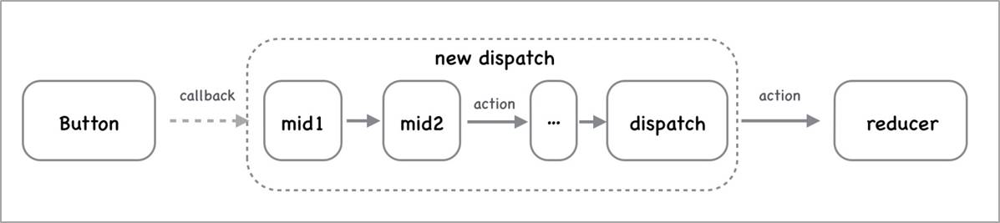
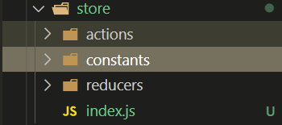

# Redux 中间件

## 中间件概述

**目标：** 能够理解为什么需要redux中间件

**内容：**

默认情况下，Redux 自身只能处理同步数据流。但是在实际项目开发中，状态的更新、获取，通常是使用异步操作来实现。

- 问题：如何在 Redux 中进行异步操作呢?
- 回答：通过 Redux 中间件机制来实现。

>  中间件概念

- 中间件，可以理解为处理一个功能的中间环节
- 下图中，自来水从水库到用户家庭中的每一个环节都是一个中间件
- 中间件的优势：可以串联、组合，在一个项目中使用多个中间件
- **Redux 中间件用来处理 状态 更新，也就是在 状态 更新的过程中，执行一系列的相应操作**


## 中间件的触发时机

- Redux 中间件执行时机：**在 dispatching action 和 到达 reducer 之间**。
  - 没有中间件：`dispatch(action) => reducer`
  - 使用中间件：`dispatch(action) => 执行中间件代码 => reducer`

- 原理：封装了 redux 自己的 dispatch 方法
  - 没有中间件：`store.dispatch()` 就是 Redux 库自己提供的 dispatch 方法，用来发起状态更新
  - 使用中间件：store.dispatch() 就是 中间件 封装处理后的 dispatch，但是，最终一定会调用 Redux 库自己提供的 dispatch 方法

- 没有中间件：
  - 
- 有中间件：
  - 

## logger 中间件

1. 安装：`yarn add redux-logger`
2. 导入 redux-logger
3. 从 redux 中导入 applyMiddleware 函数
4. 将 applyMiddleware() 调用作为 createStore 函数的第二个参数
5. 调用 applyMiddleware 函数时，将 logger 作为参数传入

- 调用 store.dispatch() 查看 logger 中间件记录的日志信息

```js
import { createStore, applyMiddleware } from 'redux'
import logger from 'redux-logger'
import rootReducer from './reducers'
const store = createStore(rootReducer, applyMiddleware(logger))
```

## redux-thunk-基本使用

> `redux-thunk` 中间件可以处理`函数形式的 action`。因此，在函数形式的 action 中就可以执行异步操作代码，完成异步操作。

1. 安装：`yarn add redux-thunk`
2. 导入 redux-thunk
3. 将 thunk 添加到中间件列表中
4. 修改 action creator，返回一个函数

- 说明：
  1. 在函数形式的 action 中执行异步操作
  2. 在异步操作成功后，分发 action 更新状态

```js
// store/index.js
import thunk from 'redux-thunk'
// 将 thunk 添加到中间件列表中
const store = createStore(rootReducer, applyMiddleware(thunk, logger))

const increment = payload => ({ type: 'counter/increment', payload })

const incrementAsync = () => {
  return dispatch => {
    // 执行异步操作
    setTimeout(() => {
      // 异步操作完成后，发起状态更新
      dispatch(increment(6))
    }, 1000)
  }
}

// 其他示例：
const login = () => {
  return dispatch => {
    // 执行异步操作
    const res = await http.post('/login', { mobile: '13911111111', code: '246810' })
    // 异步操作成功后，发起状态更新
    dispatch(setToken(res.data.data))
  }
}
```

## 使用 redux-thunk 中间件前后对比

1. 不使用 redux-thunk 中间件：

```js
// 1 dispatch 分发动作
dispatch({ type: 'INCREMENT', payload: 2 })

// 2 action 达到 reducer，调用 reducer
// reducer(10, { type: 'INCREMENT', payload: 2 })
// 得到新的状态值：12

// 3 因为 Redux 中的状态更新了，所以，导致了组件重新渲染，组件中渲染出来的值：12
```

2. 使用 redux-thunk 中间件：

```js
// 函数形式的 action
const incrementAsync = () => {
  // 注意：此处返回的是函数，而不是一个对象
  return (dispatch, getState) => {
    // 执行异步操作的代码了

    setTimeout(() => {
      dispatch({ type: 'INCREMENT', payload: 2 })
    }, 1000)

    // 1 首先执行异步操作，比如，发请求获取个人资料
    // 2 在异步操作完成后，继续调用 dispatch 分发状态
    // 3 然后，redux 中就有了这个状态数据了
  }
}

// 0 处理异步操作
// 目的：仅仅是给你一个地方，可以让你写 异步代码；也可以认为是这个函数形式的 action 帮你消化掉了 异步操作
dispatch(incrementAsync())

// 1 dispatch 分发动作
dispatch({ type: 'INCREMENT', payload: 2 })

// 2 action 达到 reducer，调用 reducer
// reducer(10, { type: 'INCREMENT', payload: 2 })
// 得到新的状态值：12

// 3 因为 Redux 中的状态更新了，所以，导致了组件重新渲染，组件中渲染出来的值：12
```

## redux-thunk-中间件原理

- [redux-thunk 源码链接](https://github.com/reduxjs/redux-thunk/blob/master/src/index.js)

```js
function createThunkMiddleware(extraArgument) {
  // Redux 中间件的写法：const myMiddleware = store => next => action => { /* 此处写 中间件 的代码 */ }
  return ({ dispatch, getState }) => (next) => (action) => {
    // redux-thunk 的核心代码：
    // 判断 action 的类型是不是函数
    // 如果是函数，就调用该函数（action），并且传入了 dispatch 和 getState
    if (typeof action === 'function') {
      return action(dispatch, getState, extraArgument);
    }
    
    // 如果不是函数，就调用下一个中间件（next），将 action 传递过去
    // 如果没有其他中间件，那么，此处的 next 指的就是：Redux 自己的 dispatch 方法
    return next(action);
  };
}
```

## redux-devtools-extension的使用

`目标`：模拟vue的devtools，开发react项目时，通过chrome开发者工具调试跟踪redux状态

`步骤`：

1. 通过包管理器在项目中安装 yarn add redux-devtools-extension
2. 在index.js中进行配置和导入
3. 安装chrome浏览器插件 
4. 启动react项目，打开chrome开发者工具，测试

`文档` [redux-devtools-exension](https://www.npmjs.com/package/redux-devtools-extension)  

## 综合案例-黑马头条

### 项目搭建

引入通用样式(资料中已经准备好)

```jsx
import './styles/index.css'
```

封装频道组件和新闻列表组件

`components/Channel.js`

```jsx
import React from 'react'

export default function Channel() {
  return (
    <ul className="catagtory">
      <li className="select">开发者资讯</li>
      <li>ios</li>
      <li>c++</li>
      <li>android</li>
      <li>css</li>
      <li>数据库</li>
      <li>区块链</li>
      <li>go</li>
      <li>产品</li>
      <li>后端</li>
      <li>linux</li>
      <li>人工智能</li>
      <li>php</li>
      <li>javascript</li>
      <li>架构</li>
      <li>前端</li>
      <li>python</li>
      <li>java</li>
      <li>算法</li>
      <li>面试</li>
      <li>科技动态</li>
      <li>js</li>
      <li>设计</li>
      <li>数码产品</li>
      <li>html</li>
      <li>软件测试</li>
      <li>测试开发</li>
    </ul>
  )
}

```

`components/NewsList.js`

```jsx
import React from 'react'
import avatar from '../assets/back.jpg'
export default function NewsList() {
  return (
    <div className="list">
      <div className="article_item">
        <h3 className="van-ellipsis">python数据预处理 ：数据标准化</h3>
        <div className="img_box">
          
        </div>
        <div className="info_box">
          <span>13552285417</span>
          <span>0评论</span>
          <span>2018-11-29T17:02:09</span>
        </div>
      </div>
    </div>
  )
}

```

根组件中渲染

```jsx
import React from 'react'
import Channel from './components/Channel'
import NewsList from './components/NewsList'
export default function App() {
  return (
    <div className="app">
      <Channel></Channel>
      <NewsList></NewsList>
    </div>
  )
}

```

准备静态资源

### 接口说明

获取频道列表 

http://geek.itheima.net/v1_0/channels

获取频道新闻

http://geek.itheima.net/v1_0/articles?channel_id=频道id&timestamp=时间戳

### redux初始化

+ 创建目录结构



+ store/index.js

```jsx
import { createStore, applyMiddleware } from 'redux'
import { composeWithDevTools } from 'redux-devtools-extension'
import thunk from 'redux-thunk'

import reducer from './reducers'

const store = createStore(reducer, composeWithDevTools(applyMiddleware(thunk)))

export default store

```

+ store/reducers/index.js

```jsx
import { combineReducers } from "redux";
export default combineReducers({
  channel,
  news
})


export default function channel(state = [], action) {
  return state
}

export default function news(state = [], action) {
  return state
}

```

+ index.js

```jsx
import ReactDOM from 'react-dom'
import App from './App'
import './styles/index.css'
import store from './store'
import { Provider } from 'react-redux'

ReactDOM.render(
  <Provider store={store}>
    <App />
  </Provider>,
  document.getElementById('root')
)

```

+ 通过开发者工具查看效果

### 加载频道数据

+ 定义actions

  ```js
  import axios from 'axios'
  import { SET_CHANNEL } from '../actionTypes'
  export const getChannels = () => {
    return async dispatch => {
      const { data: res } = await axios.get(
        'http://geek.itheima.net/v1_0/channels'
      )
      console.log(res.data.channels)
      dispatch({
        type: SET_CHANNEL,
        payload: res.data.channels
      })
    }
  }
  
  ```

+ 定义actionTypes

  ```js
  export const SET_CHANNEL = 'SET_CHANNEL'
  
  ```

+ 在channel组件中触发

  ```js
  const dispatch = useDispatch()
  useEffect(() => {
    dispatch(getChannels())
  }, [])
  ```

+ reducer中处理数据

  ```js
  import { SET_CHANNEL } from '../actionTypes'
  
  export default function channel(state = [], action) {
    if (action.type === SET_CHANNEL) {
      return action.payload
    }
    return state
  }
  
  ```

### 渲染频道

```jsx
import React, { useEffect } from 'react'
import { useSelector, useDispatch } from 'react-redux'
import { getChannels } from '../../store/actions/channel'

export default function Channel() {
  const dispatch = useDispatch()
  useEffect(() => {
    dispatch(getChannels())
  }, [])

  const list = useSelector(state => state.channel)
  console.log(list)
  return (
    <ul className="catagtory">
      {list.map(item => (
        <li className="select" key={item.id}>
          {item.name}
        </li>
      ))}
    </ul>
  )
}
```


### 默认高亮

+ 修改 数据结构

  ```js
  import { SET_CHANNEL } from '../actionTypes'
  
  const initState = {
    list: [],
    active: 0
  }
  export default function channel(state = initState, action) {
    if (action.type === SET_CHANNEL) {
      return {
        ...state,
        list: action.payload
      }
    }
    return state
  }
  
  ```

+ 根据数据渲染

  ```js
  import React, { useEffect } from 'react'
  import { useSelector, useDispatch } from 'react-redux'
  import { getChannels } from '../../store/actions/channel'
  
  export default function Channel() {
    const dispatch = useDispatch()
    useEffect(() => {
      dispatch(getChannels())
    }, [])
  
    const { list, active } = useSelector(state => state.channel)
    return (
      <ul className="catagtory">
        {list.map(item => (
          <li
            className={item.id === active ? 'select' : ''}
            key={item.id}
          >
            {item.name}
          </li>
        ))}
      </ul>
    )
  }
  
  ```

### 点击修改高亮

+ 定义action

  ```js
  export const setActive = payload => ({
    type: SET_ACTIVE,
    payload
  })
  ```

+ 定义actionTypes

  ```js
  export const SET_ACTIVE = 'SET_ACTIVE'
  ```

  

+ reducer中修改数据

  ```js
  if (action.type === SET_ACTIVE) {
      return {
        ...state,
        active: action.payload
      }
    }
  ```

+ 触发

  ```jsx
  <li
    className={item.id === active ? 'select' : ''}
    key={item.id}
    onClick={() => dispatch(setActive(item.id))}
    >
    {item.name}
  </li>
  ```

### 走通获取数据的流程

+ 定义actions

  ```js
  import { SET_NEWS } from '../actionTypes'
  
  export const getNews = () => {
    return {
      type: SET_NEWS,
      payload: [1, 2, 3]
    }
  }
  
  ```

+ 定义actiontypes

  ```js
  export const SET_NEWS = 'SET_NEWS'
  ```

  

+ reducer中处理数据

  ```js
  import { SET_NEWS } from '../actionTypes'
  
  export default function news(state = [], action) {
    if (action.type === SET_NEWS) {
      return action.payload
    }
    return state
  }
  
  ```

+ 触发

  ```js
  const dispatch = useDispatch()
    useEffect(() => {
      dispatch(getNews())
    }, [dispatch])
  ```

### 完善actions中获取数据

+ 获取新闻列表

  ```js
  import { SET_NEWS } from '../actionTypes'
  import axios from 'axios'
  
  export const getNews = id => {
    return async dispatch => {
      const { data: res } = await axios.get(
        `http://geek.itheima.net/v1_0/articles?channel_id=${id}&timestamp=${Date.now()}`
      )
      dispatch({
        type: SET_NEWS,
        payload: res.data.results
      })
    }
  }
  
  ```

+ 触发传递id

  ```js
  const dispatch = useDispatch()
  const { list, active } = useSelector(state => state.channel)
  useEffect(() => {
    dispatch(getNews(active))
  }, [active, dispatch])
  ```

  

### 渲染文章列表

```jsx
import React, { useEffect } from 'react'
import { useDispatch, useSelector } from 'react-redux'
import avatar from '../../assets/back.jpg'
import { getNews } from '../../store/actions/news'
export default function NewsList() {
  const dispatch = useDispatch()
  const { active } = useSelector(state => state.channel)
  const list = useSelector(state => state.news)
  useEffect(() => {
    dispatch(getNews(active))
  }, [active, dispatch])
  return (
    <div className="list">
      {list.map(item => {
        return (
          <div key={item.art_id} className="article_item">
            <h3 className="van-ellipsis">{item.title}</h3>
            <div className="img_box">
              {item.cover.type
                ? item.cover.images.map(imgItem => (
                    <div>
                      
                    </div>
                  ))
                : null}
            </div>
            <div className="info_box">
              <span>{item.aut_name}</span>
              <span>{item.comm_count}评论</span>
              <span>{item.pubdate}</span>
            </div>
          </div>
        )
      })}
    </div>
  )
}

```

