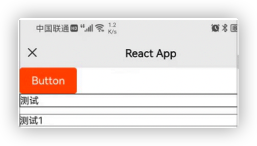
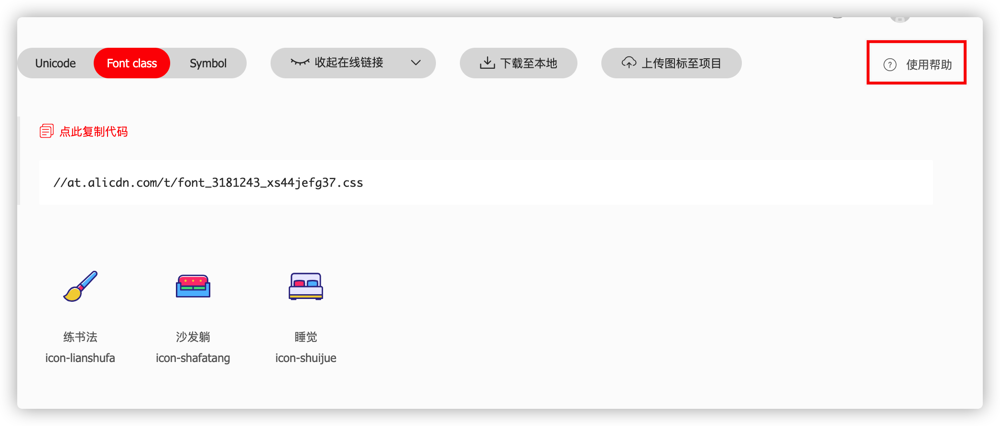

# 项目准备

资料：

 H5 端项目演示：http://toutiao.itheima.net/

 H5 端项目接口文档：http://toutiao.itheima.net/api.html

## 01-项目介绍

**目标**：了解项目定位和功能

**内容**：

极客园 H5 端项目：个人自媒体前台

> 「极客园」对标`CSDN`、`博客园`等竞品，致力成为更加贴近年轻 IT 从业者（学员）的科技资讯类应用 产品关键词：IT、极客、活力、科技、技术分享、前沿动态、内容社交 用户特点：年轻有活力，对 IT 领域前言科技信息充满探索欲和学习热情

- 项目功能和演示，包括
  - 短信登录、退出
  - 首页-频道管理，文章列表，更多操作
  - 文章详情-文章详情，文章评论，评论回复，点赞，收藏，关注
  - 个人中心-个人资料展示，个人资料编辑
- 技术栈：
  - 项目搭建：React 官方脚手架 `create-react-app`
  - react hooks
  - 状态管理：redux
  - UI 组件库：`antd-mobile` v5
  - ajax 请求库：`axios`
  - 路由：`react-router-dom` 以及 `history`
  - CSS 预编译器：`sass`
  - CSS Modules 避免组件之间的样式冲突
  - **TypeScript**
  - 工具库：lodash
  - hooks 库：ahooks
  - websocket 即时通讯

## 02-项目搭建

**目标**：能够基于脚手架搭建支持 TypeScript 的项目**步骤**：

1. 使用 React CLI 搭建项目：`npx create-react-app geek-h5 --template typescript`
2. 进入项目根目录：`cd 项目名称`
3. 启动项目：`yarn start`
4. 调整项目目录结构：

```tree
/src
  /assets         项目资源文件，比如，图片 等
  /components     通用组件
  /pages          页面
  /store          Redux 状态仓库
  /types          TS 类型，包括：接口、redux等类型
  /utils          工具，比如，token、axios 的封装等
  App.css        根组件样式文件
  App.tsx         根组件
  index.css      全局样式
  index.tsx       项目入口
```

**核心代码**：

src/index.tsx 中：

```tsx
import ReactDOM from 'react-dom';
import './index.css';
import App from './App';


ReactDOM.render(<App />, document.getElementById('root'));
```

src/index.css 中：

```scss
html,
body {
  margin: 0;
  padding: 0;
}


html,
body,
#root {
  height: 100%;
}


p,
h2,
h3 {
  margin: 0;
}
```

src/App.tsx 中：

```tsx
import './App.scss';


function App() {
  return <div className="app"></div>;
}


export default App;
```

src/App.css 中：

```scss
.app {
  height: 100%;
}
```

## 03-使用 SASS

**目标**：能够在 项目 中使用 sass 写样式**步骤**：

1. 安装解析 sass 的包：`yarn add sass`
1. 修改样式后缀为scss

## 04-使用 git/gitee 管理项目

**目标**：能够将项目推送到 gitee 远程仓库**步骤**：

1. 在项目根目录打开终端，并初始化 git 仓库（如果已经有了 git 仓库，无需重复该步），命令：`git init`
2. 添加项目内容到暂存区：`git add .`
3. 提交项目内容到仓库区：`git commit -m 项目初始化`
4. 添加 remote 仓库地址：`git remote add origin [gitee 仓库地址]`
5. 将项目内容推送到 gitee：`git push origin master -u`

- 以后只需要：`git push origin` 即可

## 05-配置基础路由

**目标**：能够配置登录页面的路由并显示在页面中**步骤**：

1. 安装路由：`yarn add react-router-dom@5.3.0` 和路由的类型声明文件 `yarn add @types/react-router-dom -D`
2. 在 pages 目录中创建两个文件夹：Login、Layout
3. 分别在两个目录中创建 index.tsx 文件，并创建一个简单的组件后导出
4. 在 App 组件中，导入路由组件以及两个页面组件
5. 配置 Login 和 Layout 的路由规则

**核心代码**：

pages/Login/index.tsx 中：

```tsx
const Login = () => {
  return <div>登录页面</div>;
};
export default Login;
```

App.tsx 中：

```tsx
// 导入路由
import { BrowserRouter as Router, Route, Switch } from 'react-router-dom';


// 导入页面组件
import Login from './pages/Login';
import Layout from './pages/Layout';


// 配置路由规则
function App() {
  return (
    <Router>
      <div className="app">
        <Switch>
          <Route path="/home" component={Layout} />
          <Route path="/login" component={Login} />
        </Switch>
      </div>
    </Router>
  );
}


export default App;
```

## 06-默认展示首页内容

**目标**：能够在打开页面时就展示首页内容

**分析说明**：

匹配默认路由，进行重定向

- [Route render prop](https://reactrouter.com/web/api/Route/render-func)
- Route 的 `render` 属性：用来内联渲染任意内容

**步骤**：

1. 在 App.tsx 中添加一个新的 Route，用来匹配默认路由
2. 为 Route 组件添加 `render` 属性，用来渲染自定义内容
3. 在 render 中，渲染 Redirect 实现路由重定向

**核心代码**：

App.tsx 中：

```tsx
import { Redirect } from 'react-router-dom';


<Route exact path="/" render={() => <Redirect to="/home" />} />;
```

**总结**：

1. Route 通过哪个属性来渲染自定义内容？
2. 通过哪个组件来实现路由重定向？

## 07-antd-mobile 组件库

**目标**：能够使用 antd-mobile 的 Button 组件渲染按钮

**内容**：

> **`antd-mobile` 是 Ant Design 的移动规范的 React 实现**，服务于蚂蚁及口碑无线业务。**开箱即用**

[antd-mobile 文档](https://mobile.ant.design/)

**步骤**：

1. 安装 antd 组件库：`yarn add antd-mobile@next`
2. 导入 Button 组件
3. 在 Login 页面渲染 Button 组件

**核心代码**：

pages/Login/index.tsx 中：

```tsx
import { Button } from 'antd-mobile';


const Login = () => (
  <div>
    <Button color="primary">Button</Button>
  </div>
);
```

## 08-原生 CSS 变量

**目标**：能够使用原始 CSS 变量

**内容**：

- [MDN - CSS 变量（自定义属性）](https://developer.mozilla.org/zh-CN/docs/Web/CSS/Using_CSS_custom_properties)

CSS 自定义属性，通常称为 `CSS 变量`。类似于 JS 中声明的变量，可以**复用** CSS 属性值。比如：

```css
/* 
  比如，项目中多次使用某一个颜色值，原来需要重复写多次
*/
.list-item-active {
  color: #fc6627;
}


.tabs-item-active {
  color: #fc6627;
}


/* 
  使用 CSS 变量来实现复用
*/


/* 1 创建全局 CSS 变量 --geek-color-primary*/
:root {
  --geek-color-primary: #fc6627;
}
/* 2 复用 */
.list-item-active {
  color: var(--geek-color-primary);
}


.tabs-item-active {
  color: var(--geek-color-primary);
}
```

- 特点：
  1. 可复用
  2. 语义化，`--geek-color-primary` 比 #fc6627 更容易让人理解
- 根据 CSS 变量的作用域，分为两种：
  1. 全局 CSS 变量：全局有效
  2. 局部 CSS 变量：只在某个作用域内（比如，某个类名中）有效

```css
/*
  全局 CSS 变量
  1. 使用 :root 这个 CSS 伪类匹配文档树的根元素 html。可以在CSS文件的任意位置使用该变量
     相当于 JS 变量中的全局
  2. CSS 变量通过两个减号（--）开头，多个单词之间推荐使用 - 链接。CSS 变量名可以是任意变量名
*/
:root {
  --geek-color-primary: #fc6627;
}
/* 使用 */
.tabs-item-active {
  color: var(--geek-color-primary);
}
.list-item-active {
  color: var(--geek-color-primary);
}


/* 
  局部 CSS 变量
*/
.list {
  --active-color: #1677ff;


  /* 在该 类 内部使用改变量 */
  color: var(--active-color);
}
.test {
  color: var(--active-color); /* 错误演示：无效！效果与不使用该变量时一致*/
}
```

## 09-组件库 antd-mobile 主题定制

**目标**：能够使用原生 CSS 变量来定制极客园项目的主题

**内容**：[antd-mobile 主题](https://mobile.ant.design/zh/guide/theming)

**核心代码**：

src/index.scss 中：

```scss
:root:root {
  --adm-color-primary: #fc6627;
  --adm-font-family: 'PingFangSC-Regular';


  --font-size: 16px;
}
```

## 10-配置路径别名

**目标**：能够配置@路径别名简化路径处理

**内容**：

[自定义 CRA 的默认配置](https://ant.design/docs/react/use-with-create-react-app-cn#高级配置)[craco 配置文档](https://github.com/gsoft-inc/craco/blob/master/packages/craco/README.md#configuration)

**步骤**：

1. 安装修改 CRA 配置的包：`yarn add -D @craco/craco`
2. 在项目根目录中创建 craco 的配置文件：`craco.config.js`，并在配置文件中配置路径别名
3. 修改 `package.json` 中的脚本命令
4. 在代码中，就可以通过 `@` 来表示 src 目录的绝对路径
5. 重启项目，让配置生效

**核心代码**：

/craco.config.js 中：

```js
const path = require('path');


module.exports = {
  // webpack 配置
  webpack: {
    // 配置别名
    alias: {
      // 约定：使用 @ 表示 src 文件所在路径
      '@': path.resolve(__dirname, 'src'),
      // 约定：使用 @scss 表示全局 SASS 样式所在路径
      // 在 SASS 中使用
      '@scss': path.resolve(__dirname, 'src/assets/styles'),
    },
  },
};
```

package.json 中：

```json
// 将 start/build/test 三个命令修改为 craco 方式


"scripts": {
  "start": "craco start",
  "build": "craco build",
  "test": "craco test",
  "eject": "react-scripts eject"
},
```

## 11-@别名路径提示

**目标**：能够让 vscode 识别@路径并给出路径提示

**分析说明**：

因为项目使用了 TS，而 TS 带有配置文件 tsconfig.json。因此，不需要再使用 jsconfig.json（实际上，jsconfig.json 是参考 tsconfig.json 的）

VSCode 会自动读取 `tsconfig.json` 中的配置，让 vscode 知道 @ 就是 src 目录

**步骤**：

1. 创建 `path.tsconfig.json` 配置文件
2. 在该配置文件中添加以下配置
3. 在 `tsconfig.json` 中导入该配置文件，让配置生效
4. 重启 VSCode

**核心代码**：

/path.tsconfig.json 中：

```json
{
  "compilerOptions": {
    "baseUrl": "./",
    "paths": {
      "@/*": ["src/*"],
      "@scss/*": ["src/assets/styles/*"]
    }
  }
}
```

/tsconfig.json 中：

```json
{
  // 导入配置文件
  "extends": "./path.tsconfig.json"
}
```

## 12-移动端适配

**目标**：能跟通过配置实现自动适配移动端项目

**分析说明**：

适配概述

- 为什么要适配？
  - 为了让我们开发的移动端项目页面，在不同尺寸大小的移动端设备（手机）中，保持相同的比例
- 适配原理
  - 选择某个手机的尺寸大小作为基准，其他手机进行**等比例缩放**
  - 一般选择 `iPhone 6`（2 倍屏幕），屏幕宽度为：`375px`
- 适配方式
  - rem：需要手动修改 `html` 元素的 `font-size`；额外设置 `body` 元素的字体大小为正常值
  - vw： 1 `vw` 等于屏幕宽度的 `1%`

```js
// rem 适配
// iphone6       html ==> font-size: 37.5px
// iphone6 plus  html ==> font-size: 41.4px
//
// iPhone 6 下宽高为 100px：
// 100 / 37.5 ≈ 2.667
// height: 2.667rem; width: 2.667rem;


// vw 适配
// iPhone 6 下宽高为 100px：
// 100 / (375 / 100) = 100 / 3.75 ≈ 26.7vw
// height: 26.667vw; width: 26.667vw;
```

- 如果每次设置宽高都需要手动计算一次，太繁琐了！因此，需要借助工具来解决！

**步骤**：

- [postcss-px-to-viewport 文档](https://github.com/evrone/postcss-px-to-viewport)

1. 安装 px 转 vw 的包：

   ```
   yarn add -D postcss-px-to-viewport
   ```

   - 包的作用：将 `px` 转化为 `vw`，所以有了该工具，只需要在代码中写 `px` 即可

2. 在 `craco.config.js` 添加相应配置

3. 重启项目，让配置生效

**核心代码**：

/craco.config.js 中：

```js
const path = require('path')
const pxToViewport = require('postcss-px-to-viewport')
const vw = pxToViewport({
  // 视口宽度，一般就是 375（ 设计稿一般采用二倍稿，宽度为 375 ）
  viewportWidth: 375
})
module.exports = {
  webpack: {
    alias: {
      '@': path.resolve(__dirname, 'src'),
      '@scss': path.resolve(__dirname, 'src/assets/styles')
    }
  },
  style: {
    postcss: {
      mode: 'extends',
      loaderOptions: {
        postcssOptions: {
          ident: 'postcss',
          plugins: [vw]
        }
      }
    }
  }
}

```

关于设计稿的说明：

1. 摹客 - 设计稿、原型图
2. 蓝湖 - 设计稿、原型图

- 设计稿，一般使用 2 倍设计稿，也就是 iPhone 6 对应的尺寸大小
  - iPhone 6 屏幕宽度：375px，因为是 2 倍屏幕，所以，实际上有 750 个物理像素，因此 1px = 2 个物理像素
- 在 摹客 中，可以通过自定义来修改设计稿的宽度，一般就修改为：设计稿宽度 375px。这样设计稿中的内容多宽多高，在代码中就写多少

## 13-移动端 1px 像素边框

**目标**：能够展示 1px 像素的边框

**分析说明**：

[参考 antd-mobile 的实现](https://github.com/ant-design/ant-design-mobile/blob/v2/components/style/mixins/hairline.less)



实现原理：**伪元素 + transform 缩放**

- 伪元素`::after`或`::before`独立于当前元素，可以单独对其缩放而不影响元素本身的缩放

**核心代码**：

```scss
// src/assets/styles/hairline.scss


@mixin scale-hairline-common($color, $top, $right, $bottom, $left) {
  content: '';
  position: absolute;
  display: block;
  z-index: 1;
  top: $top;
  right: $right;
  bottom: $bottom;
  left: $left;
  background-color: $color;
}


// 添加边框
/* 
  用法：


  // 导入
  @import '@scss/hairline.scss';


  // 在类中使用
  .a {
	  position: relative;
    @include hairline(bottom, #f0f0f0);
  }
*/
@mixin hairline($direction, $color: #000, $radius: 0) {
  @if $direction == top {
    border-top: 1px solid $color;


    // min-resolution 用来检测设备的最小像素密度
    @media (min-resolution: 2dppx), (-webkit-min-device-pixel-ratio: 2) {
      border-top: none;


      &::before {
        @include scale-hairline-common($color, 0, auto, auto, 0);
        width: 100%;
        height: 1px;
        transform-origin: 50% 50%;
        transform: scaleY(0.5);


        @media (min-resolution: 3dppx), (-webkit-min-device-pixel-ratio: 3) {
          transform: scaleY(0.33);
        }
      }
    }
  } @else if $direction == right {
    border-right: 1px solid $color;


    @media (min-resolution: 2dppx), (-webkit-min-device-pixel-ratio: 2) {
      border-right: none;


      &::after {
        @include scale-hairline-common($color, 0, 0, auto, auto);
        width: 1px;
        height: 100%;
        background: $color;
        transform-origin: 100% 50%;
        transform: scaleX(0.5);


        @media (min-resolution: 3dppx), (-webkit-min-device-pixel-ratio: 3) {
          transform: scaleX(0.33);
        }
      }
    }
  } @else if $direction == bottom {
    border-bottom: 1px solid $color;


    @media (min-resolution: 2dppx), (-webkit-min-device-pixel-ratio: 2) {
      border-bottom: none;


      &::after {
        @include scale-hairline-common($color, auto, auto, 0, 0);
        width: 100%;
        height: 1px;
        transform-origin: 50% 100%;
        transform: scaleY(0.5);


        @media (min-resolution: 3dppx), (-webkit-min-device-pixel-ratio: 3) {
          transform: scaleY(0.33);
        }
      }
    }
  } @else if $direction == left {
    border-left: 1px solid $color;


    @media (min-resolution: 2dppx), (-webkit-min-device-pixel-ratio: 2) {
      border-left: none;


      &::before {
        @include scale-hairline-common($color, 0, auto, auto, 0);
        width: 1px;
        height: 100%;
        transform-origin: 100% 50%;
        transform: scaleX(0.5);


        @media (min-resolution: 3dppx), (-webkit-min-device-pixel-ratio: 3) {
          transform: scaleX(0.33);
        }
      }
    }
  } @else if $direction == all {
    border: 1px solid $color;
    border-radius: $radius;


    @media (min-resolution: 2dppx), (-webkit-min-device-pixel-ratio: 2) {
      position: relative;
      border: none;


      &::before {
        content: '';
        position: absolute;
        left: 0;
        top: 0;
        width: 200%;
        height: 200%;
        border: 1px solid $color;
        border-radius: $radius * 2;
        transform-origin: 0 0;
        transform: scale(0.5);
        box-sizing: border-box;
        pointer-events: none;
      }
    }
  }
}


// 移除边框
@mixin hairline-remove($position: all) {
  @if $position == left {
    border-left: 0;
    &::before {
      display: none !important;
    }
  } @else if $position == right {
    border-right: 0;
    &::after {
      display: none !important;
    }
  } @else if $position == top {
    border-top: 0;
    &::before {
      display: none !important;
    }
  } @else if $position == bottom {
    border-bottom: 0;
    &::after {
      display: none !important;
    }
  } @else if $position == all {
    border: 0;
    &::before {
      display: none !important;
    }
    &::after {
      display: none !important;
    }
  }
}
```

## 14-字体图标

**目标**：能够在项目中使用字体图标

### 颜色丢失问题

+ iconfont中选择彩色图标加入到新项目

+ 在项目中生成fontclass代码

+ 使用

  + index.html中通过link引入

    ```css
    <link
          rel="stylesheet"
          href="//at.alicdn.com/t/font_3181243_xs44jefg37.css"
        />
    ```

  + App.tsx中使用

    ```jsx
    <div className="iconfont icon-lianshufa"></div>
    ```

  + 颜色丢失

### 正确使用方式

1. 点击使用帮助

   

2. 在 public 下 index.html body 中引入该文件

   ```jsx
   <script src="//at.alicdn.com/t/font_2503709_i408x28a4zp.js"></script>
   ```

   

3. 在 `index.scss` 中添加通过 css 代码

   ```css
   .icon {
     width: 1em;
     height: 1em;
     vertical-align: -0.15em;
     fill: currentColor;
     overflow: hidden;
   }
   ```

   

4. 在组件中，使用：

   ```tsx
   <svg className="icon" aria-hidden="true">
     {/* 使用时，只需要将此处的 iconbtn_like_sel 替换为 icon 的名称即可*/}
     <use xlinkHref="#iconbtn_like_sel"></use>
   </svg>
   ```

   


## 15-封装 Icon 组件

**目标**：能够封装 Icon 图片通用组件

**步骤**：

1. 在 components 目录中，创建 Icon/index.tsx 文件
2. 创建 Icon 组件，并指定 props 类型
3. 安装 classnames 包（`yarn add classnames`），处理类名

**核心代码**：

components/Icon/index.tsx 中：

```tsx
import classnames from 'classnames';


// 组件 props 的类型
type Props = {
  // icon 的类型
  type: string;
  // icon 的自定义样式
  className?: string;
  // 点击事件
  onClick?: () => void;
};


const Icon = ({ type, className, onClick }: Props) => {
  return (
    <svg
      className={classnames('icon', className)}
      aria-hidden="true"
      onClick={onClick}
    >
      <use xlinkHref={`#${type}`}></use>
    </svg>
  );
};


export default Icon;
```


