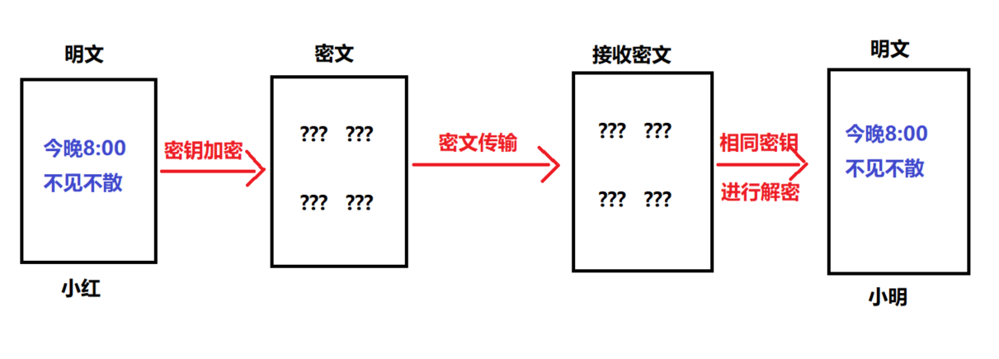
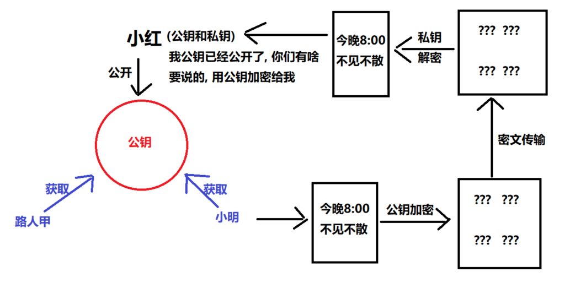
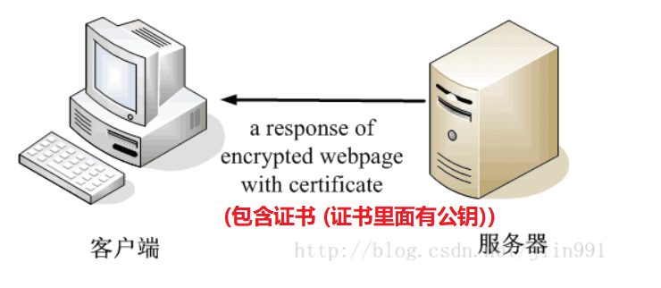
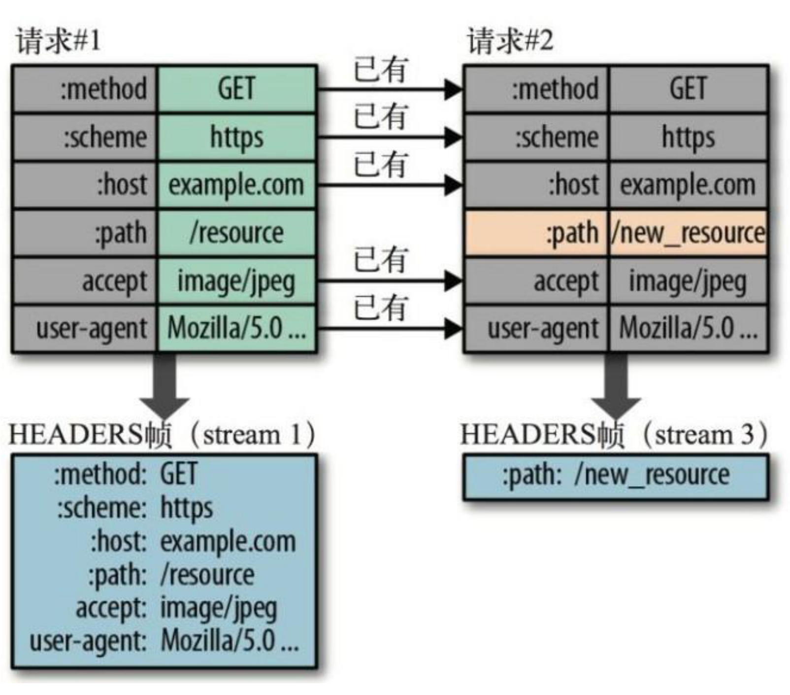

# 01 - connect

## 类组件中使用redux

+ 安装redux

+ 安装react-redux

+ 创建store,为了方便不在讲reducer，action进行抽离

  ```jsx
  import { createStore } from 'redux'
  
  const initState = {
    count: 10
  }
  
  const store = createStore((state = initState, action) => {
    return state
  })
  
  export default store
  
  ```

+ 展示数据, Show.js

  ```jsx
  import React from 'react'
  import store from './store'
  
  class Show extends React.Component {
    state = store.getState()
    render() {
      return <div>{this.state.count}</div>
    }
  }
  
  export default Show
  
  ```

+ App 组件

  ```js
  import React from 'react'
  import Add from './Add'
  import Show from './Show'
  
  class App extends React.Component {
    render() {
      return (
        <div>
          <Add />
          <Show />
        </div>
      )
    }
  }
  
  export default App
  
  ```

+ Add.js

  ```js
  import React, { Component } from 'react'
  import store from './store'
  
  export default class Add extends Component {
    render() {
      return (
        <div>
          <button
            onClick={() => {
              store.dispatch({
                type: 'ADD'
              })
            }}
          >
            +++
          </button>
        </div>
      )
    }
  }
  
  ```

+ reducer

  ```js
  import { createStore } from 'redux'
  
  const initState = {
    count: 10
  }
  
  const store = createStore((state = initState, action) => {
    if (action.type === 'ADD') {
      return {
        count: state.count + 1
      }
    }
    return state
  })
  
  export default store
  
  ```

## 解决数据不变的问题

subscribe,订阅，当然也可以放在App

```js
import React from 'react'
import store from './store'

class Show extends React.Component {
  state = store.getState()
  componentDidMount() {
    store.subscribe(() => {
      this.setState({
        ...store.getState()
      })
    })
  }
  render() {
    return <div>{this.state.count}</div>
  }
}

export default Show

```

## react-redux的connect

+ Provider提供数据

  ```jsx
  import React from 'react'
  import ReactDOM from 'react-dom'
  import App from './App'
  import store from './store'
  import { Provider } from 'react-redux'
  
  ReactDOM.render(
    <Provider store={store}>
      <App />
    </Provider>,
    document.getElementById('root')
  )
  
  ```

+ 注意useSelector和useDispatch无法在类组件中使用

### connect

connect(mapStateToProps,mapDispatchToProps,mergeProps,options)(组件)

### mapStateToProps

讲state(store)数据映射到props中

```jsx
import React from 'react'
import { connect } from 'react-redux'

class Show extends React.Component {
  render() {
    const { count } = this.props
    return <div>{count}</div>
  }
}

const mapStateToProps = state => {
  return state
}

export default connect(mapStateToProps)(Show)

```

### mapDispatchToProps

将dispatch方法映射到props中

```js
import React from 'react'
import { connect } from 'react-redux'

class Show extends React.Component {
  render() {
    const { count } = this.props
    return (
      <div>
        {count}{' '}
        <button
          onClick={() => {
            this.props.add()
          }}
        >
          ++
        </button>
      </div>
    )
  }
}

const mapStateToProps = state => {
  return state
}

const mapDispatchToProps = {
  add: () => {
    return {
      type: 'ADD'
    }
  }
}

export default connect(mapStateToProps, mapDispatchToProps)(Show)

```

# 02 - 后台项目权限

## 鉴权AuthRoute组件

+ 判断本地是否有token

  有token返回Route组件，并显示页面组件

  没有token，通过redirect重定向到登录页面

+ 路由权限的控制

  通过pathname匹配后端返回的路由表，如果匹配成功，返回Route组件，并显示路由对应的组件

  如果没有匹配成功返回404组件

+ 菜单也是通过后台返回的用户权限动态循环遍历生成

## token过期处理

+ 前端主动处理

  存token的时候同时存时间戳，每次使用token的时候，在请求拦截器进行token的约定过期时间进行对比，如果过期，进行无感刷新token

  无感刷新token：通过存储到本地的token中会包含一个refresh-token重新获取token，在将token重新存储到本地

  如果refresh-token也过期了，重新跳到登录页面

+ 被动处理

  后端也会判断token是否过期，如果过期，在响应拦截器中通过error.response进行判断，如果后端判断过期，同样也是先用refre-token获取新的token，如果refresh-token也过期，重新跳到登录页面


# 03 - immutable.js

不可变数据鼓励使用纯函数（数据输入、数据输出），并有助于更简单的应用程序开发，以及从函数编程（如惰性评估）中启用技术。

虽然旨在将这些强大的功能概念引入Java脚本，但它提供了一个Javascript工程师熟悉的面向对象的API，并与数组、映射和集合的API非常相似。在普通Javascript类型之间进行转换既简单又高效。

对项目侵入比较强，api比较多

## immer.js

api比较简单，使用比较简单

+ 未使用immer

  ```js
  import React, { Component } from 'react'
  
  export default class App extends Component {
    state = {
      obj: {
        name: '张三',
        age: 19
      }
    }
    render() {
      return (
        <div>
          {this.state.obj.name}
          {this.state.obj.age}
          <button
            onClick={() =>
              this.setState({
                obj: {
                  ...this.state.obj,
                  name: '李四'
                }
              })
            }
          >
            修改信息
          </button>
        </div>
      )
    }
  }
  
  ```

+ 使用immer

  ```js
  import React, { Component } from 'react'
  import { produce } from 'immer'
  
  export default class App extends Component {
    state = {
      obj: {
        name: '张三',
        age: 19
      }
    }
    render() {
      return (
        <div>
          {this.state.obj.name}
          {this.state.obj.age}
          <button
            onClick={() => {
              this.setState({
                obj: produce(this.state.obj, darft => {
                  darft.name = '李四'
                })
              })
            }}
          >
            修改信息
          </button>
        </div>
      )
    }
  }
  
  ```

## 对比深拷贝

+ 深拷贝lodash：拷贝所有数据，数据量比较对，影响性能
+ immer：对数据进行劫持，只有相关的数据发生变化数据做深拷贝
+ 因为immer使用的是Proxy进行的数据代码

# 04 - redux源码分析

# 05 - HTTP协议

简单的HTTP协议 HTTP协议是Hyper Text Transfer Protocol(超文本传输协议)的缩写。HTTP 协议和 TCP/IP 协议族内的其他众多的协议相同, 用于客户端和服务器之间的通信。请求访问文本或图像等资源的一端称为客户端, 而提供资源响应的一端称为服务器端。

## 1. HTTP有哪些⽅法？

HTTP 1.0 标准中，定义了3种请求⽅法：GET、POST、HEAD

HTTP 1.1 标准中，新增了请求⽅法：PUT、PATCH、DELETE、OPTIONS、TRACE、CONNECT


## 2. 各个HTTP方法的具体作用是什么？

|  方法   | 功能                                                         |
| :-----: | ------------------------------------------------------------ |
|   GET   | 通常⽤于请求服务器发送某些资源                               |
|  POST   | 发送数据给服务器                                             |
|  HEAD   | 请求资源的头部信息, 并且这些头部与 HTTP GET ⽅法请求时返回的⼀致。<br />该请求⽅法的⼀个使⽤场景是在下载⼀个⼤⽂件前先获取其⼤⼩再决定是否要下载, 以此可以节约带宽资源 |
|   PUT   | ⽤于全量修改⽬标资源 (看接口, 也可以用于添加)                |
| DELETE  | ⽤于删除指定的资源                                           |
| OPTIONS | ⽤于获取⽬的资源所⽀持的通信选项 (跨域请求前, 预检请求, 判断目标是否安全) |
|  TRACE  | 该方法会  让服务器  原样返回任意客户端请求的信息内容, 用于诊断和判断 |
| CONNECT | HTTP/1.1协议中预留给能够将连接改为管道⽅式的代理服务器<br />(把服务器作为跳板，让服务器代替用户去访问其它网页, 之后把数据原原本本的返回给用户) |
|  PATCH  | ⽤于对资源进⾏部分修改                                       |


GET POST PUT PATCH DELETE

GET/DELETE  参数是在地址栏中传递的

PUT/PATCH/POST 参数是在请求体传递的


## 3. GET方法和POST方法有何区别？

默认的http请求的内容, 在网络中传输, 明文的形式传递的  (https 对内容加密)

|                  | GET方法                                                      | POST方法                                           |
| ---------------- | ------------------------------------------------------------ | -------------------------------------------------- |
| **数据传输⽅式** | 通过URL传输数据 (地址栏拼接参数)                             | 通过请求体传输                                     |
| **数据安全**     | 数据暴露在URL中，可通过浏览历史记录、缓存等很容易查到数据信息 | 数据因为在请求主体内，<br />所以有⼀定的安全性保证 |
| **数据类型**     | 只允许 ASCII 字符                                            | ⽆限制                                             |
| **GET⽆害**      | 刷新、后退等浏览器操作是⽆害的                               | 可能会引起重复提交表单                             |
| **功能特性**     | 安全且幂等（这⾥的安全是指只读特性，就是使⽤这个⽅法不会引起服务器状态变化。<br />**幂等的概念是指同⼀个请求⽅法执⾏多次和仅执⾏⼀次的效果完全相同）** | ⾮安全(会引起服务器端的变化)、**⾮幂等**           |


## 4. HTTP请求报文是什么样的？

请求报文就是封装了http要请求的内容，服务端根据协议规范进行报文解析，然后向客户端返回响应报文

HTTP 请求报⽂的组成：请求⾏、请求头、(空⾏)、请求体。

实际请求报文实例:


**请求行**

包含了请求⽅法、URL、HTTP 协议版本，它们之间⽤空格进行分隔。例如：

```bash
GET http://www.abc.com/articles HTTP/1.1
```

**请求头**

请求头由键值对组成，每⾏⼀对，键值之间⽤英⽂冒号`:`进行分隔。例如：

```
Content-Type: application/json
Host: www.abc.com
```

**请求体**

请求体中放置 POST、PUT、PATCH 等请求方法所需要携带的数据。


## 5. HTTP响应报文是什么样的？

HTTP 响应报⽂的组成: 响应⾏、响应头、空⾏、响应体。


**响应行**

响应行由协议版本、状态码、状态码的原因短语3个内容组成，中间以空格分隔。例如：

```bash
HTTP/1.1 200 OK
```


**响应头**

响应头由键值对组成，每⾏⼀对，键值之间⽤英⽂冒号`:`进行分隔。例如：

```
Content-Length: 1024
Content-Type: application/json
```


**响应体**

服务器发送过来的数据。

小结:


## 6. 你了解的HTTP状态码有哪些？

**成功（2XX）**

| 状态码 | 原因短语        | 说明                                                         |
| ------ | --------------- | ------------------------------------------------------------ |
| 200    | OK              | 表示从客户端发来的请求在服务器端被正确处理                   |
| 201    | Created         | 请求已经被实现，⽽且有⼀个新的资源已经依据请求的需要⽽建⽴<br />通常是在POST请求，或是某些PUT请求之后创建了内容, 进行的返回的响应 |
| 202    | Accepted        | 请求服务器已接受，但是尚未处理，不保证完成请求<br />适合异步任务或者说需要处理时间比较长的请求，避免HTTP连接一直占用 |
| 204    | No content      | 表示请求成功，但响应报⽂不含实体的主体部分                   |
| 206    | Partial Content | 进⾏的是范围请求, 表示服务器已经成功处理了部分 GET 请求<br />响应头中会包含获取的内容范围 (常用于分段下载) |


**重定向（3XX）**

| 状态码  | 原因短语           | 说明                                                         |
| ------- | ------------------ | ------------------------------------------------------------ |
| 301     | Moved Permanently  | 永久性重定向，表示资源已被分配了新的 URL<br />比如，我们访问 **http**://www.baidu.com 会跳转到 **https**://www.baidu.com |
| 302     | Found              | 临时性重定向，表示资源临时被分配了新的 URL, 支持搜索引擎优化<br />首页, 个人中心, 遇到了需要登录才能操作的内容, 重定向 到 登录页 |
| 303     | See Other          | 对于POST请求，它表示请求已经被处理，客户端可以接着使用GET方法去请求Location里的URI。 |
| **304** | **Not Modified**   | **自从上次请求后，请求的网页内容未修改过。<br />服务器返回此响应时，不会返回网页内容。(协商缓存)** |
| 307     | Temporary Redirect | 对于POST请求，表示请求还没有被处理，客户端应该向Location里的URI重新发起POST请求。<br />不对请求做额外处理, 正常发送请求, 请求location中的url地址 |

因为post请求, 是非幂等的,  从302中, 细化出了 303 和 307

简而言之: 

- 301  302  307  都是重定向
- 304 协商缓存


**客户端错误（4XX）**

| 状态码  | 原因短语        | 说明                                        |
| ------- | --------------- | ------------------------------------------- |
| **400** | **Bad Request** | **请求报⽂存在语法错误(（传参格式不正确）** |
| 401     | UnAuthorized    | 权限认证未通过(没有权限)                    |
| 403     | Forbidden       | 表示对请求资源的访问被服务器拒绝            |
| 404     | Not Found       | 表示在服务器上没有找到请求的资源            |
| 408     | Request Timeout | 客户端请求超时                              |
| 409     | Confict         | 请求的资源可能引起冲突                      |


**服务端错误（5XX）**

| 状态码 | 原因短语                   | 说明                                                         |
| ------ | -------------------------- | ------------------------------------------------------------ |
| 500    | Internal Sever Error       | 表示服务器端在执⾏请求时发⽣了错误                           |
| 501    | Not Implemented            | 请求超出服务器能⼒范围，例如服务器不⽀持当前请求所需要的某个功能，<br />或者请求是服务器不⽀持的某个⽅法 |
| 503    | Service Unavailable        | 表明服务器暂时处于超负载或正在停机维护，⽆法处理请求         |
| 505    | Http Version Not Supported | 服务器不⽀持，或者拒绝⽀持在请求中使⽤的 HTTP 版本           |

问到状态码: 304   400  401??

当前端看到控制台报出 400 时, 请问一定是后台的问题么? 如何排查错误? (前端先检查传参格式是否有误)


## 8. 为什么需要HTTPS？

HTTP协议是网络通信的基石, 基于HTTP协议, 完成了很多的网页应用功能, 但是HTTP协议是明文传输数据的! 太不安全了!

HTTPS 是安全版的 HTTP。

HTTP 协议在传输数据时采用的是明⽂方式传递，因此，⼀些敏感信息的传输就变得很不安全。

而 HTTPS 就是为了解决 HTTP 的不安全⽽产⽣的。


## 9. HTTPS是如何保证安全的？

HTTPS 在传输数据的过程中会对数据进行加密处理，保证安全性。

那HTTPS采用的什么样的加密方式呢？我们来了解下一些加密的基本概念。

目前常见的加密算法可以分成三类，`对称加密算法`，`非对称加密算法` 和 `Hash算法`。

1. 对称加密算法: 相同密钥加密解密,  可逆的! 可以用于加密解密传输数据

   想使用对称加密算法, 一定要保证密钥不被泄漏  (且进行密钥的传输约定时, 一定要保证安全)

2. 非对称加密算法: 有两把钥匙, 公钥, 私钥,  可逆的, 可以用于 https 的初步交换密钥

3. Hash算法: 不可逆的,  根据一段内容, 生成一段唯一标识, 一般用于验证数据是否被修改!   (md5)


### 9.1 **什么是对称加密？**

对称加密的特点是文件加密和解密使用相同的密钥，即加密密钥也可以用作解密密钥，

这种方法在密码学中叫做对称加密算法，对称加密算法使用起来简单快捷，密钥较短，且破译困难

**通信的双⽅都使⽤同⼀个秘钥进⾏加密, 解密。**⽐如，两个人事先约定的暗号，就属于对称加密。 



对称加密的特点是：

- 优点:

  计算量小、加密速度快、加密效率高。

- 缺点: 

  **在数据传送前，发送方和接收方必须商定好秘钥，然后双方保存好秘钥。**

  **如果一方的秘钥被泄露，那么加密信息也就不安全了**

  最不安全的地方, 就在于第一开始, 互相约定密钥的时候!!! 传递密钥!

使用场景：本地数据加密、https通信、网络传输等

常见算法：AES、DES、3DES、DESX、Blowfish、IDEA、RC4、RC5、RC6  (全球公开, 通过了层层筛选, 层层检验)  没有被破解

全球有专门做算法设计的加密算法设计师, 但经过公开检验的算法才是安全的 (很多公开的算法, 虽然可以用撞库的方式破解, 但是尝试破解的成本会非常高 (甚至几百年))


### 9.2 **什么是⾮对称加密？**

而加密和解密其实可以使用不同的规则，只要这两种规则之间存在某种对应关系即可，

这样就避免了直接传递之前的相同的密钥。这种新的加密模式被称为"非对称加密算法"。

通信的双方使用不同的秘钥进行加密解密，即秘钥对（私钥 + 公钥）。

特征: 私钥可以解密公钥加密的内容,  公钥可以解密私钥加密的内容



非对称加密的特点是：

- 优点：非对称加密与对称加密相比其安全性更好

- **缺点：加密和解密花费时间长、速度慢，只适合对少量数据进行加密。**

使用场景：https会话前期、CA数字证书、信息加密、登录认证等

常见算法：RSA、ECC（移动设备用）、Diffie-Hellman、El Gamal、DSA（数字签名用）


### 9.3 **HTTPS 加密解决⽅案** 

结合了两种加密⽅式：

- 将 `对称加密的密钥(一串约定的字符串)` ⽤非对称加密的公钥, 进⾏加密并发送出去，接收⽅使⽤私钥解密得到 `对称加密密钥`

- 双⽅沟通时使⽤ `对称加密密钥` 进⾏

**可以看到，只有在发送秘钥阶段才使用非对称加密，而后续的通信都使用对称加密，这样解决了性能问题。**

HTTPS 目前所使用的 TLS或SSL协议,  就是目前采用的加密通道的规范协议 

它利用对称加密、(公私钥)非对称加密, 以及其密钥交换算法，可完成可信任的信息传输

1. 利用 非对称加密 加密传输 对称加密所约定的密钥  (保证了密钥传输的安全)
2. 后续, 利用对称加密, 有效便捷的进行数据传输!!


### 9.4 数字证书

为了安全性, 一般还需要签发数字证书! 

客户端 和 服务器端要初步互通消息时,  客户端发送请求可以拿到公开的公钥信息

进而进行非对称加密, 使用公钥, 加密`对称加密密钥`, 传递给服务器, 后续通信都使用对称加密! 


**问题是: 初步互通消息时, 如果请求拿到的公钥信息, 就是假的, 或者不安全的! 那么后续的所有操作, 都将是不安全的!**

如何保证公钥的安全性呢??  说白了, 需要证明公钥是安全可靠的!!! 要证明网站是安全可靠的!!!


所以, 就需要有数字证书(CA证书),  一般是CA机构(互联网的机构,  登记网站和公钥的)颁发的, 证明这个公钥是安全可靠的!

**CA证书中心会对你网站的公钥, 网站的域名地址,  证书到期时间, 等一些相关信息一起加密签发数字证书, 保证你网站的安全性**


当公司申请了 CA 证书后, 就应该在响应时, 将数字证书一起发送给客户端



而客户端, 接收到消息后, 就可以查看证书 , 权威CA机构都可以

1. 如果正在访问的网站 和 证书记载的网址 不一致, 说明不安全,  可能被冒用, 浏览器就会发出警告!!! 

2. 如果签发证书的机构, 不权威, 发出警告 

   

3. 如果证书过期了, 浏览器也会发出警告

   因为一旦证书过期了, CA机构, 不会继续实时检测网站的安全有效性!


### 9.5 数字签名

但这还是有问题：如果证书被篡改了怎么办?

这时就需要用⼀个技术：**数字签名**。 (根据证书内容, 生成的一个唯一标识) 

数字签名就是先⽤ **CA ⾃带的 Hash 算法来计算出证书内容的⼀个摘要**，然后使⽤ CA 私钥进行加密，组成数字签名。

当别⼈把他的证书发过来时，**接收方⽤同样的算法再次⽣成摘要**，⽤ CA 公钥解密后得到CA生成的摘要，两者进行对⽐后,

就能确定中间是否被⼈篡改。这样就能最⼤程度的保证通信的安全了。

[博客参考](https://blog.csdn.net/u014044812/article/details/80723009)

---

简要小结:

1. 为什么需要 HTTPS ? 因为HTTP是明文传输数据的, 不安全, 而 HTTPS 是会对内容加密的

2. HTTPS 的加密策略是什么 ?

   先用 `非对称加密`, 传递对称加密的密钥   (保证了密钥传输的安全)

   后续 使用`对称加密`, 进行交流  (保证了传输数据安全)

3. 问题: 就算是第一次交流用非对称加密,  公钥也是要在网络中传输的!

   如何证明公钥是可靠的? 如何证明网站是可靠的 ?    (CA机构认证, 网站需要申请  **`数字证书`**  )

   请求时, 网站就会将数字证书给到浏览器, 浏览器默认就会检测证书的可靠性!

   (1) 是否是权威机构发布的!

   (2) 看证书中记录的地址 和 当前访问的网站的地址, 是否一致, 只有一致, 才可靠!

   (3) 看证书是否过期

   ...

4. 如何保证证书不被篡改 => **`数字签名`**,  可以根据证书的所有的内容, 生成一个唯一标识!!! (`Hash加密算法`)

   一旦内容如果被修改了, 再次生成唯一标识时,  和之前生成的唯一标识就不一样!  检测是否被修改!


## 10. HTTP/2 和 HTTP1.x 比，有什么优势和特点？(了解)

**HTTP/2 的升级, 对于用户来说, 是跨时代的!  基于HTTP/2, 用户访问网页的速度会非常快!!! (充分利用带宽)**

HTTP/2: 淘宝, 天猫, 京东等, 已做升级 ....

1. HTTP/2 采⽤`⼆进制格式`来传输数据，⽽⾮ HTTP 1.x 的⽂本格式，⼆进制协议`解析起来更⾼效`
2. HTTP/2 采用一些`头部压缩技术`，减少在请求和响应头中重复携带的数据，`降低网络负担`
3. HTTP/2 采⽤`服务器推送`方式，主动向客户端推送资源，提高页面加载效率
4. **HTTP/2 采⽤`多路复用机制`，减少需要创建的连接数量，降低资源占用和性能消耗**

下面是一些与之关联的技术知识。


**⼆进制格式分帧**

帧：HTTP/2 数据通信的最⼩单位消息，是指 HTTP/2 中逻辑上的 HTTP 消息（例如请求、响应等）。消息由⼀个或多个帧组成 

流：存在于连接中的⼀个虚拟通道，它可以承载双向消息，且每个流都有唯⼀的整数ID


**头部压缩**

在 HTTP1.x 中，请求和响应中会重复携带一些不常改变、冗⻓的头数据，给⽹络带来额外负担。

在 HTTP/2 中，客户端和服务端使⽤ **“⾸部表”** 来跟踪和存储之前发送过的键值对，

相同的数据不再随着每次请求和响应发送。⾸部表在连接存续期间始终存在，由客户端和服务器共同渐进更新。

每个新的⾸部键值对，要么被追加到当前表的末尾，要么替换表中已存在的键值对。

> 可以简单的理解为：只发送差异数据，⽽不是全部发送，从⽽减少头部的信息量

下图为首部表的更新示意图：




**服务器推送**

服务端可以在发送⻚⾯ HTML 内容时，再主动推送一些其它资源，⽽不⽤等到浏览器解析到相应的位置时发起请求后再作响应。

例如，服务端可以主动把 JS 和 CSS ⽂件推送给客户端，⽽不需要客户端解析 HTML 时再发送这些请求。 


不过，服务端的主动推送行为，客户端有权利选择是否要接收。

如果服务端推送的资源已经被浏览器缓存过，浏览器可以通过发送 RST_STREAM 帧来拒收。


**多路复用**

在 HTTP 1.x 中如果想并发多个请求的话，必须使⽤多个 TCP 链接，但浏览器为了控制资源，

会对单个域名有 6-8 个 TCP 链接的数量限制。而在 HTTP/2 中： 

- 同域名下的所有通信，都在单个连接上完成 
- 单个连接可以承载任意数量的双向数据流 
- 数据流以消息的形式发送，⽽消息⼜由⼀个或多个帧组成（多个帧可以乱序发送，因为可以根据帧⾸部的流标识来重新组装）


[参考文章：HTTP/2特性及其在实际应用中的表现](https://zhuanlan.zhihu.com/p/30166894)


**小结:** 

**HTTP1.X 同一时间, 只能并发建立 6-8 个 TCP 连接, 一个连接同时只能一个请求  (虽然可以 keep-alive复用, 但也得一个个来)**

**(建立连接的成本比较高, 不让一次性建立太多连接)**

**而新版本 HTTP/2 建立一次连接, 就可以并发很多个请求!** 

所以 HTTP/2 的升级, 大大提升了页面加载的效率!