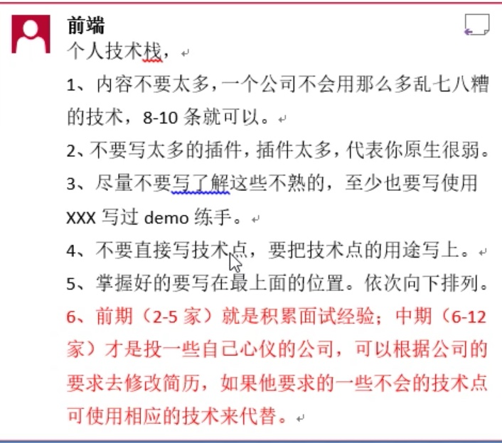
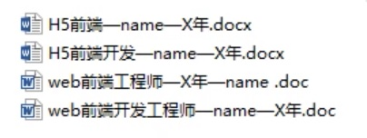

# 简历核心组成

+ [前端面试魔法书](http://www.qianduan.site/)

## 简历标题
## 个人信息
  + 一般个人信息必须放在最上面
  + 小心把邮箱设为垃圾邮箱，这样发Offer的时候可能会收不到 
## 求职意向
  + 目标薪资一般不能写区间，比如15~20K。尽量写面议或精确的数字，比如：15K
## 职业技能
  + 求职技能尽量不要写太多，这样面试的时候会尴尬的，被问到的问题会很多
  + 框架，插件什么的不要写太多
    <!--  -->

## 工作经历
## 项目经验
## 教育背景
  + 根据自己的情况来写，比如你是一个211，985毕业的，有很好的教育背景可以写，如果教育背景不是那么好的话可以不写，面试的时候说就行了。
## 自我评价

> 学校里面获得的奖励，优秀学生什么的东西在初级工程师阶段可以写，这是一个闪光点，不过到中级和高级工程师阶段不必写。

::: danger TODO
  目前还没看完视频，等到快面试之前要看
:::

