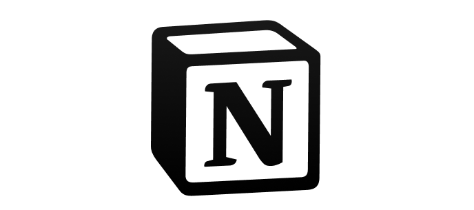

# Notion

::: tip 最好用的笔记本-Notion
首先，Notion是一款极其出色的个人笔记软件，它将“万物皆对象”的思维运用到笔记中，让使用者可以天马行空地去创造、拖拽、链接。

其次，Notion不仅是一款优秀的个人笔记软件，其功能还涵盖了项目管理、wiki、文档等，与OneNote令人捉急的团队协作体验相比，Notion的团队协作体验几乎可以媲美HackMD（一款极其顺滑的多人在线协作Markdown编辑器，用过的人都说好）。
:::

### 视频资源
+ [自律也太轻松了吧！如何用notion进行自我管理？超强自律体系分享](https://www.bilibili.com/video/BV1wK4y1G7L3/?spm_id_from=333.788.recommend_more_video.4)
+ [这就是最棒的效率软件！如果不是，我倒想试试你的 | Notion使用技巧分享](https://www.bilibili.com/video/BV1aV411v7te?spm_id_from=333.788.b_636f6d6d656e74.6)

### 模板
+ [1、读书笔记（老石谈芯）](https://www.notion.so/4a612dbc4ef54209ac489a05e29a6831?v=89ba045f56b845df9e60ced0b214623b)
+ [2、文章和视频记录](https://www.notion.so/5ea105ad803a4171bb2f1d0c53ed9c14?v=01f07a4c725a499e90edd1d6a212d28d&_ga=2.195350700.1678438170.1642410890-159679422.1642410890)
+ [3、文献整理](https://www.notion.so/1d36200a48af406595649332f3ff401c?v=5b65a570d6e2414496c19fe7d9f85808)
- [老石谈芯对Notion的感想](https://shilicon.com/notion)